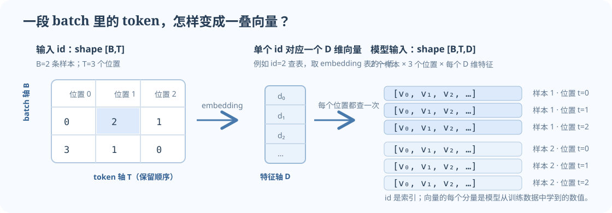

数学中的张量是描述多线性关系的对象；选定坐标系后，才用多维数值数组表示它的分量。写代码时还要区分具体的数据结构：NumPy 的 `ndarray` 是带 `shape` 和 `dtype` 的 N 维数组，标准 NumPy 数组在 CPU 上运行，也不自带自动微分；PyTorch 的 `torch.Tensor` 同样承载多维数值，但还带 `device`，并可在 `requires_grad=True` 时由 autograd 追踪运算。本文主要讲这些数组式对象的 shape：先问每一轴表示什么，再看运算如何变形。

## 1. 从一张小表理解 shape

```python
import numpy as np

x = np.array([
    [1, 2, 3],
    [4, 5, 6],
])

print(x.ndim)   # 2：有两个轴
print(x.shape)  # (2, 3)：2 行、每行 3 个数
print(x[1, 0])  # 4：第 2 行、第 1 列（索引从 0 开始）
```

顺序很重要：`(2, 3)` 和 `(3, 2)` 都有 6 个数，含义却不同。对一个 batch 的 token id，`[B,T]` 表示 B 条样本、每条 T 个位置；这里的轴不是抽象“第 0 维、第 1 维”，而是有具体角色的 batch 轴和序列轴。



*图 1. 对语言模型而言，batch 轴表示并行处理的样本数，token 轴保留顺序，特征轴保存每个 token 的向量分量。*

## 2. 矩阵乘法：看共享的中间维度

矩阵乘法要求左边最后一轴和右边倒数第二轴长度相同：

$$
(m\times n) @ (n\times k) \;\longrightarrow\; (m\times k).
$$

用数字做一次：

```python
import numpy as np

x = np.array([[1, 2, 3], [4, 5, 6]])      # [2, 3]
w = np.array([[1, 0], [0, 1], [1, 1]])    # [3, 2]
y = x @ w
print(y)
# [[ 4,  5],
#  [10, 11]]
print(y.shape)  # (2, 2)
```

第一行第一列是 `1×1 + 2×0 + 3×1 = 4`。这里 3 是两矩阵共享的计算轴，乘完以后消失；留下 x 的行轴 2 和 w 的列轴 2，所以结果为 `[2,2]`。

`@` 是矩阵乘法；`*` 是对应位置相乘，通常要求 shape 相同或能广播。把这两者混淆会让代码能运行、但计算错了，所以要看运算符和输出形状。

## 3. 语言模型怎样从 id 查出向量

设词表里有 4 个 token，每个 token 用 3 个数表示，embedding 表可以写成 `E[V,D]`：

```python
import numpy as np

E = np.array([
    [0.1, 0.0, 0.2],  # token 0 的向量
    [0.0, 0.3, 0.1],  # token 1 的向量
    [0.2, 0.2, 0.0],  # token 2 的向量
    [0.4, 0.1, 0.1],  # token 3 的向量
])                              # [V=4, D=3]
token_ids = np.array([[0, 2], [1, 3]])  # [B=2, T=2]
vectors = E[token_ids]                  # [B=2, T=2, D=3]
```

`E[token_ids]` 不是普通矩阵乘法；它按 id 从表里取行。每个整数变成一组三维向量，原有 batch 和位置轴保留，所以结果有 `[B,T,D]` 三个轴。模型里的 `[B,T,D]` 常称为隐藏表示或 hidden states。

实际词表可能有几万到几十万个 token，隐藏维度也可能上千；但维度含义和这个小例子相同。先用小数表对齐轴，再看真实模型的矩阵，不容易把 `V` 和 `D` 混为一谈。

## 4. 广播：让同一个偏置加到每个样本

有时想给每个特征加一个偏置，而这个偏置对 batch 和位置都相同：

```python
import numpy as np

x = np.zeros((2, 3, 4))  # [B=2, T=3, D=4]
b = np.array([10, 20, 30, 40])  # [D]
y = x + b
print(y.shape)  # (2, 3, 4)
```

NumPy 从最右侧开始对齐 shape。若一边缺少某个更左侧的轴，可以把它想成长度为 1；长度为 1 的轴可以扩展到另一边对应的长度，而不需要手动复制数据。

本例相当于把 `b` 看成 `[1,1,4]`，然后广播到 `[2,3,4]`。它沿 batch 和位置重复使用同一个 4 维偏置。

可以广播的简单判断：从右向左逐轴比较，长度必须相同，或其中一个为 1。因而 `[2,3,4] + [3,4]` 可算；`[2,3,4] + [2,5]` 通常不行，因为最右侧的 4 和 5 不匹配。

## 5. 维度换位与展平不是一回事

```python
import numpy as np

x = np.zeros((2, 3, 4))
print(x.transpose(1, 0, 2).shape)  # (3, 2, 4)，交换 batch 和 token 轴
print(x.reshape(6, 4).shape)       # (6, 4)，把前两轴合并
```

- `transpose` / PyTorch 的 `permute`：重新排列轴的顺序，所以轴的语义跟着移动。
- NumPy 的 `reshape`：在保留元素顺序的前提下改变形状；它可能返回视图，也可能复制数据，但不会替你判断哪一轴是 batch 或 token。
- PyTorch 的 `view` 与 `reshape` 不是完全等价的接口：`view` 要求当前步幅（stride）允许这种形状，经过 `permute` 后常会报错；PyTorch 的 `reshape` 会在可行时返回视图，否则复制数据。两者都不会替你判断轴的语义。

例如 `[B,T,D]` 与 `[T,B,D]` 元素总数相同，含义却相反。如果某个 API 需要 `[T,B,D]`，通常要显式 `permute(1,0,2)`，而不是只把张量 `reshape` 成那个形状。

## 6. 把注意力分数的 shape 推出来

采用 batch-first 布局。这里 `B` 是批次大小，`T` 是序列长度，`D=d_model` 是模型隐藏宽度；`H` 是注意力头数，`d_h` 是每个头中 query/key/value 向量的通道宽度。常见的等宽划分会把 `D` 个通道均分给 `H` 个头，因此设 `d_h=D/H`，这时要求 `D` 能被 `H` 整除。这个整除条件属于这种均分设计，不是注意力运算的普遍约束：也可以独立选择 `d_h`（总投影宽度为 `H·d_h`），再用输出投影映回 `D`。

按每个头的 Q、K、V 通道宽度相同来记，拆开注意力头后：

$$
Q,K,V\in\mathbb{R}^{B\times H\times T\times d_h},
\qquad QK^\top\in\mathbb{R}^{B\times H\times T\times T}.
$$

在最后两个轴上相乘：Q 的末轴是特征 `d_h`，K 转置后倒数第二轴也是 `d_h`，它们相乘后消去。保留 Q 的 query 位置 T，和 K 的 key 位置 T，因此每个 query 位置会得到对所有 key 位置的一个分数向量。

这个分数 shape 不是巧合：两个 T 分别回答“正在计算哪个位置”和“正在查看哪个位置”。因果 mask 再决定某个 query 是否允许读取相应 key。完整的注意力解释见 [[../03-CS224N/L05-Attention 与 Transformer|CS224N L05 Attention 与 Transformer]]。

## 7. PyTorch 中的同一套规则

PyTorch tensor 和 NumPy 数组的 shape、索引、广播、矩阵乘法概念相同：

```python
import torch

ids = torch.tensor([[0, 2], [1, 3]])       # [B=2, T=2]
embedding = torch.nn.Embedding(4, 3)       # 4 个 token，每个 D=3
vectors = embedding(ids)                   # [2, 2, 3]

print(vectors.shape)
print(vectors.dtype, vectors.device)
```

PyTorch tensor 带有 `dtype` 和 `device`；只有在 `requires_grad=True` 且运算处于梯度记录状态时，autograd 才会跟踪相应计算。词 id 用整数类型（如 `torch.long`）；向量通常用浮点类型。整数索引本身不计算梯度，模型要学习的是 embedding 表里的向量参数。

## 8. 逐步练习

### 练习 A：shape 预报

有两个 batch，每条 3 个 token；embedding 维度为 4。分别写出 token id、embedding 输出、词表大小为 20 时 logits 的 shape。

<details><summary>核对</summary>

token id 为 `[2,3]`，embedding 输出为 `[2,3,4]`，logits 为 `[2,3,20]`。每个位置都预测整个词表中的下一个 token。

</details>

### 练习 B：矩阵乘法

`X` 的 shape 是 `[5,7]`，`W` 的 shape 是 `[7,11]`。能否计算 `X @ W`？结果是什么 shape？如果 `W` 改为 `[8,11]` 呢？

<details><summary>核对</summary>

可以，结果是 `[5,11]`。7 和 8 不一致时不能按矩阵乘法计算；要回头检查建权重的输入维，而不是盲目 reshape。

</details>

### 练习 C：广播和 reshape

一个 `[B,T,D]=[2,3,4]` 表示能不能加形状 `[4]` 的偏置？`[2,5]` 能不能加？把 `[2,3,4]` reshape 为 `[6,4]` 后，前两轴表达了什么？

<details><summary>核对</summary>

`[4]` 可广播到 `[2,3,4]`；`[2,5]` 与末轴 4 不匹配。reshape 以后 6 只是把 `B=2` 与 `T=3` 合并后的元素数；若后续仍要区分哪个样本、哪个位置，必须记录映射或避免过早合并。

</details>

### 练习 D：从代码预测输出

```python
import torch

ids = torch.tensor([[1, 0, 2], [3, 1, 0]])
E = torch.nn.Embedding(num_embeddings=5, embedding_dim=4)
out = E(ids)
```

在不运行的情况下写出 `ids.shape`、`E.weight.shape`、`out.shape` 和元素的数据类型。说明为什么 `E` 的第一维必须至少为 4。

<details><summary>核对</summary>

`ids` 为 `[2,3]`，embedding 权重为 `[5,4]`，输出为 `[2,3,4]`，输出通常是浮点张量。token id 最大为 3；它会用作 `E` 的行索引，因此 `num_embeddings=5` 包含合法索引 0 至 4。

</details>

## 参考资料

- [NumPy Quickstart（官方）](https://numpy.org/doc/stable/user/quickstart.html)
- [PyTorch Tensors（官方）](https://pytorch.org/docs/stable/tensors.html)
- [PyTorch Embedding（官方）](https://pytorch.org/docs/stable/generated/torch.nn.Embedding.html)
- [《动手学深度学习》中文版](https://zh-v2.d2l.ai/)：可查数组、线性代数、自动微分和 Transformer；本站只链接教材，不将源码许可误作正文图片许可。
- [Datawhale《深入浅出 PyTorch》](https://github.com/datawhalechina/thorough-pytorch)：项目标注 CC BY-NC-SA 4.0；本站提供原始链接，不转载正文。

接下来读 [[PyTorch-Train-Step|PyTorch 训练一步]]，把 shape 和矩阵乘法连接到损失、梯度和参数更新。符号速查见 [[../05-Reference/Tensor-Shape-Cheat-Sheet|张量形状速查表]]。
