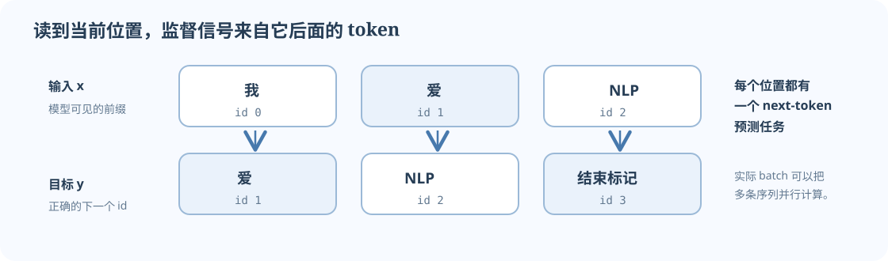

深度学习训练不是代码里的神秘按钮。对语言模型来说，它每一步都在做一件清楚的事：给模型一段前文，让模型猜下一个 token；比较猜测和真实 token；再把参数往“下次更可能猜对”的方向微调。

## 先用一条短序列看目标怎么来

设 token id `0=我`、`1=爱`、`2=NLP`、`3=结束标记`。样本是：

```text
原始序列：[0, 1, 2, 3]
输入 x：  [0, 1, 2]
目标 y：  [1, 2, 3]
```

每个位置的任务是预测**下一个** token：看到 `0` 预测 `1`，看到 `0,1` 预测 `2`，看到 `0,1,2` 预测 `3`。`input_ids` 和 `target_ids` 的 shape 都是 `[B,T]`，只是沿序列轴错开一格。实际 causal Transformer 会用因果 mask，保证位置 t 看不到目标本身和未来内容。



*图 1. 同一个序列切成输入与标签后逐位置对齐。批次里的每一行都遵守相同规则；实际模型还会用 mask 阻止提前看到答案。*

## 1. 模型输出的是分数，不是选好的 token

假设当前位置要从三个候选 token 中选择，模型输出：

$$
\text{logits}=[2,\;0,\;-1].
$$

这三个数是词表三个类别的未归一化分数，叫 **logits**。分数越高，模型越倾向于那个 token；但它们还不是概率，而且不要求相加为 1。softmax 把它们变成概率，约为：

$$
\text{softmax}(z)\approx[0.844,\;0.114,\;0.042].
$$

若正确答案 id 是 0，模型给正确答案的概率就是 0.844。交叉熵损失取正确类别概率的负对数：

$$
\mathcal{L}=-\log p(y=0)\approx-\log(0.844)\approx0.17.
$$

如果模型把正确答案概率压得很低，损失就会很大。训练的目标是降低很多样本、很多位置上的平均损失。更完整的 [[../05-Reference/Formula-Sheet|公式速查]] 里列出 batch 形式；[L04 语言模型讲义](../03-CS224N/L04-语言模型与 RNN) 解释序列概率的含义。

## 2. 反向传播给每个参数一条“修正方向”

对刚才这个简单 softmax 分类例子，交叉熵对 logits 的梯度为：

$$
\nabla_z\mathcal{L}=p-\operatorname{onehot}(y)
\approx[-0.156,\;0.114,\;0.042].
$$

第一项为负，表示稍微调高正确类别分数会降低损失；错误类别为正，表示往下调整它们会降低损失。这只是 logits 的梯度，不是整个 Transformer 参数的梯度。PyTorch 会把链式法则沿前向计算反方向应用到 embedding、线性层等参数上。

`loss.backward()` 计算出这些梯度，并写入每个可训练参数的 `.grad`。优化器的 `step()` 才根据梯度和学习率改参数。二者是不同操作：只运行 `backward()` 不会自动让权重变化。

## 3. 一步训练代码，每行对应一个明确动作

先看一般形式。假设 `model(input_ids)` 返回 logits `[B,T,V]`：

调用前要先把模型参数放到 `device` 上；这个函数只把输入和目标移动过去。通常在创建优化器前执行 `model = model.to(device)`，再用 `model.parameters()` 创建优化器，确保模型与输入/目标位于同一设备，且优化器绑定当前模型参数。

```python
import torch.nn.functional as F

def train_step(model, optimizer, input_ids, target_ids, device):
    model.train()  # 使用训练模式，例如启用 dropout
    input_ids = input_ids.to(device)
    target_ids = target_ids.to(device)

    optimizer.zero_grad(set_to_none=True)
    logits = model(input_ids)                  # [B, T, V]
    B, T, V = logits.shape
    loss = F.cross_entropy(
        logits.reshape(B * T, V),              # [B*T, V]
        target_ids.reshape(B * T),             # [B*T]
    )
    loss.backward()                            # 计算参数梯度
    optimizer.step()                           # 更新参数
    return loss.detach().item()
```

用 shape 追踪：

1. `input_ids: [B,T]` 是 token 编号；模型逐位置算出 `logits: [B,T,V]`。
2. 交叉熵把 `[B,T]` 看作 B×T 个分类题，因此将 logits 展成 `[B*T,V]`，target 展成 `[B*T]`。
3. 默认 `reduction="mean"` 会平均这些位置的损失。若存在 padding，需要用 `ignore_index` 跳过无效位置，且要确认平均分母的约定。
4. `zero_grad()` 清上一步梯度。PyTorch 默认累加梯度，不清理就会意外叠加。
5. `backward()` 只算梯度；`step()` 更新参数；`detach().item()` 把值取成 Python 数字用于打印。

如果你每个 batch 先累积多个 microbatch 的梯度再 `step()`，要按设计控制清零和损失缩放。这与忘记清梯度导致错误累加不是一回事。

## 4. 在四个 token 上运行一次真实的交叉熵

```python
import torch
import torch.nn.functional as F

logits = torch.tensor([[2.0, 0.0, -1.0]], requires_grad=True)
target = torch.tensor([0])
loss = F.cross_entropy(logits, target)
loss.backward()

print(loss.item())     # 大约 0.1698
print(logits.grad)     # 大约 [[-0.156, 0.114, 0.042]]
```

第一维是 batch，shape 为 `[1,3]`，代表 1 个样本、3 个类别；目标 `[0]` 表示正确类别 id 是 0。`CrossEntropyLoss` / `F.cross_entropy` 内部已处理 log-softmax，因此把原始 logits 传进去；不要先 softmax 后再传，否则数值语义不对。

这个玩具代码只演示交叉熵的梯度。训练完整模型时，logits 来自一连串 embedding 和网络运算，PyTorch 根据计算图把梯度继续传到模型参数。

## 5. `train()`、`eval()` 和“是否记录梯度”

- `model.train()` 设为训练行为；例如 dropout 随机屏蔽部分激活。
- `model.eval()` 设为评估行为；例如 dropout 不再随机屏蔽。
- `torch.no_grad()` 或 `torch.inference_mode()` 关闭梯度记录、节约评估和生成时的内存。

`eval()` 不会冻结参数，`train()` 也不等于打开梯度。它们分别控制层的行为和自动微分记录。做验证时常见写法是：

```python
model.eval()
with torch.inference_mode():
    logits = model(input_ids)
```

## 6. 如何知道更新真的发生了

一次可检查的最小训练闭环：

1. 用 1–2 个简短样本构造可重复的小 batch。
2. 打印输入、目标、logits、loss 的 shape，并确认目标 id 在 `[0,V)`。
3. `backward()` 后检查几个预期参数的 `.grad` 不是 `None`，数值有限。
4. `step()` 前保存一个参数副本；更新后比较参数是否改变。
5. 重复训练相同小批次。若数据和实现无误，模型通常可以逐渐记住它，loss 应下降。

若 loss 是 NaN，先检查输入含 NaN/Inf、logits 范围、学习率和混合精度；若 loss 不变，查梯度是否为空、优化器是否绑定了当前模型参数、是否每步都清零并更新。逐层检查可用 [[../05-Reference/Debugging-Checklist|调试清单]]。

## 分层自测

### 直觉题

1. 为什么同一句话既有输入 `x` 又有目标 `y`？
2. logits `[1.2, -0.1, 2.4]` 里哪个 token 最可能被选中？现在它们是概率吗？
3. `loss.backward()` 执行后，参数是不是已经更新？

<details><summary>核对</summary>

1. 每个位置读取已有前缀并预测下一个 token，因此目标序列向前错一格。
2. 第三类分数最高；logits 不是概率，softmax 后才是和为 1 的概率分布。
3. 不是；它计算 `.grad`，还需由 `optimizer.step()` 更新参数。

</details>

### 维度题

`B=2,T=4,V=10`。模型 logits、目标、展平后 logits 和展平后目标分别是什么 shape？

<details><summary>核对</summary>

分别为 `[2,4,10]`、`[2,4]`、`[8,10]`、`[8]`。每一行分类题对应一个样本的一个 token 位置。

</details>

### 梯度方向题

对三类 softmax 预测，概率是 `[0.7,0.2,0.1]`，真实标签为类别 1（从 0 开始编号）。写出 loss 对 logits 的梯度，并解释正确类的方向。

<details><summary>核对</summary>

`p-onehot(y) = [0.7,-0.8,0.1]`。正确类的梯度为负，梯度下降会提高该类 logit；另外两类梯度为正，梯度下降会压低它们。

</details>

### 错误定位题

若 `logits.shape == [8,10]`，`target.shape == [8]`，但运行时报 target 超出范围，应先检查什么？

<details><summary>核对</summary>

整数目标应在 0 至 9 之间（除非某个位置使用了 API 约定的 `ignore_index`）。检查 tokenizer 的词表大小是否和输出类别数 `V=10` 一致，打印目标的最小/最大 id；不应通过 reshape 掩盖越界问题。

</details>

## 官方文档与后续阅读

- [PyTorch Quickstart](https://pytorch.org/tutorials/beginner/basics/quickstart_tutorial.html)
- [Autograd mechanics](https://pytorch.org/docs/stable/notes/autograd.html)
- [CrossEntropyLoss API](https://pytorch.org/docs/stable/generated/torch.nn.CrossEntropyLoss.html)
- [CS336 Spring 2026 官方课程页](https://cs336.stanford.edu/)：作业接口、依赖和规则以当期 handout 为准。
- [Datawhale《深入浅出 PyTorch》](https://github.com/datawhalechina/thorough-pytorch)：项目声明 CC BY-NC-SA 4.0；本站链接原文，不复制正文与插图。

理解训练一步以后，去 [[../04-CS336/a1-basics|CS336 A1 Basics]] 顺着 tokenizer、Transformer 和训练循环追踪更完整的数据流。
