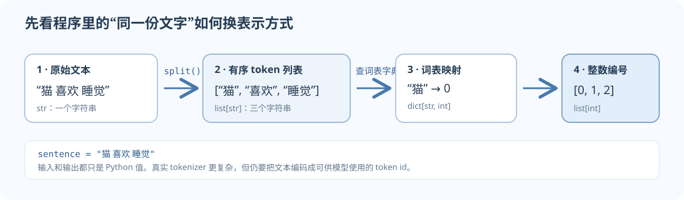

这页不是 Python 语法大全。目标是读懂课程代码里的数据怎样流动：文字先变成 token，再变成整数 id，最后交给张量和模型。如果一个小函数能解释清楚输入、输出和中间状态，你就已经有了开始读深度学习代码的抓手。

## 先看完整的小例子

假设我们暂时用空格把句子切开，并给每个词安排一个编号：

```python
sentence = "猫 喜欢 睡觉"
tokens = sentence.split()
vocabulary = {"猫": 0, "喜欢": 1, "睡觉": 2}
token_ids = [vocabulary[token] for token in tokens]

print(tokens)     # ['猫', '喜欢', '睡觉']
print(token_ids)  # [0, 1, 2]
```

上面有三种不同的东西：`sentence` 是字符串，`tokens` 是字符串列表，`token_ids` 是整数列表。真实 tokenizer 的规则会复杂得多，但“文本 → token → id”的数据流一样。下面拆开看每个 Python 结构在做什么。



*图 1. Python 示例只用空格切词来展示程序数据流；真实的子词 tokenizer 会处理标点、词片段和特殊 token。*

## 1. 变量：给一个值起名字

```python
batch_size = 2
learning_rate = 0.001
is_training = True
```

等号在这里表示“让名字指向右侧的值”，不是数学里的恒等关系。选择能说明含义的名字，调试时你才能一眼认出它代表 batch 数量还是学习率。Python 的变量不会在赋值时声明固定类型：同一个名字可以被重新赋值，但模型代码里尽量不要因此改变它代表的概念。

常见基础类型包括整数 `int`、小数 `float`、字符串 `str`、布尔值 `bool` 和表示“没有值”的 `None`。token id 是整数；它只是词表中的索引，不代表词之间有数值大小关系。id 为 12 的词不比 id 为 3 的词“大”。

## 2. 列表与字典：保存一串值，或建立查找表

### 列表按位置存值

```python
tokens = ["猫", "喜欢", "睡觉"]
print(tokens[0])  # 猫；Python 从 0 开始计数
print(len(tokens))  # 3
```

列表适合保存有顺序的数据：token 序列、一个 batch 的样本、模型里的多层网络。`tokens[1:]` 会取从第 1 个位置到末尾的子列表；切片的终点不包含在结果里。访问 `tokens[3]` 会报 `IndexError`，因为合法索引只有 `0、1、2`。

### 字典按键查值

```python
vocabulary = {"猫": 0, "喜欢": 1, "睡觉": 2}
print(vocabulary["喜欢"])  # 1
```

词表本质上是一个查找表：输入 token，查出它对应的整数 id。用不存在的键索引会报 `KeyError`。未知 token 必须按明确策略处理：可以让程序报错，也可以映射到词表中预留的 UNK id。若用 `vocabulary.get(token, unknown_id)`，先定义 `unknown_id`，并确认它确实是词表中预留的未知 token 编号；不要让它和已有 token 的 id 冲突。

字典也常保存一组有名字的训练数据：

```python
batch = {"input_ids": [0, 1], "labels": [1, 2]}
```

从 `batch["input_ids"]` 读取的是输入；`batch["labels"]` 是目标。真实项目可能把这里的列表换成 PyTorch 张量，但键名仍常相同。

### 什么时候选哪一种

| 你要表示 | 常用结构 | 例子 |
|---|---|---|
| 有先后顺序的一串东西 | `list` | `token_ids = [0, 1, 2]` |
| 从一个名字查对应的值 | `dict` | `vocabulary["猫"] == 0` |
| 一组固定位置的返回值 | `tuple` | `inputs, targets = make_batch(...)` |
| 去重后的集合 | `set` | 已见过的 token 或 URL |

## 3. 条件与循环：逐个检查样本

```python
valid_ids = []
for token in tokens:
    if token not in vocabulary:
        raise ValueError(f"词表中没有这个 token：{token}")
    valid_ids.append(vocabulary[token])
```

`for` 按顺序取出一个 token；`if` 检查词表是否缺少它；`raise` 在缺词时明确报错；`append` 把 id 加到列表末尾。这里选择报错，避免静默删掉 token 后改变序列位置；若项目规定使用 UNK，应把缺失 token 映射到预留的 UNK id。缩进不是装饰：它标出哪些语句属于循环或条件。模型训练里也会用循环逐批读取数据、逐层查看网络，思路相同。

读循环时，每次都可以追踪一个“当前值”：第一轮 `token == "猫"`，然后 `"喜欢"`，最后 `"睡觉"`。如果不清楚某行为什么执行，把这一轮的变量值写在纸上，往往比通读整段代码更快。

## 4. 函数：把有名字的步骤变成可复用工具

```python
def encode(tokens, vocabulary):
    token_ids = []
    for token in tokens:
        if token not in vocabulary:
            raise ValueError(f"词表中没有这个 token：{token}")
        token_ids.append(vocabulary[token])
    return token_ids

ids = encode(["猫", "睡觉"], vocabulary)
```

读函数时问四件事：参数是什么、参数表示什么、函数做了什么、返回什么。这里 `tokens` 和 `vocabulary` 是输入，`token_ids` 是返回值。`raise ValueError(...)` 表示输入不符合预期时主动报错；比悄悄生成一个错误 id 更容易定位数据问题。

`return` 会结束这次函数调用并把结果交还给调用者。函数里的局部变量不会自动成为函数外的变量。把操作拆成几个短函数，能分别检查“切分是否正确”“查表是否正确”，避免一次面对整个训练程序。

## 5. 解包与列表推导式：同一件事的两种写法

```python
def make_example(token_ids):
    inputs = token_ids[:-1]
    targets = token_ids[1:]
    return inputs, targets

inputs, targets = make_example([0, 1, 2, 3])
# inputs  = [0, 1, 2]
# targets = [1, 2, 3]
```

两个返回值被放进一个 tuple，然后由左边两个名字依序接收，这叫**解包**。自回归语言模型用这种错一格的输入和目标：读到位置 `t` 时，目标是下一个 token `t+1`。

遍历列表也可以简写为：

```python
ids = [vocabulary[token] for token in tokens]
```

它和先创建空列表、再循环并 `append` 的写法效果相同。先看懂展开版，再把短写法读成“对每个 token 查一次词表”就够了。为了排错或过滤异常值，展开成普通循环通常更清楚。

## 6. 导入、文件与错误信息

```python
from pathlib import Path

text_path = Path("data") / "sample.txt"
text = text_path.read_text(encoding="utf-8")
```

`from ... import ...` 把其他模块提供的名字引入当前文件。文件路径通常相对于程序的**当前工作目录**，而不一定相对于这段代码所在的文件；文件找不到时，先打印 `Path.cwd()` 确认程序从哪里启动。

错误信息里最值得先看的通常是异常类型、报错消息、最后一个指向你代码的文件名/行号，以及该行输入的实际 shape 或值。例如：

- `IndexError`：按位置取列表元素时，索引超出范围。
- `KeyError`：字典里没有请求的键。
- `TypeError`：给了不支持这种操作的类型，例如把字符串和整数直接相加。
- `ValueError`：类型能参与操作，但具体值不符合要求，例如把 `"hello"` 转成整数。
- `FileNotFoundError`：路径对应的文件不存在或当前工作目录不对。

遇到报错时，先读 traceback 底部的异常，再沿调用栈找到第一行自己的代码。不要立刻改很多行；打印最靠近错误位置的变量，核对它的值与类型。

## 7. 把这些工具用在课程代码里

课程 starter 常出现下面的函数和类。先读接口，不需要一开始就设计复杂面向对象程序：

```python
def make_batch(token_ids, batch_size, seq_len):
    """取出输入和下一个 token 目标，返回两个张量。"""
    ...

class TinyModel:
    def __init__(self, vocab_size, hidden_size):
        ...

    def forward(self, token_ids):
        ...
```

`class` 把相关数据和操作组织起来。`__init__` 建立对象，`self` 指当前对象，`forward` 根据输入计算输出。PyTorch 的模型继承 `torch.nn.Module`；读者先理解构造参数和输入/输出约定即可，暂时不必掌握复杂类继承。

## 8. 自测：先预测，再运行

### 第一层：跟踪程序

不运行代码，写出每一步的结果：

```python
text = "模型 会 学习"
tokens = text.split()
vocabulary = {"模型": 4, "会": 7, "学习": 9}
ids = [vocabulary[token] for token in tokens]
print(len(tokens), ids[1])
```

<details><summary>核对</summary>

`tokens` 有三个元素，顺序是 `模型、会、学习`；`ids` 是 `[4, 7, 9]`，因此输出 `3 7`。重点是区分 token 的位置和 token id 的数值。

</details>

### 第二层：改写与边界

1. 把列表推导式改写成普通 `for` 循环。
2. 如果 `tokens` 中包含 `"未知词"`，`vocabulary[token]` 会怎样？写一个你认为明确的处理策略。
3. 把 `[2, 5, 8, 3]` 切成 next-token 的 `inputs` 和 `targets`。

<details><summary>核对与提示</summary>

1. 新建空列表，逐个 token 查 `vocabulary`，再 `append`。
2. 直接索引会得到 `KeyError`。你可以显式拒绝未知值，或按项目约定映射到 UNK id；关键是不能暗中改变词表语义。
3. 输入 `[2, 5, 8]`，目标 `[5, 8, 3]`。同一位置的输入预测下一位置的目标。

</details>

### 第三层：阅读代码接口

给函数 `make_batch(token_ids, batch_size, seq_len)` 写出可能的输入类型、返回值和至少两条前置检查。再说明返回的输入和目标为什么会错开一格。

**自查：**能说清参数含义、形状、边界条件和返回值，就能开始读 starter 函数。处理张量时，还要补上轴的含义，见 [[NumPy-and-Tensor-Shapes|NumPy 与张量形状]]。

## 前置检查清单

- [ ] 我能区分字符串、整数 token id、列表和字典。
- [ ] 我能跟踪循环中当前处理的值，并读懂函数参数与返回值。
- [ ] 我知道 Python 索引从零开始，且切片终点不包含在结果中。
- [ ] 我能从 traceback 里找到异常类型和第一处相关代码。
- [ ] 我能说明一批输入数据的形状以及每个轴代表什么。

如果最后一项还不确定，继续读 [[NumPy-and-Tensor-Shapes|NumPy 与张量形状]]；Python 前三项掌握后即可边读课程代码边补其他语法。

## 中文与官方学习材料

- [Python 官方中文教程：数据结构](https://docs.python.org/zh-cn/3/tutorial/datastructures.html)
- [Python 官方中文教程：控制流与函数](https://docs.python.org/zh-cn/3/tutorial/controlflow.html)
- [Think Python 作者维护的英文在线版](https://allendowney.github.io/ThinkPython/)，适合系统练习；在线英文版和旧版中文译本并非同一版本。
- [Think Python 第二版中文译本源仓库](https://github.com/apachecn/think-py-2e-zh)：这是第三方译本。其 LICENSE 与 README 的版本描述存在冲突，本网站只提供来源链接，不转载正文。

本页示例为独立编写的小型教学代码，不是课程作业实现。继续学 [[NumPy-and-Tensor-Shapes|NumPy 与张量形状]]，再看 [[PyTorch-Train-Step|PyTorch 训练一步]]。
