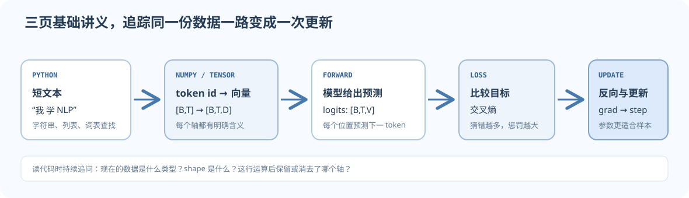

学深度学习不需要先背完整本 Python 教材；需要的是能跟踪一批样本怎么从文字变成数字、张量、损失和梯度。本目录从你能看见的小数据出发，再逐步把同一条路线交给模型处理。

## 建议顺序

1. [[Python-Environment|先搭好 Python 环境]]，学会用终端运行文件、安装库并检查环境。
2. [[Python-Prerequisites|Python：变量、列表、字典、函数和调试]]。再运行配套脚本，用小数据练习读数据流。
3. [[NumPy-and-Tensor-Shapes|NumPy 与张量：shape、索引、广播和矩阵乘法]]。每看一个公式，先给每一轴写出名字。
4. [[PyTorch-Core-Practice|PyTorch 核心动手：Tensor、autograd 和 nn.Module]]，随后读 [[PyTorch-Train-Step|PyTorch 训练一步]]。
5. [[Dataset-and-DataLoader|Dataset 与 DataLoader：把样本整理成 batch]]，接着跑 [[Tiny-Next-Token-Project|小型 next-token 训练项目]]。
6. 做完 [[Practice-and-Solutions|分层编程练习与逐步答案]]，再进入 CS224N/CS336。
7. [[../05-Reference/Debugging-Checklist|训练调试清单]] 与 [[../05-Reference/Tensor-Shape-Cheat-Sheet|shape 速查表]] 可在实现时反复打开。



*图 1. 这三篇基础讲义分别解释前半段的数据处理、张量计算和后半段的训练更新。*

## 学习完后应能

- 读懂 `input_ids` 是一批整数，而 `tokenizer` 决定文字如何变成这些整数。
- 把 `[B,T,D]` 解释成批次、位置和特征，而不是只报出三个数字。
- 检查 `[B,T,V]` logits 怎样与 `[B,T]` 的下一个 token 目标对齐。
- 区分计算梯度的 `backward()` 与实际更新参数的 `optimizer.step()`。
- 遇到错误时先报告出错张量的 shape、dtype 和 device，再改代码。
- 能独立建立虚拟环境、运行 `.py` 文件，并确认 Python 与 PyTorch 的实际版本。
- 能写一个 `Dataset`，并看懂 `DataLoader` 如何把多条样本堆成 `[B,T]` batch。
- 能从字符序列建立 next-token 训练数据，完成一次前向、损失、反传和参数更新。

## 你不必预先掌握

先不要求会高级 Python 特性、复杂面向对象、微积分的严格证明或 GPU kernel 编程。页面会在需要时解释新符号和 API；如果手算 shape 仍会卡住，就回到张量页，不必因为某个库还不熟就停止学习整门课。

## 与课程的衔接

CS224N 的 Word2Vec、反向传播、RNN 和 Transformer 都依赖张量与损失的基础。CS336 A1 会把同一数据流连成 byte-level BPE、Transformer 语言模型和训练循环。进入课程页后，请同时打开 [[../05-Reference/Glossary|中英术语表]] 与 [[../05-Reference/Formula-Sheet|公式速查]]。

## 本地可运行脚本

页面配套源码位于本目录的 `examples/` 子目录。请先按环境页创建虚拟环境；随后在仓库根目录使用该环境的 Python 运行。例如 PowerShell 可运行：

```powershell
.\.venv\Scripts\python.exe content/01-Foundations/examples/train_tiny_bigram.py
```

这个命令只用 CPU 和脚本自带的小语料，不会下载数据。正常运行会打印训练样本数、训练前后的 loss，以及模型学到的三个字符转移。其他脚本也可把命令末尾替换为 `python_basics.py`、`pytorch_core.py` 或 `dataset_dataloader.py`。
