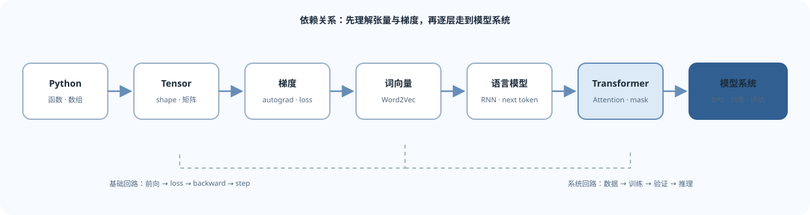

这张图按知识依赖排列，而不是按日历排课。遇到数学不熟的概念，先回到基础页；开始写模型时，再沿 CS336 A1 的实现顺序推进。

如果你希望按日历推进，请打开 [[30-Day-Plan|30 天学习路线]]。它每天安排 2 小时，以中文讲义、手算与编程练习完成 Python/PyTorch 前置、CS224N L01–L14、CS336 A1–A5 和 Hands-on LLM 的依赖衔接。

## 主题依赖

*图 1. 学习顺序按知识依赖排列；后面的系统主题建立在前面的表示、优化和建模基础之上。*

## 模块与完成标准

| 模块 | 核心问题 | 能力证据 |
|---|---|---|
| Python 与 PyTorch | 如何把想法写成可检查的程序？ | 写函数、张量操作和一次完整训练更新 |
| 词向量与优化 | 词的上下文如何形成可学习表示？ | 推导 Skip-gram 的概率目标并检查梯度方向 |
| 序列模型 | 模型怎样根据上下文预测下一项？ | 区分输入、目标、loss 和 perplexity |
| Transformer | 信息如何在序列位置之间流动？ | 解释 Q/K/V、mask、位置编码、残差和 FFN |
| 分词与训练 | 文本如何转成可训练样本？ | BPE round-trip，训练、验证和恢复 checkpoint |
| 现代 NLP 系统 | 如何使用和评估模型？ | 解释 SFT/PEFT/RAG/评估的目标与局限 |

## 课程材料映射

- CS224N 的主概念链是 **L02-L05**：词向量、反向传播、语言模型/RNN、Transformer。
- CS224N **L07-L14** 用来扩展预训练、后训练、PEFT、RAG、评估、推理和多语言分词。
- CS336 A1 是从零实现的主线；完整 CS336 还包含 GPU 系统、分布式训练、缩放、数据和对齐作业。
- 本地清单与缺失项见 [[99-Sources/index|资料来源与课程覆盖说明]]。

## 复习方法

1. 读一节材料后，合上它画出输入、运算、输出和 shape。
2. 用最小数字例子手算一个损失或 attention 权重。
3. 写最小实验验证预期，再增加 batch、序列长度和层数。
4. 记录错误症状、排查顺序和修复原因，而不是只保存最终代码。
