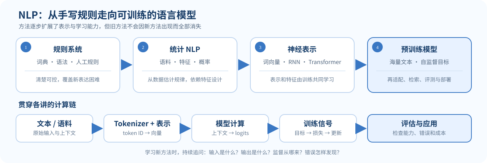

自然语言处理（NLP）研究如何让计算机处理人类语言。我们希望机器能分类文本、抽取信息、回答问题、翻译语言，也能写出连贯的文字。CS224N 的开场课把这些问题放到历史脉络里，后面的课程再逐步拆解其中的表示、模型与训练方法。

先把课程想成一条“把文字变成可检验计算”的流水线：原始字符串被切成 token，模型把 token 映射为向量，神经网络根据上下文计算预测，训练目标把“预测得好不好”变成损失，再由梯度更新参数。这个视角比一开始记住一串模型名称更有用；后面每一讲都在补这条链上的一个环节。

*图 1. NLP 方法的演进与一条贯穿课程的计算链。不同方法按成本、可靠性和场景继续并存。*

### 先看一个具体问题：一句话可能不止一种意思

例如英文句子 **“I saw the man with the telescope”** 有两种结构：①“我用望远镜看见了那个男人”，`with the telescope` 修饰“看见”；②“我看见了那个拿着望远镜的男人”，它修饰“男人”。字面词语相同，短语挂接位置不同，意思就不同。人会结合语序和上下文判断是哪一种解析；计算机也需要把这些线索转成表示和预测。分类器可以判断句子属于哪类，信息抽取器可以标注人和关系，语言模型则给下一个 token 分配概率。不同任务对“答对”的定义并不一样，所以 NLP 不只是让句子读起来像人写的。

初学时建议每遇到一种方法就追问四件事：**输入是什么、模型输出什么、训练信号从哪来、错误怎样被发现？** 这四个问题会贯穿后续全部课程。

## 1. 方法怎样一步步变化

### 规则系统：把知识写进程序

早期系统依赖人工编写的词典、语法和规则。它们适用于边界明确的小问题，但难以穷举语言中的歧义、例外与新表达。规则能解释“为什么系统这样判断”，维护成本却会随规则数量快速上升。

### 统计方法：从语料中估计规律

统计 NLP 收集标注样本，估计分类器、语言模型或序列模型的参数。系统开始用数据而不是一长串手写规则来处理变化。它的效果仍受特征设计、训练数据规模和数据分布影响。

### 神经表示：让模型学习特征

词向量把离散词语映射到稠密向量；神经网络可以从上下文中组合这些表示。RNN 按序列更新状态，Transformer 则用注意力直接连接不同位置。L02–L05 会从词向量一路解释到这些结构。

### 预训练模型：先学通用语言，再适配任务

大规模语料上的自监督训练，使模型可以用预测下一个 token 等目标吸收语言规律。之后再通过指令微调、偏好优化、检索增强等方式适配用途。L07 之后会讨论训练数据、对齐、检索、评测和推理。

这不是“新方法把旧方法彻底淘汰”的直线故事。规则、统计模型、神经网络和大模型仍会在不同成本、数据和可靠性约束下并存。

## 2. 一个统一的语言建模视角

给定前文 $x_{<t}=(x_1,\ldots,x_{t-1})$，自回归语言模型估计下一个 token 的条件概率：

$$
p(x_1,\ldots,x_T)=\prod_{t=1}^{T}p(x_t\mid x_{<t})
$$

模型把词或子词编码为 token ID，再经 embedding 和网络得到词表上的 logits。训练时，真实下一个 token 提供监督信号；推理时，模型从预测分布选出一个 token，并把它接回上下文。

### 用三个 token 走一遍训练与生成

假设 tokenizer 把“猫吃鱼”编码成三个 token：`[猫, 吃, 鱼]`。训练自回归模型时，把输入前缀和目标错开一格：输入 `[猫, 吃]`，目标是 `[吃, 鱼]`。模型在第一个位置要猜“吃”，在第二个位置要猜“鱼”。在 Transformer 里，因果遮罩保证“猜吃”时读不到未来的“鱼”。批处理时会加上 batch 维度和填充位置，但核心对齐关系不变。

推理时没有真实目标可供读取：给模型 `[猫]`，它对词表中的每个 token 输出一个分数（logit）；softmax 把分数变成概率；解码器按策略选中一个 token，例如“吃”；接着把它拼回前缀，再预测一次。**logits 是未归一化分数，概率是归一化结果，token ID 是最终选中的离散编号**，不要把三者混为一谈。

对于长度为 $T$ 的序列，常见的因果语言模型损失是各预测位置负对数概率的平均或总和：

$$
\mathcal{L}_{\mathrm{LM}}
=-\frac{1}{T}\sum_{t=1}^{T}\log p_\theta(x_t\mid x_{<t}).
$$

写成平均还是总和取决于批次归约和实现；忽略 padding 的目标位置通常不参与损失。真实 token 越可能，$-\log p$ 越小；如果正确 token 的概率是 $0.8$，损失为 $-\ln(0.8)\approx0.223$，若只有 $0.1$，损失为 $-\ln(0.1)\approx2.303$。这就是负对数似然会惩罚“把高概率押给错误选项”的原因。

这个视角贯穿后面的内容：词向量解释输入表示，反向传播解释参数怎样更新，RNN 与 Transformer 解释条件概率怎样计算，CS336 再把这些组件放进完整训练系统。

## 3. 任务目标决定评估方式

- **分类与判断**：情感、主题、蕴含或安全性分类；关注准确率、召回率与类别错误。
- **信息抽取**：从文本中识别人名、关系或事件；要说明标注边界和漏报、误报成本。
- **生成与对话**：续写、摘要、翻译和问答；单一自动指标通常不足以代表事实性或帮助程度。
- **检索与工具使用**：把语言理解与外部证据、程序动作结合；要检查检索命中和最终回答是否受证据支持。

同一个模型在不同任务上会出现不同错误。因此做实验时，先明确使用场景、数据和评估协议，再比较模型，不能只凭“看起来流畅”判断效果。

### 初学者术语卡

| 词 | 这里指什么 | 用“猫吃鱼”理解 |
|---|---|---|
| Token | tokenizer 切出的离散文字单位 | 可能是“猫”“吃”“鱼”，也可能不是一字一个 token |
| Token ID | 词表中对应的整数编号 | 例如猫可能编码为 17；编号本身没有语义大小 |
| Embedding | 把编号查表变成向量 | ID 17 查到一个 $d$ 维浮点向量 |
| Logit | 模型对每个候选 token 给出的未归一化分数 | 预测“吃”“喝”等候选前的原始分数 |
| 参数 $\theta$ | 训练中会被更新的矩阵和偏置 | 决定从上下文怎样算出分数 |
| Loss | 当前模型对训练目标的错误度量 | 正确目标“吃”概率越低，损失越大 |
| 推理 / inference | 用固定参数处理新输入、生成输出 | 给前缀算分布并选下一个 token |

“自监督”也不是“没有监督信号”：通常是从原文自动造出目标。例如下一词预测直接用原文的后续 token 当标签；它省去了逐条人工标注，但数据质量和目标设计仍然重要。

## 4. 课程路线图

| 主题 | 要回答的问题 | 后续页面 |
|---|---|---|
| Word2Vec 与词表示 | 怎样从上下文学习词向量？ | [[L02-词向量与 Word2Vec]] |
| 神经网络与梯度 | 预测错了以后，参数如何修正？ | [[L03-神经网络与反向传播]] |
| RNN 语言模型 | 怎样按顺序处理 token 并预测下一个词？ | [[L04-语言模型与 RNN]] |
| Attention 与 Transformer | 怎样让位置之间交换信息？ | [[L05-Attention 与 Transformer]] |
| 期末项目方法 | 怎样把一个 NLP 问题变成可检验实验？ | [[L06-期末项目与研究方法]] |
| 现代语言模型 | 怎样训练、适配、检索、评测与推理？ | [[现代主题地图-L07-L14]] |

### 这条路线为什么按这个顺序

L02 先把“离散词怎样变成可学习表示”讲清；L03 补上“损失怎样把错误传回参数”；L04 用 RNN 展示按顺序预测，L05 再用注意力直接交换序列信息。到 L07，模型结构已不再是唯一问题：还要考虑预训练数据、后训练反馈、适配成本、外部证据、评测协议和推理资源。换句话说，前半段重点看**模型内部怎样计算**，后半段则把模型放进**完整系统**里。

建议读新概念时先手算一个最小例子，再看公式里的每个符号，最后看张量形状和实现。若发现公式看不懂，回到“输入—输出—监督信号”的四问，比继续硬背术语有效。

## 5. 自测

先独立作答，再展开提示与核对。第一组检查术语，第二组检查计算链，第三组练习判断模型的证据是否足够。

### A. 基础检查

1. token、token ID 和 embedding 各是什么？
2. 自监督预测中的目标从哪里来？为什么仍需检查语料？

提示
想想 tokenizer 输出整数后，模型如何把整数变成浮点向量。

### B. 计算与因果关系

3. 输入 token ID 的形状是 $[B,T]$，词表大小为 $V$，最后一层 logits 通常是什么形状？每个位置对应什么？
4. 正确 token 的概率从 $0.8$ 降到 $0.1$，其单 token 负对数损失是变大还是变小？为什么？

提示
每个 batch 的每个位置都要对 $V$ 个候选 token 打分；负对数是递减函数。

### C. 迁移到实际系统

5. 为什么学习一个大模型的同时，还要检查训练数据和评估协议？
6. 摘要流畅但新增了原文没有的事实，应该补测哪些性质？仅看 BLEU 或读起来通顺够不够？

提示
区分“像不像参考文字”和“主张是否被来源支持”。

核对答案

1. Token 是切分单位，ID 是词表整数编号，embedding 是 ID 查表得到的向量。
2. 目标常由原文后续内容自动生成；来源、重复、偏见和错误也来自语料，所以无人工标签不代表没有数据问题。
3. $[B,T,V]$；每个 batch、每个位置对词表每个 token 有一个 logit。
4. 变大：$-\ln 0.8\approx0.223$，而 $-\ln0.1\approx2.303$。
5. 数据影响模型学到的分布，评估协议决定报告测到什么；污染或偏置指标会让结论失真。
6. 测事实忠实度、来源支持与关键信息覆盖。表面重合或流畅度不能单独证明事实正确。

## 课程来源

- Stanford CS224N Winter 2026 [课程主页与课表](https://web.stanford.edu/class/cs224n/#schedule)
- 官方 [L01 Intro 课件](https://web.stanford.edu/class/cs224n/slides_w26/cs224n-2026-lecture01-intro.pdf) 与 [History of NLP 课件](https://web.stanford.edu/class/cs224n/slides_w26/cs224n-2026-lecture01-history.pdf)

本页是独立撰写的中文概念说明，不是 Stanford 课件翻译；课程具体要求以当期官方页面为准。
