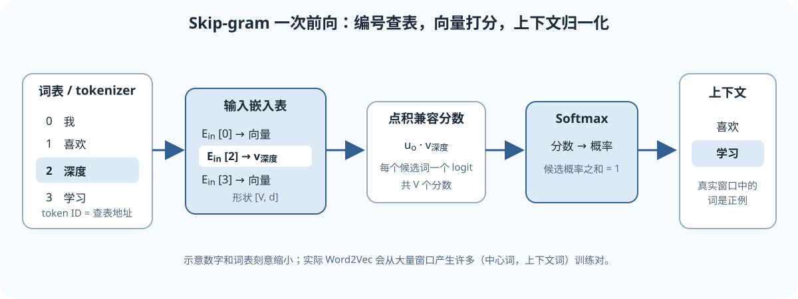

---
title: L02：词向量与 Word2Vec
description: 从词表索引到可学习的向量，用共现窗口理解 Skip-gram、Softmax、负采样和 PyTorch Embedding。
tags:
  - CS224N
  - word2vec
  - embeddings
  - NLP
---

## 本讲地图：把“词”变成模型能学习的数

先记住这条路线：

1. 分词器把文本转换成整数 ID；ID 只是词表中的编号。
2. Embedding 表按 ID 查出一行可学习的实数向量。
3. Word2Vec 用“哪些词常在附近出现”作为训练信号。
4. 训练后，我们得到能用于相似度、分类等任务的词向量。

本页会反复用一句短句做例子：**“我 喜欢 深度 学习”**。它只是帮助计算的微型语料；真实模型要从大量文本里统计规律。

*图：整数 ID 先查输入嵌入表得到向量；Skip-gram 再为词表候选计算分数并归一化。图中的小词表与数字仅用于演示。*

## 1. 词 ID 是地址，Embedding 才是表示

假设词表有 $V$ 个 token，每个 token 用 $d$ 个实数表示。输入嵌入表是

$$
E_{\mathrm{in}}\in\mathbb{R}^{V\times d}.
$$

第 $i$ 个 token 的向量就是第 $i$ 行：

$$
\mathbf v_i=E_{\mathrm{in}}[i]\in\mathbb{R}^{d}.
$$

可以把它想成通讯录：ID 是联系人编号，Embedding 表是通讯录，查到的一行数字才是模型当前学到的表示。ID 的大小和语义无关；编号 28 并不比编号 17“更像”某个词。

### 用一行具体数字看查表

假设词表按顺序是「我、喜欢、深度、学习」，因此 $V=4$。为了便于手算，令 $d=3$，当前输入表暂时是

$$
E_{\mathrm{in}}=
\begin{bmatrix}
0.2&-0.1&0.5\\
0.7& 0.3&-0.2\\
-0.4&0.8&0.1\\
0.6&0.2&0.9
\end{bmatrix}.
$$

若「深度」的 ID 是 2（本讲从 0 开始编号），查表结果是 $E_{\mathrm{in}}[2]=[-0.4,0.8,0.1]$。它是训练参数，不是人工预先写好的“深度”定义。

如果一批里有两个 ID，例如 $[1,3]$，查表结果形状是 $[2,3]$：两行，每行一个三维向量。这里的 $[2,3]$ 是张量形状，不是数值区间。

### Python / PyTorch 对照

~~~python
import torch
from torch import nn

V, d = 4, 3
ids = torch.tensor([1, 3])           # 两个 token ID，形状 [B] = [2]
table = nn.Embedding(V, d)            # 可学习参数，形状 [V, d] = [4, 3]
vectors = table(ids)                  # 查两行，形状 [B, d] = [2, 3]
~~~

<code>nn.Embedding</code> 不是把词转换成有固定含义的数字；它是一张会随训练更新的参数表。要让模型知道某个 ID 对应哪个 token，分词器的词表必须与这张表使用同一套编号。

## 2. 上下文怎样提供训练信号

我们没有给每个词手写定义，但原始文本里有大量共现事实。看「我 喜欢 深度 学习」，若中心词是「深度」且窗口半径 $m=1$，上下文是「喜欢」和「学习」。窗口向左、向右各最多取 $m$ 个 token；句子边缘自然拿不到完整窗口。

Skip-gram 把每个中心词映射到若干训练对：

| 中心词 $c$ | 上下文词 $o$ | 训练对 |
|---|---|---|
| 深度 | 喜欢 | $(\text{深度},\text{喜欢})$ |
| 深度 | 学习 | $(\text{深度},\text{学习})$ |

同一个中心词可能产生多个 pair；边界位置或不同窗口半径会改变 pair 数量。Skip-gram 的方向是**中心词预测上下文**，不要和 CBOW（多个上下文预测中心词）混为一谈。

这是弱监督：训练信号来自文本里实际相邻的 token，不需要人逐条标出「深度」这个词的词性或定义。结果因此反映语料分布；语料偏向、歧义和常见搭配都会留下痕迹。

## 3. 两张嵌入表与 Skip-gram Softmax

为了给候选上下文词打分，Skip-gram 还学习输出嵌入表

$$
E_{\mathrm{out}}\in\mathbb{R}^{V\times d}.
$$

中心词 $c$ 的输入向量记作 $\mathbf v_c=E_{\mathrm{in}}[c]$；候选上下文词 $o$ 的输出向量记作 $\mathbf u_o=E_{\mathrm{out}}[o]$。它们的点积作为兼容分数：

$$
s(c,o)=\mathbf u_o^\top\mathbf v_c.
$$

点积大表示当前参数更倾向于把这对词判为相容。点积不是概率，也不是相似度的唯一度量。

把所有 $V$ 个候选都打分后，Softmax 归一化：

$$
P(o\mid c)=
\frac{\exp(\mathbf u_o^\top\mathbf v_c)}
{\sum_{j=1}^{V}\exp(\mathbf u_j^\top\mathbf v_c)}.
$$

对语料抽出的正样本集合 $\mathcal D$，最大化真实上下文的概率，等价于最小化负对数似然：

$$
\mathcal L_{\mathrm{SG}}
=-\sum_{(c,o)\in\mathcal D}\log P(o\mid c).
$$

### 张量形状：为什么 logits 是 $[B,V]$

沿用常见的输入维度在前、输出维度在后的约定：

| 名称 | 形状 | 含义 |
|---|---:|---|
| 中心词 ID | $[B]$ | 一批 $B$ 个中心词的整数编号 |
| 查表后的中心向量 $V_c$ | $[B,d]$ | 每行一个中心词向量 |
| 输出表 $U=E_{\mathrm{out}}$ | $[V,d]$ | 词表中每个候选的输出向量 |
| $V_cU^\top$ | $[B,V]$ | 每行对 $V$ 个候选的分数 |
| 上下文目标 ID | $[B]$ | 每个训练 pair 的正确候选编号 |

维度检查：$[B,d]\times[d,V]=[B,V]$。这里的 $B$ 是训练 pair 数，不一定等于原句数；一个句子能产生多个 pair。

### 两个候选的手算

令中心向量 $\mathbf v_c=[1,0]$，两个候选向量为 $\mathbf u_A=[1,0]$ 与 $\mathbf u_B=[0,1]$。点积 logits 是 $[1,0]$，所以

$$
P(A\mid c)=\frac{e}{e+1}\approx0.731,\qquad
P(B\mid c)\approx0.269.
$$

若正确上下文是 $A$，损失为 $-\log(0.731)\approx0.313$。Softmax 对 logits 的梯度是预测概率减去目标 one-hot：

$$
\nabla_{\mathrm{logits}}\mathcal L
=[0.731,0.269]-[1,0]=[-0.269,0.269].
$$

梯度下降会提高正确候选 $A$ 的分数，并压低候选 $B$ 的相对分数。Softmax 概率之和必须为 1，所以候选之间会竞争。

## 4. 为什么会有负采样

全 Softmax 每个 pair 都要和词表的全部 $V$ 个候选比较。当词表很大时，计算代价可能很高。负采样改成一个较小的二分类任务：

- 文本里真实出现的 $(c,o)$ 是正例；
- 从噪声分布抽出的 $K$ 个词 $n_k$ 是负例；
- 模型学习给正例较高的 sigmoid 分数、给采样负例较低的分数。

$$
\mathcal L_{\mathrm{NS}}
=-\log\sigma(\mathbf u_o^\top\mathbf v_c)
-\sum_{k=1}^{K}\log\sigma(-\mathbf u_{n_k}^\top\mathbf v_c),
\qquad
\sigma(x)=\frac{1}{1+e^{-x}}.
$$

正例项要求点积变大，负例项要求负例点积变小。训练常用的噪声抽样并非一定对词表均匀；频率校正等是算法/实现选择，具体应以所读论文或代码为准。

**关键区别：**负采样不是“少算几项的 Softmax”，它优化的是正负 pair 的二分类目标。其 sigmoid 分数不应直接当作归一化的全词表概率。

## 5. 训练完后，向量可以说明什么

许多使用方式取输入表 $E_{\mathrm{in}}$ 的行作为词向量；也有任务取输出表，或按约定组合两者。做实验时必须说清用了哪一套向量。

余弦相似度比较方向：

$$
\cos(\mathbf a,\mathbf b)
=\frac{\mathbf a^\top\mathbf b}{\lVert\mathbf a\rVert_2\lVert\mathbf b\rVert_2}.
$$

点积同时受方向和向量长度影响，余弦会把长度归一化，两者回答的问题不同。相似向量往往表示它们在训练语料中有相似上下文，并不代表模型掌握了可靠的词典释义。

传统 Word2Vec 是静态表示：同一个词通常查出同一行向量，即使它在不同句子里含义不同。现代上下文模型会根据整句生成不同的 token 表示。

## 符号速查与常见误区

- $V$：词表大小；$d$：每个词向量的维数；$B$：一批训练 pair 数；$K$：每个正例采样的负例数。
- **ID 不是表示。** ID 是查表地址，只有查出的实数向量参与点积等运算。
- **共现不是因果，也不是真值定义。** 向量学到的是当前语料与目标函数共同诱导出的统计结构。
- **负采样分数不是完整词表概率。** 它训练正负 pair 分类，不做全词表归一化。
- **增大窗口有取舍。** 较大窗口通常纳入更宽的共现关系；较小窗口更集中于局部搭配，不存在适用于所有语料的万能半径。
- **大点积不一定代表高余弦。** 向量长度也会影响点积。
- **同一个静态词向量无法按句子消歧。** “苹果”作为水果或品牌通常仍用同一行参数。

## 分层自测

先遮住答案试做。直觉题检查概念；手算题检查公式；应用题检查能否从形状和目标判断实现。

### A. 直觉题

1. 为什么不能把词 ID 直接当作模型的语义向量？
2. Skip-gram 从句子里得到的监督信号是什么？它能直接教会模型词典定义吗？

### B. 手算与形状题

3. 词表大小 $V=50000$、向量维数 $d=128$，中心词批量大小 $B=32$。输入嵌入查表结果、输出表转置、logits 各是什么形状？
4. 某个正确上下文的点积 logit 为 2，唯一另一个候选 logit 为 0。正确类 Softmax 概率和交叉熵是多少（保留三位小数）？
5. 负采样的目标里，真实 pair 的项和噪声 pair 的项各自希望点积朝哪个方向变化？

### C. 应用题

6. 某个语料里“国王”和“女王”处于相似上下文中，但“银行”同时常与河流和金融词共现。Word2Vec 可能学到什么？静态向量的限制是什么？
7. 用 PyTorch 的 <code>nn.Embedding(V, d)</code> 查一批长度为 $B$ 的 ID，结果 shape 是什么？若 ID 越界，模型是否能靠学习自动修复？

答案提示与核对步骤

1. 整数只标识词表项，编号的大小和编号差没有语义；可学习向量是查表得到的实数行。
2. 窗口内真实出现的上下文 token 是正例。它提供分布统计信号，不直接提供人工词典释义。
3. 查表为 $[32,128]$；输出表转置为 $[128,50000]$；矩阵乘法后 logits 为 $[32,50000]$。
4. $P=\frac{e^2}{e^2+1}\approx0.881$；交叉熵 $-\ln P\approx0.127$。
5. 正例点积应上升；负例点积应下降。更新还会受共享参数、其他样本和优化器影响。
6. 相似上下文可能让“国王/女王”靠近；“银行”的多个用法会混在同一个静态向量里。上下文表示有机会按句子区分词义。
7. 结果为 $[B,d]$。越界 ID 是数据/词表对齐错误，Embedding 会报错或产生无效索引；训练不能猜回正确 token。

## 课程材料与版本

- 本讲对应 Stanford CS224N Winter 2026 的 L02 Word Vectors。
- [CS224N 官方课程主页](https://web.stanford.edu/class/cs224n/) · [官方 L02 课件 PDF](https://web.stanford.edu/class/cs224n/slides_w26/cs224n-2026-lecture02-wordvecs.pdf)
- 这篇中文讲解是独立撰写的学习材料，不是 Stanford 官方译文；公式和术语可对照官方课件核验。
