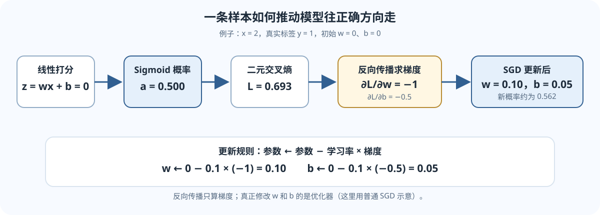

---
title: L03：神经网络与反向传播
description: 从张量形状和一个二分类小例子出发，理解前向计算、交叉熵、链式法则、梯度下降与 PyTorch 自动微分。
tags:
  - CS224N
  - neural-networks
  - backpropagation
  - PyTorch
---

## 本讲地图：模型怎样从错误中更新

一个神经网络可以看作一串可微的函数：

$$
\text{输入}\longrightarrow \text{预测}\longrightarrow \text{损失}
\longrightarrow \text{梯度}\longrightarrow \text{参数更新}.
$$

这五步要分清：**前向传播**算预测和损失；**反向传播**按链式法则算梯度；**优化器**用梯度改参数。反向传播不会自己更新权重，自动微分也不会替你检查标签和代码有没有写对。

本页先用「一个数字判成正类还是负类」做贯穿例子，再推广到多分类和批量张量。

*图：蓝色表示前向计算，金色表示反向传梯度。每个算子根据自己的局部导数，把上游敏感度继续传回去。*

*图：从零初始化开始，完整走过 logit、Sigmoid、二元交叉熵、参数梯度和一步 SGD 更新。*

## 1. 先看形状：张量就是带尺寸的数组

- **标量**只有一个数，例如损失 $0.693$。
- **向量**是一列数，例如一条样本的特征 $[x_1,\ldots,x_d]$。
- **矩阵**把多条向量排成批次。
- 更高维张量可以分别表示 batch、序列位置、特征等轴。

本讲采用「行向量按行排列」的记号。若一批 $B$ 条样本，每条有 $d_{\mathrm{in}}$ 个特征，则

$$
X\in\mathbb{R}^{B\times d_{\mathrm{in}}},\qquad
W\in\mathbb{R}^{d_{\mathrm{in}}\times d_{\mathrm{out}}},\qquad
b\in\mathbb{R}^{d_{\mathrm{out}}}.
$$

一次线性层计算为

$$
Z=XW+b\in\mathbb{R}^{B\times d_{\mathrm{out}}}.
$$

原因是矩阵相乘的内侧维度必须相同：$[B,d_{\mathrm{in}}]\times[d_{\mathrm{in}},d_{\mathrm{out}}]$，留下 $[B,d_{\mathrm{out}}]$。偏置 $b$ 会沿 batch 方向广播到每一行。PyTorch 的线性层通常存权重为 $[d_{\mathrm{out}},d_{\mathrm{in}}]$，执行时按内部约定等价地相乘；看代码时不要把数学记号的存储方向想当然。

线性层再接非线性函数，例如

$$
\operatorname{ReLU}(z)=\max(0,z),\qquad
\sigma(z)=\frac{1}{1+e^{-z}}.
$$

如果把很多线性层直接连在一起且中间没有非线性，它们仍然可以合并为单个线性变换；非线性让深层网络有能力表示更丰富的函数。

## 2. 用一个数值例子理解损失与梯度

假设输入 $x=2$，真实标签 $y=1$ 表示「正类」。最简单的逻辑回归模型为

$$
z=wx+b,\qquad a=\sigma(z),
$$

其中 $z$ 是 **logit**（未归一化的分数），$a$ 是预测为正类的概率。

令初始化 $w=0,b=0$。于是 $z=0$、$a=0.5$：模型此时像掷硬币。二元交叉熵把真实标签和预测概率比较：

$$
\mathcal L=-y\log a-(1-y)\log(1-a).
$$

因为 $y=1$，本例损失为 $-\log(0.5)\approx0.693$。如果正类概率更接近 1，损失就会下降；若模型很自信地猜错，损失会很大。

Sigmoid 和二元交叉熵组合后，关于 logit 的导数可以化简为 $a-y$。再用链式法则：

$$
\frac{\partial\mathcal L}{\partial z}=a-y,\qquad
\frac{\partial z}{\partial w}=x,\qquad
\frac{\partial z}{\partial b}=1,
$$

因此

$$
\frac{\partial\mathcal L}{\partial w}=(a-y)x,\qquad
\frac{\partial\mathcal L}{\partial b}=a-y.
$$

代入 $a=0.5,y=1,x=2$，得到 $w$ 的梯度 $-1$，$b$ 的梯度 $-0.5$。学习率取 $\eta=0.1$，普通 SGD 的更新规则是

$$
\theta\leftarrow\theta-\eta\nabla_\theta\mathcal L,
$$

所以 $w$ 更新为 $0.1$，$b$ 更新为 $0.05$。新 logit 为 $0.1\times2+0.05=0.25$，新概率约为 $\sigma(0.25)=0.562$，比更新前更偏向正确的正类。

梯度是「损失对参数的敏感度」：负号表示参数稍微增大时，损失倾向于下降。梯度下降在梯度前加负号，因此沿着让局部损失下降的方向移动。

## 3. 反向传播就是链式法则反复接力

把一个计算写成 $h=f(x)$、$\mathcal L=g(h)$。链式法则给出

$$
\frac{\partial\mathcal L}{\partial x}
=\frac{\partial\mathcal L}{\partial h}
 \frac{\partial h}{\partial x}.
$$

可以把它读成：“损失对 $x$ 的变化有多敏感” = “损失对中间量 $h$ 的敏感度” × “$h$ 对 $x$ 的敏感度”。网络有很多层时，就从损失开始逐层向前传递这个敏感度。每层会缓存前向计算所需的局部信息，例如 ReLU 哪些位置大于 0。

在向量和矩阵情形下，导数一般是 Jacobian 或其乘积；深度学习框架通常用反向模式自动微分，避免真的构造庞大的完整 Jacobian。标量损失对很多参数求导时，这种方式很合适。

## 4. 多分类：Softmax 与交叉熵

若模型有 $C$ 个候选类别，它为每类输出一个 logit $z_j$。Softmax 将它们归一化为概率：

$$
p_j=\frac{e^{z_j}}{\sum_{k=1}^{C}e^{z_k}}.
$$

若正确类别编号是 $y$，交叉熵等于正确类概率的负对数：

$$
\mathcal L=-\log p_y.
$$

例：logits 是 $[2,1,0]$，正确类为第 1 类。为了避免指数溢出，先减去最大值 2；Softmax 不变：

$$
[2,1,0]\longrightarrow[0,-1,-2],\qquad
p\approx[0.665,0.245,0.090].
$$

损失约为 $-\ln(0.665)=0.408$。减去最大 logit 只改变 logits 的共同偏移，不改变任何类别概率。

当目标为 one-hot 向量 $Y$，单条样本对 logits 的梯度为 $P-Y$。对 batch 的损失求平均时，整体梯度还会除以 batch 大小。正确类概率低时，正确类的 logit 梯度为负，梯度下降会提高它。

### PyTorch 里 logits 和标签的 shape

若 $B$ 条样本、每条有 $C$ 类分数：

| 量 | shape | 约定 |
|---|---:|---|
| logits | $[B,C]$ | 每行一条样本；每列一个类别 |
| target | $[B]$ | 每个元素是正确类别整数 ID，通常为 LongTensor |
| 每样本交叉熵 | $[B]$ | 每行取正确类别概率的负对数 |
| 默认平均损失 | 标量 | 对未忽略的样本求平均 |

通常直接把**原始 logits**传给 <code>torch.nn.functional.cross_entropy</code>；不要先手动 Softmax 再传入。该函数内部使用数值稳定的 log-softmax 与负对数似然计算。

## 5. 把手算例子映射到 PyTorch

下面这段代码刻意使用零初始化，让输出与上面手算的初始状态相同：

~~~python
import torch
import torch.nn.functional as F

x = torch.tensor([[2.0]])       # [B=1, 输入特征数=1]
y = torch.tensor([1.0])         # [B]，正类标签
w = torch.tensor([[0.0]], requires_grad=True)
b = torch.tensor([0.0], requires_grad=True)

logits = x @ w + b              # [1, 1]
loss = F.binary_cross_entropy_with_logits(
    logits.squeeze(-1), y
)                               # 标量
loss.backward()                 # 计算梯度，不会改 w、b
print(w.grad, b.grad)           # tensor([[-1.]]) tensor([-0.5000])
~~~

<code>binary_cross_entropy_with_logits</code> 把 Sigmoid 和交叉熵合并成数值更稳定的实现。注意 <code>backward()</code> 只负责计算并累加 <code>.grad</code>；要改参数还需要优化器。

一个常见的多分类写法是：

~~~python
logits = model(features)                    # [B, C]，未归一化分数
targets = torch.tensor([2, 0, 1])           # [B]，类别 ID
loss = F.cross_entropy(logits, targets)     # 默认对 batch 求平均
~~~

若使用梯度下降式优化器，训练一步大致是：清空上一批的梯度、前向计算、算损失、<code>loss.backward()</code>、<code>optimizer.step()</code>。PyTorch 默认会累加梯度，所以如果不清零，当前梯度会与先前 <code>.grad</code> 相加。

## 6. batch 平均、求和与训练集划分

对 $B$ 个样本的损失 $\ell_i$，平均损失是

$$
\mathcal L_{\mathrm{mean}}=\frac{1}{B}\sum_{i=1}^{B}\ell_i.
$$

若改成求和，梯度会放大约 $B$ 倍；这会改变有效步长。比较不同 batch 大小时，要确认损失采用 sum 还是 mean。

训练集用于更新参数；验证集用于选择超参数或检查泛化表现，不参与梯度更新。最终测试集应尽量只在选择完成后用于一次独立评估。若反复按验证结果挑模型，验证集信息也会间接影响选择。

## 容易混淆的地方

- **logit 不是概率。** 单个 logit 可以为任意实数；二分类概率通常经 Sigmoid，多分类概率通常经 Softmax。
- **损失低不保证每条样本都预测正确。** batch 平均可能掩盖少数困难例子，还应看准确率和任务相关指标。
- **反向传播不等于梯度下降。** 前者求导；后者根据导数更新参数。
- **自动微分不验证你的问题定义。** 标签错位、数据泄漏、维度广播错误依然可能产生可计算的梯度。
- **梯度清零是训练循环的一部分。** PyTorch 默认累加梯度，不清会把不同批次的梯度混在一起。
- **shape 能抓住错误，但不能保证语义正确。** $[B,C]$ 的交叉熵 shape 合法，不代表类别编号映射正确。

## 分层自测

### A. 直觉题

1. 如果模型对正确类的概率从 $0.2$ 提高到 $0.8$，交叉熵会如何变化？为什么？
2. 反向传播和优化器分别负责哪一步？

### B. 手算与形状题

3. 对 $X:[B,5]$、$W:[5,7]$、$b:[7]$，输出 $Z$ 的形状是什么？偏置怎样应用？
4. 二分类例子里 $x=2,y=1,w=b=0$，写出初始概率、损失、两个参数梯度以及学习率 $0.1$ 的 SGD 更新。
5. 三分类 logits 的 shape 为 $[8,4]$。若标签是类别 ID，target 应该是 $[8]$ 还是 one-hot 的 $[8,4]$？

### C. 应用题

6. 连续对同一批调用 <code>loss.backward()</code>，没有清梯度。梯度缓冲区通常会发生什么？
7. 某个实现先对 logits 做 Softmax，再调用 PyTorch 的交叉熵函数，通常该怎样修正？
8. 若训练损失持续下降但验证损失开始上升，这提供了什么信号？接下来应看什么？

答案提示与核对步骤

1. 损失从 $-\ln 0.2\approx1.609$ 降到 $-\ln0.8\approx0.223$；模型给真实类更多概率，负对数更小。
2. 反向传播求损失对参数的梯度；优化器读取梯度更新参数。
3. $Z:[B,7]$。长度为 7 的 bias 在 batch 的每一行广播相加。
4. $z=0,a=0.5,\mathcal L\approx0.693$；$\partial L/\partial w=-1,\partial L/\partial b=-0.5$；更新后 $w=0.1,b=0.05$。
5. 常用类别 ID 目标是 $[8]$，dtype 为整数；API 也可能支持概率分布目标，但这不是默认类别索引形式。
6. 梯度通常累加到已有梯度，数值约为单次的两倍（同一计算图仍可反传时）；实际写法还要考虑计算图是否已释放。
7. 直接传未 Softmax 的 logits。交叉熵实现内部会做稳定的 log-softmax，外部再 Softmax 会改变输入含义并增加数值风险。
8. 可能开始过拟合，但也要排除数据分布差异或评估噪声；检查验证指标、数据划分，并考虑早停或正则化。

## 课程材料与版本

- 本讲对应 Stanford CS224N Winter 2026 的 L03 Backpropagation and Neural Network Basics。
- [CS224N 官方课程主页](https://web.stanford.edu/class/cs224n/) · [官方 L03 课件 PDF](https://web.stanford.edu/class/cs224n/slides_w26/cs224n-2026-lecture03-neuralnets.pdf)
- 这篇中文讲解是独立撰写的学习材料，不是 Stanford 官方译文；推导符号可对照官方课件核验。
