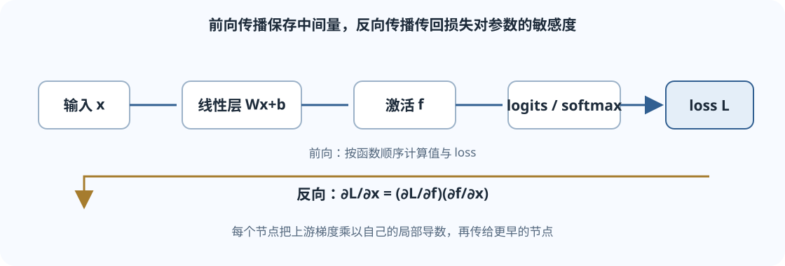

## 从输入到损失

一个神经网络由一连串可微运算组成。输入经过矩阵乘法、偏置和非线性函数，产生预测；损失函数把预测和目标比较成一个标量。训练的任务是调整参数，让平均损失下降。

线性层的一批输入写成矩阵 $X\in\mathbb{R}^{B\times d_{\text{in}}}$，权重采用“输入维在前、输出维在后”的约定：

$$
W\in\mathbb{R}^{d_{\text{in}}\times d_{\text{out}}},
\qquad b\in\mathbb{R}^{d_{\text{out}}},
\qquad Z=XW+b\in\mathbb{R}^{B\times d_{\text{out}}}.
$$

这里的偏置会沿批次维广播到每一行。若把权重存为转置形状，矩阵乘法顺序会改变，但数学含义相同；阅读代码时要先确认约定。

非线性激活让多层网络不再等价于一个大线性变换。常见例子有 ReLU：

$$
\operatorname{ReLU}(z)=\max(0,z),
$$

以及 Sigmoid：

$$
\sigma(z)=\frac{1}{1+e^{-z}}.
$$

## 交叉熵如何衡量预测

多分类模型输出每类一个 logit $z_j$。Softmax 把它转成概率：

$$
p_j=\frac{e^{z_j}}{\sum_{k=1}^{C}e^{z_k}}.
$$

若正确类别是 $y$，交叉熵损失是

$$
\mathcal{L}=-\log p_y.
$$

预测给正确类别的概率越高，损失越小。计算时通常先从每个样本的 logits 中减去最大值，再计算指数：

$$
\operatorname{softmax}(z)
=\operatorname{softmax}(z-\max_j z_j).
$$

减去同一个常数不改变 Softmax 概率，却能减少指数溢出的风险。实际库函数通常把 LogSoftmax 与负对数似然合并成数值稳定的交叉熵实现。

### 一个三分类手算例子

logits 为 $[2,1,0]$，目标类别是第一类。减去最大值后得到 $[0,-1,-2]$，指数近似为 $[1,0.368,0.135]$，归一化后

$$
p\approx[0.665,\;0.245,\;0.090].
$$

因此正确类别的损失约为

$$
\mathcal{L}=-\ln(0.665)\approx0.408.
$$

logits 的梯度是预测概率减去目标 one-hot 向量：

$$
\nabla_z\mathcal{L}
\approx[-0.335,\;0.245,\;0.090].
$$

负的第一项表示优化会提高正确类别 logit；其他类别的正梯度会推动它们下降。

## 反向传播就是链式法则的系统应用

考虑一个非常小的二分类模型：

$$
z=wx+b,\qquad a=\sigma(z),
$$

其中 $a$ 是模型预测输入属于正类的概率。对于标签 $y\in\{0,1\}$，二元交叉熵为

$$
\mathcal{L}=-y\log a-(1-y)\log(1-a).
$$

把损失对每个中间量的导数沿计算图向后传，得到

$$
\frac{\partial\mathcal{L}}{\partial z}=a-y,\qquad
\frac{\partial\mathcal{L}}{\partial w}=(a-y)x,\qquad
\frac{\partial\mathcal{L}}{\partial b}=a-y.
$$

*图：前向按函数次序计算，反向从损失出发按链式法则传回各个参数。*

### 数值例子：一步更新

设 $x=2$、$y=1$、$w=0$、$b=0$。初始 logit $z=0$，预测 $a=0.5$，损失为 $-\ln 0.5\approx0.693$。

梯度为

$$
\frac{\partial\mathcal{L}}{\partial w}=(0.5-1)\cdot2=-1,\qquad
\frac{\partial\mathcal{L}}{\partial b}=0.5-1=-0.5.
$$

若学习率 $\eta=0.1$，普通 SGD 更新为

$$
w\leftarrow w-\eta(-1)=0.1,\qquad
b\leftarrow b-\eta(-0.5)=0.05.
$$

更新后 $z=0.25$，预测概率高于 $0.5$，符合正类标签。这里反向传播只计算梯度；按学习率改变参数是优化器做的事。

## 批量训练时的形状与归约

若每个样本有 $C$ 个分类 logits：

| 张量 | 形状 | 作用 |
|---|---:|---|
| logits | $[B,C]$ | 每行一个样本的类别分数 |
| target | $[B]$ | 每个样本正确类别的整数 ID |
| 每样本损失 | $[B]$ | 正确类别的负对数概率 |
| batch 平均损失 | 标量 | 默认常见训练目标 |

如果使用 one-hot 目标 $Y\in\mathbb{R}^{B\times C}$，Softmax 交叉熵对 logits 的矩阵梯度为

$$
\frac{\partial \mathcal{L}}{\partial Z}=\frac{P-Y}{B},
$$

这里采用对 batch 求平均的约定。如果损失求和而非求平均，就没有除以 $B$。这会改变梯度尺度，也影响学习率的实际效果。

反向传播从标量损失开始，局部导数逐层相乘。若中间结果 $h=f(x)$、输出 $\mathcal{L}=g(h)$，链式法则是

$$
\frac{\partial\mathcal{L}}{\partial x}
=\frac{\partial\mathcal{L}}{\partial h}
\frac{\partial h}{\partial x}.
$$

在张量程序中，“相乘”可能是矩阵乘法、按元素乘法或 Jacobian-vector product；具体方向取决于张量的布局和所求梯度。

## 梯度、优化器和训练循环不是同一个步骤

一次基本更新可拆成：

1. 根据当前参数计算前向输出。
2. 计算标量损失。
3. 反向传播，得到各参数的梯度。
4. 优化器根据梯度更新参数。

在 PyTorch 中常见的控制顺序是清空旧梯度、前向、算损失、调用 **backward()**、调用 **optimizer.step()**。因为梯度默认累加，若忘记清空，当前更新会叠加上一次的梯度。

训练集用于更新参数，验证集用于检查未参与更新的数据表现。若反复根据验证集调超参数，验证集的信息也会逐渐影响选择；最终评估应留出未用于调参的数据。

## 容易混淆的地方

- **反向传播不是梯度下降。** 反向传播算导数，优化器才用导数移动参数。
- **低损失不是所有样本都正确。** 平均损失会掩盖少数困难样本；还要查看预测、准确率或任务相关指标。
- **批次平均会缩放梯度。** mean 与 sum 并不等价，不能在不调整学习率时随意替换。
- **张量形状能排除很多错误。** 对 $XW$ 而言，内侧维度必须相同；若输出类别数放错维度，Softmax 也可能沿错误轴计算。
- **自动微分不会替你选择正确目标。** 程序能对错误标签或错误张量求导；梯度存在并不说明训练定义正确。

## 自测

1. 对 $X:[B,d_{\text{in}}]$、$W:[d_{\text{in}},d_{\text{out}}]$，为什么输出是 $[B,d_{\text{out}}]$？
2. 多分类交叉熵为什么只取正确类别的概率？
3. 如果反向传播后再次计算梯度但没有清梯度，常见结果是什么？
4. 普通梯度下降中，若 $\partial\mathcal{L}/\partial w$ 为负，参数会往哪个方向改？

核对要点

1. 矩阵乘法 $[B,d_{\text{in}}]\times[d_{\text{in}},d_{\text{out}}]$ 得到 $[B,d_{\text{out}}]$。
2. 交叉熵是正确类别目标分布的负对数似然；提高正确类概率会降低损失。
3. 梯度默认累加，新的结果会叠加到已有的梯度缓存。
4. 更新 $w\leftarrow w-\eta\,\partial\mathcal{L}/\partial w$，负梯度会使 $w$ 增大。

## 课程材料与版本

- 官方对应课程：Stanford CS224N Winter 2026，L03 Backpropagation and Neural Network Basics。
- [官方 L03 课件 PDF](https://web.stanford.edu/class/cs224n/slides_w26/cs224n-2026-lecture03-neuralnets.pdf)；[课程主页与课表](https://web.stanford.edu/class/cs224n/)。
- 第三方中文补充：[L03 神经网络与反向传播原网页](https://www.dihengye.cn/cs224n/lectures/l03-neural-nets/)。该页面不是 Stanford 官方译本，公开再分发许可未确认；本站只链接原网页，未复制或托管其内容。

本页是独立中文说明，不复制第三方笔记或官方幻灯片文字。公式与课程范围可通过 Stanford 原课件核对。
