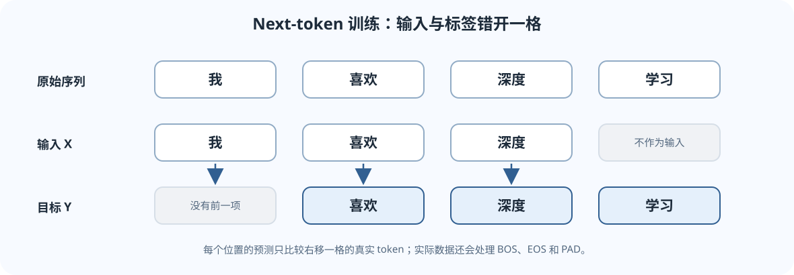

---
title: L04：语言模型与 RNN
description: 从下一个 token 预测理解语言模型、序列概率分解、RNN 隐状态、移位训练目标、困惑度与长程梯度难题。
tags:
  - CS224N
  - language-model
  - RNN
  - perplexity
---

## 本讲地图：语言模型是在给续写打分

给模型一句开头：「天冷了，我想喝一杯……」。语言模型要对下一个 token 的候选分配概率，例如「热茶」的概率高于不合语境的候选。它并不直接回答“句子对不对”，而是在学习文本序列中的条件概率。

本页围绕「我 喜欢 深度 学习」说明三件事：

1. 一段序列怎样拆成一连串 next-token 预测。
2. RNN 怎样用一个随时间更新的隐藏状态保存有限的历史摘要。
3. 训练和评估时，目标移位、概率和困惑度怎样对应。

*图：同一组递归参数在每个时间步重复使用。隐藏状态是对已读前文的有限摘要。*

*图：训练输入取序列前半段，目标取向右移一格的序列；每一列对齐一项 next-token 预测。*

## 1. 联合概率为什么可以写成一串预测

一段 token 序列是 $x_1,\ldots,x_T$。概率链式法则给出

$$
P(x_1,\ldots,x_T)
=\prod_{t=1}^{T}P(x_t\mid x_1,\ldots,x_{t-1}).
$$

读作：先给第一个 token 概率，再给定前一个 token 预测第二个，再给定前两个预测第三个，依此类推。这个等式适用于任何合法的联合分布；它并没有规定一定要使用 RNN。

真实训练时通常在序列开头加入开始符号 BOS，也可能加入结束符号 EOS。这样模型能学习序列何时开始、何时结束。批量数据会按长度补齐 PAD；PAD 不是自然语言目标，算损失时通常要屏蔽它。

## 2. n-gram 与 RNN：历史怎么保存

最简单的 bigram 模型只看上一个 token：

$$
P(x_t\mid x_1,\ldots,x_{t-1})\approx P(x_t\mid x_{t-1}).
$$

比如训练语料中「甲」后面出现「乙」3 次、「丙」1 次，未平滑的计数估计会给 $P(\text{乙}\mid\text{甲})=3/4$。真实语料里必须处理低频和从未出现的组合，否则概率可能被估为 0。

n-gram 固定只看最近几个 token。RNN 则用递归状态总结读过的前文：每读入一个新 token，就把它与上一时刻的状态合并。它仍有固定大小的状态，因此不是无限容量的“完美记忆”。

## 3. 一个基础 RNN 的状态更新

token ID 先查 Embedding 表，成为向量 $\mathbf e_t\in\mathbb R^{d_e}$。令隐藏状态 $\mathbf h_t\in\mathbb R^{d_h}$，一种基础 Elman RNN 写成

$$
\mathbf h_t
=\tanh(\mathbf e_t W_x+\mathbf h_{t-1}W_h+\mathbf b_h),
$$

其中 $W_x\in\mathbb R^{d_e\times d_h}$、$W_h\in\mathbb R^{d_h\times d_h}$、$\mathbf b_h\in\mathbb R^{d_h}$。按行向量记法，两个矩阵乘积的结果都是 $[d_h]$，所以可以相加。常用初始状态 $\mathbf h_0$ 为零向量或可学习向量。

每一步都用同一组 $W_x,W_h$，所以参数数目不会因句子变长而增加。读入新 token 后，状态更新为

$$
\mathbf h_t=f(\mathbf e_t,\mathbf h_{t-1}),
$$

再用输出层给下一 token 的词表 logits：

$$
\mathbf z_t=\mathbf h_tW_o+\mathbf b_o,\qquad
W_o\in\mathbb R^{d_h\times V},\qquad
\mathbf z_t\in\mathbb R^V.
$$

对 logits 做 Softmax 就得到 $P(x_{t+1}\mid x_{\le t})$。RNN 状态传递方向从左往右，因此在这个单向结构里，时刻 $t$ 不会读到未来 token。

## 4. 批量 shape 与「错开一格」的目标

设 token ID 批量为 $X\in\mathbb N^{B\times T}$，其中 $B$ 是序列条数，$T$ 是每条序列长度。查 Embedding 后 shape 为 $[B,T,d_e]$。沿时间递归后可得到隐藏状态 $[B,T,d_h]$，输出 logits 常为 $[B,T,V]$。

对序列「我 喜欢 深度 学习」，典型训练配对是：

| 时间位置 | 输入给模型的 token | 要预测的目标 |
|---:|---|---|
| 1 | 我 | 喜欢 |
| 2 | 喜欢 | 深度 |
| 3 | 深度 | 学习 |

所以输入是「我 喜欢 深度」，目标是「喜欢 深度 学习」。若目标没有向右错一格，模型可能只学会复制当前位置 token，而不是预测下一个 token。

批量数据对应地做切片：

~~~python
import torch
import torch.nn.functional as F

tokens = torch.tensor([[2, 5, 9, 4]])  # [B, T]
inputs = tokens[:, :-1]               # [B, T-1] = [[2, 5, 9]]
targets = tokens[:, 1:]               # [B, T-1] = [[5, 9, 4]]

logits = model(inputs)                # 约定输出 [B, T-1, V]
B, steps, vocab_size = logits.shape
loss = F.cross_entropy(
    logits.reshape(B * steps, vocab_size),
    targets.reshape(B * steps),
)
~~~

展平只是把每个时间位置当作一个分类样本；词表维 $V$ 仍是类别轴。含 PAD 的 batch 要用有效 token mask 或损失函数的 <code>ignore_index</code> 排除填充位置。具体 RNN API 的输入输出 layout 可能是 batch-first 或 time-first，必须查所用库的 shape 约定。

## 5. Teacher forcing：训练时模型看哪段前文

训练 next-token 模型时，常把真实前文喂给模型，这叫 teacher forcing。上例里模型第二步仍看到真实 token「喜欢」，而不是第一步自己猜出的 token。这样每个预测都能直接监督，计算也稳定。

自由生成时则不同：先用提示词预测一个 token，选择或采样后把它接回输入，再预测下一个；模型看到的是自己之前的输出。训练与生成的前文来源不同，预测错误会逐步影响后续结果。

## 6. 交叉熵和困惑度

只看真实目标 token 的平均负对数概率：

$$
\operatorname{NLL}
=-\frac1N\sum_{i=1}^{N}\log P(x_i\mid x_{<i}),
$$

其中 $N$ 是参与评估的目标 token 数。困惑度定义为平均 NLL 的指数：

$$
\operatorname{PPL}=\exp(\operatorname{NLL}).
$$

例：如果三个正确 token 的概率依次是 $1/2,1/4,1/8$，平均 NLL 为
$(\ln2+\ln4+\ln8)/3=\ln4$，所以 PPL 是 $4$。可以把它粗略理解为模型在这批文本上“平均有多难预测”；它不是“模型每一步真有 4 个选项”的严格说法。

PPL 越低通常表示模型对评估文本分配了更高的平均概率。但只有在数据、tokenizer、切分、特殊 token 处理和聚合方式一致时才适合比较。不同 tokenizer 会把同一句话切成不同数量和粒度的 token，因此 PPL 不能脱离评估协议直接横向比较。

## 7. 为什么 RNN 难学很远的关系

训练 RNN 时，损失梯度要沿着时间展开的状态链反传，这称为通过时间的反向传播。粗略地看，从较早时刻到较晚时刻的导数包含一连串 Jacobian 相乘：

$$
\left\|\frac{\partial\mathbf h_T}{\partial\mathbf h_t}\right\|
\leq
\prod_{k=t+1}^{T}
\left\|\frac{\partial\mathbf h_k}{\partial\mathbf h_{k-1}}\right\|.
$$

这里可取诱导算子范数（例如谱范数），它满足乘积范数不超过各因子范数之积。每个局部 Jacobian 描述“前一时刻状态的微小变化，会怎样影响下一时刻状态”；从 $t$ 到 $T$ 的总影响是这些局部变化按时间逐步传递的结果。上式用范数给出不依赖行向量/列向量记法的上界，避免把不可交换的矩阵乘积写成含糊的顺序。

如果长链路上的变化反复收缩，早期信息对应的梯度会消失；如果反复放大，梯度可能爆炸。梯度裁剪能限制过大的梯度，LSTM、GRU 通过门控改善信息和梯度的传递，但都不能保证任意长距离关系必然学好。

## 容易混淆的地方

- **语言模型是任务，RNN 是一种模型结构。** n-gram、RNN、Transformer 都可以做 next-token 预测。
- **隐藏状态是压缩摘要，不是完整原文。** 容量有限，长距离细节可能遗忘。
- **输入和目标必须错开。** 不移位可能造成当前位置泄漏，评估会虚高。
- **因果性依然重要。** 训练时不能让位置 $t$ 偷看目标位置之后的 token。
- **PPL 不是所有任务的通用质量分。** 它衡量特定 tokenization 下的序列概率，不能直接替代问答正确率等任务指标。
- **teacher forcing 不等于生成时总能看到真值。** 推理时后续输入通常来自模型自己。
- **batch 内的 PAD 不能随便计入损失。** 否则模型会被训练去预测补齐符号。

## 分层自测

### A. 直觉题

1. 概率链式法则和 RNN 是什么关系？它们分别规定了什么？
2. 为什么 RNN 能处理长度不同的序列，但隐藏状态仍然会丢失部分信息？

### B. 手算与形状题

3. token 序列为「甲 乙 丙 丁」，next-token 训练的输入和目标分别是什么？
4. 有 $B=3$ 条序列、每条长度 $T=7$，每个位置输出 $V=10000$ 个 logits。logits shape 是什么？展平后分类 logits 和标签 shape 各是什么？
5. 三个目标 token 的概率为 $1/2,1/4,1/8$，计算平均 NLL 与 PPL。

### C. 应用题

6. 若评估脚本用输入 <code>[甲,乙,丙]</code>，却把目标设成 <code>[甲,乙,丙]</code>，可能出现什么问题？
7. 模型训练 PPL 比验证 PPL 持续下降得快很多，应该检查哪些训练现象或数据细节？
8. 两个模型 tokenizer 不同，为什么不能只比较各自报告的 PPL 来宣布胜负？

答案提示与核对步骤

1. 链式法则把联合分布分解为条件概率乘积；它不限定网络结构。RNN 是一种具体的递归参数化方式，用状态估计这些条件分布。
2. 同一组递归函数逐步应用，因此长度可变；状态维度固定，必须把全部前文压进有限向量，信息可能遗失。
3. 输入 <code>[甲,乙,丙]</code>，目标 <code>[乙,丙,丁]</code>。
4. logits 为 $[3,7,10000]$；展平后 logits 为 $[21,10000]$，类别 ID 标签为 $[21]$。
5. 平均 NLL $=\ln4$，PPL $=4$。
6. 模型可能学成复制当前位置，目标信息泄漏造成错误评估。
7. 可能过拟合。查看训练与验证曲线、划分与去重、训练和评估预处理是否一致、PAD 是否计入损失等。
8. 切分粒度会改变目标 token 数和 NLL 平均单位；应采用一致数据、tokenizer 和协议，必要时补充按字节或按字符等可比指标。

## 课程材料与版本

- 本讲对应 Stanford CS224N Winter 2026 的 L04 Language Models and RNNs。
- [CS224N 官方课程主页](https://web.stanford.edu/class/cs224n/) · [官方 L04 课件 PDF](https://web.stanford.edu/class/cs224n/slides_w26/cs224n-2026-lecture04-rnnlm.pdf)
- 这篇中文讲解是独立撰写的学习材料，不是 Stanford 官方译文；章节范围和符号可对照官方课件核验。
