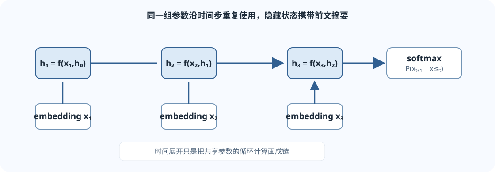

## 语言模型在回答什么问题？

语言模型给一个 token 序列分配概率，或根据前文预测下一个 token。把序列写成 $x_1,\ldots,x_T$，概率链式法则给出

$$
P(x_1,\ldots,x_T)
=\prod_{t=1}^{T}P(x_t\mid x_1,\ldots,x_{t-1}).
$$

这个等式本身不要求使用 RNN；它只是把联合概率改写成一连串条件概率。实际语言模型要学习每个条件分布。生成时先从起始上下文得到下一个 token，再把新 token 接到上下文末尾并重复。

为了让模型有一个明确任务，训练语料里每个位置都可以变成一个预测样本：给定当前位置之前的 token，预测当前位置的真实 token。这叫 next-token prediction。

## 从 n-gram 到 RNN

最简单的 bigram 模型只看紧邻的前一个 token：

$$
P(x_t\mid x_1,\ldots,x_{t-1})\approx P(x_t\mid x_{t-1}).
$$

它可以直接统计相邻 token 的频数。若训练语料中 token “甲”后接“乙”三次、接“丙”一次，最大似然估计会给出

$$
P(\text{乙}\mid\text{甲})=\frac{3}{3+1}=0.75.
$$

真实数据中还需要平滑或其他处理，避免未见过的转移概率恰好为零。

n-gram 的上下文长度固定；如果窗口很大，可能遇到大量稀有组合。RNN 改为递归更新一个固定维度的隐藏状态，把此前的信息压进状态向量中。

## RNN 的状态更新

设 token $x_t$ 的嵌入为 $e_t\in\mathbb{R}^{d_e}$，隐藏状态为 $h_t\in\mathbb{R}^{d_h}$。一个基础 Elman RNN 可写成

$$
h_t=\tanh(e_tW_x+h_{t-1}W_h+b_h),
$$

其中

$$
W_x\in\mathbb{R}^{d_e\times d_h},
\qquad W_h\in\mathbb{R}^{d_h\times d_h}.
$$

用行向量约定时，$e_tW_x$ 和 $h_{t-1}W_h$ 都是 $[d_h]$，因此它们可以相加。输出层把隐藏状态映射到词表 logits：

$$
z_t=h_tW_o+b_o,
\qquad W_o\in\mathbb{R}^{d_h\times V},
\qquad z_t\in\mathbb{R}^{V}.
$$

同一组 $W_x,W_h,W_o$ 在每个时间步重复使用。这样模型可以处理不同长度的序列，参数量不会随着句长线性增加。

*图：每个时间步接收当前 token embedding 与上一隐藏状态，生成新的隐藏状态和下一 token 分布。*

### 批量计算形状

令输入 token ID 为 $X\in\mathbb{N}^{B\times T}$，嵌入后为

$$
E[X]\in\mathbb{R}^{B\times T\times d_e}.
$$

隐藏状态按时间步更新。把各步输出堆叠后，logits 通常是 $[B,T,V]$。隐藏状态本身常见形状是 $[B,d_h]$；若使用多层 RNN，框架可能再增加层数和方向维，因此阅读 API 时必须以具体实现的形状约定为准。

## 训练时输入与目标错开一格

文本 token ID 若为

$$
[a,b,a,b],
$$

那么模型输入可取 $[a,b,a]$，目标取 $[b,a,b]$。每个位置预测下一个位置；不能把同一位置作为自己的目标。

对 batch 形式的输入 $X:[B,T]$，一种常见准备方式是：

- 输入：原序列的前 $T-1$ 个 token，形状 $[B,T-1]$；
- 目标：原序列从第二个 token 开始的部分，形状 $[B,T-1]$；
- logits：模型对每个位置预测词表，形状 $[B,T-1,V]$。

计算交叉熵时，常把 logits 展平为 $[B(T-1),V]$，目标展平为 $[B(T-1)]$。也可以使用支持序列维度的损失实现，但要确认它把哪一维当作类别维。

因果语言模型训练必须保证位置 $t$ 看不到未来 token。RNN 按从左到右的状态更新自然满足这一点；带自注意力的模型则用因果 mask 明确屏蔽未来位置。

## 交叉熵与困惑度

真实目标 token 的平均负对数似然可以写成

$$
\operatorname{NLL}
=-\frac{1}{N}\sum_{i=1}^{N}\log P(x_i\mid x_{<i}).
$$

困惑度定义为平均 NLL 的指数：

$$
\operatorname{PPL}=\exp(\operatorname{NLL}).
$$

在同一 tokenization、同一数据与相同评估协议下，更低的 PPL 表示模型给真实 token 分配了更高的平均概率。PPL 不是“模型会多少题”的直接评分；它衡量的是特定 token 序列上的概率质量。

## 为什么长距离依赖难学？

反向传播穿过 RNN 的时间展开图时，早期状态的梯度会经过许多次状态变换。粗略地看，梯度包含一串 Jacobian 的乘积：

$$
\frac{\partial h_T}{\partial h_t}
=\prod_{k=t+1}^{T}\frac{\partial h_k}{\partial h_{k-1}}.
$$

若这些变换的范数长期小于 1，梯度可能快速缩小，早期 token 的影响难以传到当前损失；若长期大于 1，梯度也可能变得很大。LSTM、GRU 和梯度裁剪等方法缓解了一部分训练问题，但并不意味着序列建模自动变简单。

## 容易混淆的地方

- **语言模型是概率建模任务，不等同于某个网络结构。** n-gram、RNN、Transformer 都可以学习条件概率。
- **RNN 的隐藏状态是压缩表示。** 它容量有限；远距离信息可能被遗忘或难以通过训练信号传递。
- **目标必须向后移一位。** 如果目标没移位，代码可能学成复制当前 token。
- **训练时因果性仍重要。** 如果输入包含整段文本却没有遮挡未来，模型会得到不公平的信息。
- **PPL 的比较要遵守协议。** tokenization、数据清洗或平均方法不同时，单独比较数值可能误导。
- **Teacher forcing 不代表推理时总能看到真实前文。** 训练时常喂真实 token，生成时后续上下文来自模型自己的预测。

## 自测

1. 为什么 $P(x_1,\ldots,x_T)$ 可以分解成一组条件概率的乘积？
2. RNN 的权重为什么能用于不同长度的序列？
3. 输入序列为 $[a,b,c,d]$ 时，next-token 训练的输入与目标应如何配对？
4. 在 tokenization 不同的情况下，为什么 PPL 不一定适合直接比较？

核对要点

1. 这是概率链式法则：联合概率可依次写成 $P(x_1)P(x_2\mid x_1)\cdots$。
2. 同一个状态更新函数按时间步反复应用，参数数目不依赖序列长度。
3. 输入 $[a,b,c]$，目标 $[b,c,d]$。
4. PPL 的指数来自按 token 计的平均 NLL；token 单位与切分改变了计数和分母。

## 课程材料与版本

- 官方对应课程：Stanford CS224N Winter 2026，L04 Language Models and RNNs。
- [官方 L04 课件 PDF](https://web.stanford.edu/class/cs224n/slides_w26/cs224n-2026-lecture04-rnnlm.pdf)；[课程主页与课表](https://web.stanford.edu/class/cs224n/)。
- 第三方中文补充：[L04 语言模型与 RNN 原网页](https://www.dihengye.cn/cs224n/lectures/l04-rnn-and-lm/)。该页面不是 Stanford 官方译本，公开再分发许可未确认；本站只链接原网页，未复制或托管其内容。

本页是独立中文讲解，不是 Stanford 官方译文。课次和链接以 Winter 2026 公开课程页面为准。
