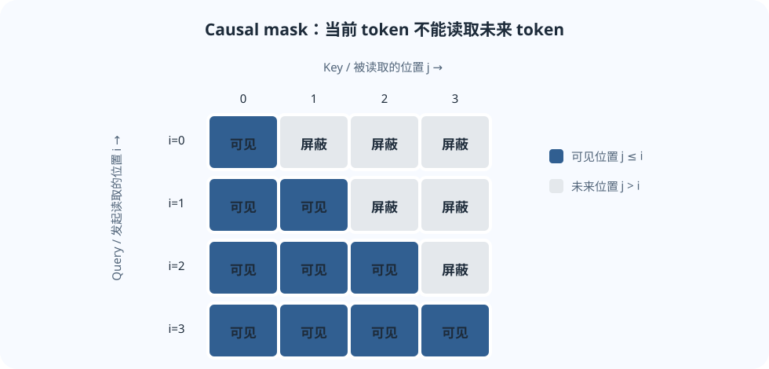
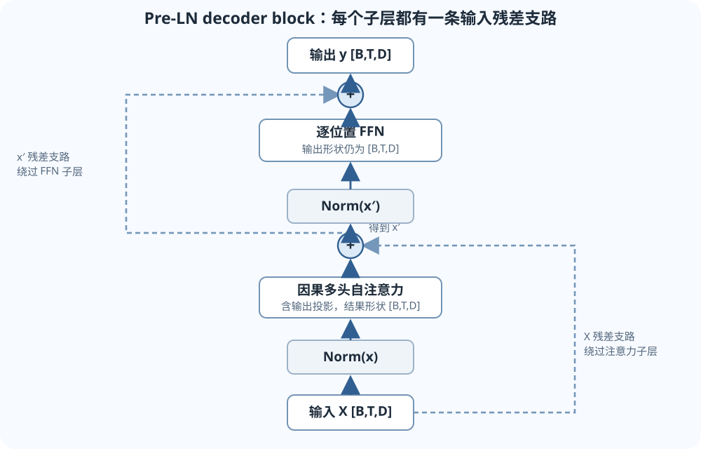

## 为什么需要 Attention？

处理句子中的一个位置时，模型通常需要参考句子里的其他位置。RNN 把信息逐步传给后续位置；自注意力则让每个位置直接比较当前查询与可见位置的 Key，再按权重汇总它们携带的信息。

权重会随当前上下文改变。同一个词在不同句子里，可能需要读取完全不同的位置。这里的“读取”是对向量做加权求和，不是查一个固定的词典。

## Query、Key、Value 的计算

把一批 token 的隐藏状态写成

$$
X\in\mathbb{R}^{B\times T\times D},
$$

其中 $B$ 是 batch 大小，$T$ 是序列长度，$D=d_{\text{model}}$ 是每个 token 的隐藏维数。第一层的 $X$ 通常由 token embedding 与位置表示组成，后续层的 $X$ 则是上一层的输出。

在单头例子中，省略可选偏置项，令

$$
W_Q,W_K\in\mathbb{R}^{D\times d_k},
\qquad
W_V\in\mathbb{R}^{D\times d_v}.
$$

对同一份输入做三组可学习的线性投影：

$$
Q=XW_Q,\qquad K=XW_K,\qquad V=XW_V,
$$

因此 $Q,K\in\mathbb{R}^{B\times T\times d_k}$，$V\in\mathbb{R}^{B\times T\times d_v}$。自注意力中三者都来自同一个 $X$，但使用不同的投影矩阵。Q、K、V 可以分别理解为“要找什么”“各位置用来匹配的特征”和“匹配后读出的内容”；这些是帮助理解的比喻，真正参与计算的是投影后的向量。

对每个 Query 与所有 Key 做点积，得到匹配分数；经 Softmax 变成权重，再用权重对 Value 求和：

$$
\operatorname{Attn}(Q,K,V)
=\operatorname{softmax}\!\left(
\frac{QK^\top}{\sqrt{d_k}}+M
\right)V.
$$

这里 Softmax 沿 Key 的位置维归一化。对某个固定 Query，它对所有允许读取的 Key 的权重之和为 1。对四维分数张量 $[B,H,T,T]$ 来说，Key 位置在最后一维，所以 PyTorch 写 `dim=-1`。$M$ 是加到分数上的 additive mask；没有遮挡时可省略，或取全零。

除以 $\sqrt{d_k}$ 是为了让点积的尺度不随维度变大而不断增大。若 Q、K 各维方差约为 1 且分量近似独立，点积的方差会随 $d_k$ 增长；除以 $\sqrt{d_k}$ 后，分数方差回到约 1，可减小 Softmax 过度饱和。

### 对应到 PyTorch 张量操作

下列写法假设 Q、K、V 已经整理成多头形状，且 `M` 是可加到分数上的 mask，形状可广播到 `[B,H,T,T]`：

```python
# Q, K: [B, H, T, d_k]；V: [B, H, T, d_v]
scores = Q @ K.transpose(-2, -1) / math.sqrt(d_k)  # [B, H, T, T]
weights = torch.softmax(scores + M, dim=-1)         # 对每个 Query 的 Key 位置归一化
context = weights @ V                               # [B, H, T, d_v]
```

`transpose(-2, -1)` 只交换 K 的最后两维，把 `[B,H,T,d_k]` 变成 `[B,H,d_k,T]`。不要对四维 K 直接用 PyTorch 的 `K.T`：多维 `.T` 会反转所有维度，和这里需要的转置不同。

### 一个带上下文的两位置手算例子

把当前 Query 想成句子里“它”这个位置正在读取前文；两个候选位置分别是“小猫”和“蝴蝶”。真实模型会把上下文隐藏状态投影成向量，下面把这些向量压成标量，只为方便手算，不代表词语有固定的标量编码。

令 $q=1$，两个 Key 为 $k_1=1,k_2=2$，对应 Value 为 $v_1=10,v_2=20$。暂时不考虑缩放和 mask，logits 为 $[1,2]$。Softmax 权重为

$$
[\alpha_1,\alpha_2]
=\operatorname{softmax}([1,2])
\approx[0.269,0.731].
$$

读出的内容是 Value 的加权和：

$$
\alpha_1v_1+\alpha_2v_2
\approx 0.269\cdot10+0.731\cdot20
=17.31.
$$

第二个 Key 与这个 Query 的点积更大，所以第二个位置携带的 Value 对结果影响更大。模型会为每个 Query 分别做这样的读取；真实计算使用向量，并且 Q/K/V 投影会在训练中学习。

## 因果遮罩：不能偷看未来

自回归语言模型在位置 $i$ 只能读取位置 $j\le i$。这里 $i$ 表示 Query 所在的行，$j$ 表示 Key 所在的列；位置编号从 0 开始：

$$
M_{ij}=
\begin{cases}
0,&j\le i,\\
-\infty,&j>i,
\end{cases}
\qquad i,j\in\{0,\ldots,T-1\}.
$$

加上 $-\infty$ 后，被屏蔽位置的 Softmax 权重严格为 0。某些实现用很大的有限负数（例如 `-1e9`）代替 $-\infty$；数学上权重只是接近 0，具体浮点计算中也可能因下溢变成 0。布尔 mask 的 True/False 极性由 API 决定，使用前应查对应函数的约定。

以长度为 4 的序列为例，矩阵的每一行是一个 Query，每一列是一个 Key；1 表示允许读取，0 表示屏蔽：

$$
\begin{bmatrix}
1&0&0&0\\
1&1&0&0\\
1&1&1&0\\
1&1&1&1
\end{bmatrix}.
$$



*图：Query 位置 $i$ 只能读取列 $j\le i$ 的 Key；右上三角是未来位置。*

## 多头注意力与完整形状

以下先讲常见的等宽多头注意力：特征维 $D$ 能被头数 $H$ 整除，并令每头

$$
d_k=d_v=d_{\text{head}}=D/H.
$$

Q/K/V 不是直接把原始 $X$ 切成几段，而是先分别做可学习投影，再把投影结果重排成头维。省略偏置时，$W_Q,W_K\in\mathbb{R}^{D\times(Hd_k)}$，$W_V\in\mathbb{R}^{D\times(Hd_v)}$；重排后

$$
Q,K\in\mathbb{R}^{B\times H\times T\times d_k},
\qquad
V\in\mathbb{R}^{B\times H\times T\times d_v}.
$$

矩阵乘法会在每个 batch、每个 head 内对序列位置配对。下表最后两维按 PyTorch `transpose(-2,-1)` 与 `dim=-1` 的约定：

| 中间量 | 形状 | 含义 |
|---|---:|---|
| `Q @ K.transpose(-2, -1)` | $[B,H,T,T]$ | 每个 Query 对每个 Key 位置的分数 |
| `softmax(scores, dim=-1)` | $[B,H,T,T]$ | 每个 Query 在可见 Key 位置上归一化 |
| `weights @ V` | $[B,H,T,d_v]$ | 每个位置汇总 Value |
| 拼接各头 | $[B,T,Hd_v]$ | 合并各头的输出特征 |
| 输出投影 `W_O` | $[B,T,D]$ | $W_O\in\mathbb{R}^{(Hd_v)\times D}$，回到残差所需的模型维度 |

不同头可以学习不同的投影和关注模式，但不能保证每个头都对应一个人类可命名的语言学功能。现代模型也可能使用不同的 Q/K/V 头数或头维度；上面的等宽设定是理解标准多头注意力的起点。

## Transformer block 的两部分

一个常见的 decoder-only block 依次做因果自注意力和逐位置前馈网络（FFN）。FFN 对每个 token 分别应用相同参数，不会在 token 之间交换信息：

$$
\operatorname{FFN}(x)
=W_2\,\phi(W_1x+b_1)+b_2.
$$

这里 $x$ 是某个位置的 $D$ 维向量，$W_1$ 通常把隐藏维扩展到较大的中间维，$W_2$ 再投影回 $D$。所以 FFN 的输入、输出都能与该位置的残差相加。

下面画的是一种 Pre-LN block。$x$、$x'$、$y$ 都具有 `[B,T,D]` 形状；每个相加节点两边也必须同形。残差支路把子层输入直接送到输出相加处，保留原表示并提供一条直接的信息和梯度路径。



*图：主干依次经过 Norm、子层和相加；第一条残差支路传递 $x$，第二条传递 $x'$。*

一种 Pre-LayerNorm 写法是

$$
x'=x+\operatorname{MHA}(\operatorname{Norm}(x)),
\qquad
y=x'+\operatorname{FFN}(\operatorname{Norm}(x')).
$$

此处 MHA 包括拼接各头和输出投影 $W_O$，所以输入与输出形状均为 `[B,T,D]`。Norm 沿每个 token 的最后一维 $D$ 计算，不跨 batch 或 token 位置统计。LayerNorm 会减去均值并按方差缩放；RMSNorm 按均方根缩放，通常不减均值。两者通常都含可学习缩放参数；具体实现与参数配置会有差异。Pre-LN 是一种常见结构，Post-LN 等其他结构也存在，不能把单一写法当作所有 Transformer 的固定定义。

## 位置线索与三类 Transformer

对于不带位置线索的双向 self-attention，单靠 token 内容做注意力会对输入排列呈等变性：同时重排输入 token，输出也会按同样方式重排，模型本身无法知道原顺序。位置向量、相对位置偏置或 RoPE 等机制可以给模型提供位置线索。

Decoder 的因果 mask 也编码了“只能看左侧”的可见结构，但它主要规定哪些位置能互相读取，不等同于常规的位置表示机制。两者的作用需要区分。

- **Encoder** 通常允许一个输入位置查看整段输入，适合双向表示任务。
- **Decoder-only 模型** 通常使用因果 mask，按自回归方式生成。
- **Encoder–decoder** 由 Encoder 读取源序列，Decoder 生成目标序列。Decoder 的交叉注意力中，Q 来自 Decoder 当前隐藏状态，K 和 V 来自 Encoder 输出；若源长度为 $T_s$、目标长度为 $T_t$，分数形状为 `[B,H,T_t,T_s]`。

“Transformer”描述一类网络结构；“decoder-only 语言模型”是在这类结构上的一种具体安排。

## 容易混淆的地方

- **Attention 权重不是完整解释。** 它只显示该子层对可见 Key 的权重分配；Value 投影、输出投影、残差和后续层都会改变最终影响。
- **mask 的极性取决于实现。** 先查 API 文档，再用长度为 3 的例子验证“位置 0 看不到位置 1、2”。
- **Softmax 轴很关键。** 对 `[B,H,T,T]` 的分数，最后一维是 Key 位置；固定一个 Query 后，权重沿 Key 轴求和为 1。
- **形状能揭示错位。** 注意力分数最后两维应为 `[T,T]`；在 PyTorch 中需交换 K 的最后两轴。
- **多头不是复制 H 个完整模型。** 每个头使用投影后的一部分通道；各头输出拼接后还要经过 `W_O`。
- **因果遮罩是训练约束的一部分。** 若未来 token 未被屏蔽，训练时可能读到答案信息，生成时却没有同样信息，训练目标就与使用方式不一致。

## 自测

1. 给定 $Q,K\in\mathbb{R}^{B\times H\times T\times d_k}$，注意力分数的形状是什么？PyTorch 中要怎样转置 K？
2. 除以 $\sqrt{d_k}$ 的目的是什么？
3. 长度为 3 时，位置 1 可以关注哪些位置？位置编号从 0 开始。
4. 多头结果 `[B,H,T,d_v]` 怎样变回 `[B,T,D]`？
5. 对分数 `[B,H,T,T]`，若 Softmax 沿 Query 轴而非 Key 轴计算，哪个“和为 1”的性质会改变？
6. 为什么 Pre-LN 的残差相加要求子层输出回到 `[B,T,D]`？Norm 在哪个轴上计算？
7. 交叉注意力中的 Q、K、V 分别来自哪里？

<details>
<summary>核对要点</summary>

1. `[B,H,T,T]`；使用 `K.transpose(-2, -1)`，仅交换最后两轴。
2. 控制点积尺度。若各维方差约为 1，未缩放点积方差随 $d_k$ 增长；缩放可减少 Softmax 过度饱和。
3. 位置 1 能看位置 0 和 1，不能看位置 2。
4. 先把头维移到序列维旁，再合并 $H$ 与 $d_v$ 得 `[B,T,Hd_v]`，乘输出投影 $W_O\in\mathbb{R}^{(Hd_v)\times D}$，得到 `[B,T,D]`。
5. 正确时固定一个 Query，对 Key 位置求和为 1。若改沿 Query 轴归一化，则固定一个 Key 的列方向求和为 1；每个 Query 那一行不再保证和为 1。
6. 两个相加项必须形状一致；attention/FFN 需要输出维度为 $D$。LayerNorm/RMSNorm 在每个 token 的最后一维 $D$ 上计算。
7. Q 来自 Decoder 隐藏状态；K、V 来自 Encoder 输出。

</details>

## 课程材料与版本

- 官方对应课程：Stanford CS224N Winter 2026，L05 Transformers。
- [官方 L05 课件 PDF](https://web.stanford.edu/class/cs224n/slides_w26/cs224n-2026-lecture05-transformers.pdf)；[课程主页与课表](https://web.stanford.edu/class/cs224n/)。
- 第三方中文补充：[L05 Attention 与 Transformer 原网页](https://www.dihengye.cn/cs224n/lectures/l05-transformers/)。该页面不是 Stanford 官方译本，公开再分发许可未确认；本站只链接原网页，未复制或托管其内容。

本页为独立中文讲解，不是 Stanford 官方译文。若课件中的符号与此页记号不同，以课件上下文为准。