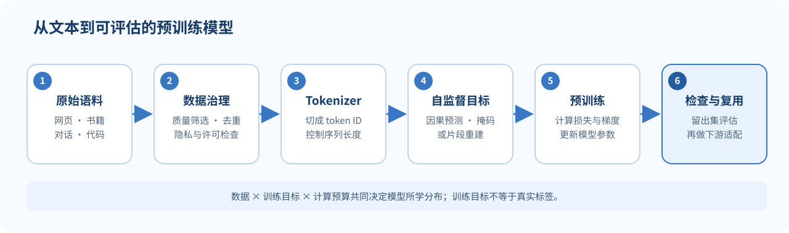

## 预训练为什么有用？

监督任务的数据通常比较少，而且每种任务都要单独收集标签。互联网上的大量文本本身没有人工标注，却含有丰富的共现、句法和事实线索。预训练把“根据文本的一部分预测另一部分”当作监督任务，先让模型学习通用表示，再用下游数据调整它。

这里的“自监督”不是没有目标，而是目标标签由原始文本自动构造。例如，句子中下一个 token、被遮住的词，都是训练信号。预训练学到的是训练目标与数据分布下有用的规律；它不保证每个记住的关联都真实，也不能消除数据的偏差。

*图 1. 预训练的数据与目标流程。数据治理和评估贯穿训练链路；图中流程为概念示意。*

## 三种常见的预训练目标

### 1. 因果语言模型：预测下一个 token

自回归模型按从左到右的条件概率分解序列：

$$
P_\theta(x_1,\ldots,x_T)
=\prod_{t=1}^{T}P_\theta(x_t\mid x_{<t}).
$$

忽略起始位置等边界细节，训练损失是每个位置正确 token 的负对数概率：

$$
\mathcal{L}_{\text{CLM}}
=-\sum_{t=1}^{T}\log P_\theta(x_t\mid x_{<t}).
$$

例如文本 token 为「猫、吃、鱼」，输入位置「猫、吃」分别监督目标「吃、鱼」。模型在训练中看不到目标位置之后的 token；因此它可以直接用同一目标逐 token 生成文本。

若批次输入为 $X\in\mathbb{N}^{B\times T}$，模型输出 logits 通常为 $[B,T,V]$，其中 $V$ 是词表大小。目标 token ID 为 $[B,T]$。实现中需要把目标向右错开一位，并让注意力遮住未来。

### 2. 掩码语言模型：恢复被遮住的内容

双向编码器希望一个位置能同时使用左、右上下文。若训练目标是预测每个位置的下一个 token，模型就不能在生成时直接访问未来而又声称使用了双向上下文。掩码语言模型改为随机选取一组位置 $M$，将这些输入位置替换或扰动，再只在被选位置上预测原 token：

$$
\mathcal{L}_{\text{MLM}}
=-\sum_{i\in M}
\log P_\theta(x_i\mid \widetilde{x}_{1:T}),
$$

其中 $\widetilde{x}$ 表示经过遮蔽或替换的输入。被预测的位置仍可以读取两侧未被遮住的上下文，因此适合训练双向表示。

例子：原句「小猫在窗边睡觉」，输入可能变成「小猫在 [MASK] 睡觉」，模型预测被替换的位置。实际训练会采用更丰富的遮蔽策略，避免模型只学会识别单一的 [MASK] 符号。

### 3. Encoder–decoder：把输入改写成目标序列

编码器读取完整输入，解码器依据输入表示和已生成的目标前缀预测目标 token。目标可以是翻译，也可以是从输入中挖去若干连续片段后，让解码器按顺序重建这些片段。后者称为 span corruption。

这种设计统一了“读入一段内容”和“生成另一段内容”：编码器提供源上下文，解码器用自回归目标逐 token 生成答案。它适合输入与输出都具有序列结构的任务。

## 一个小例子：同一段文本，不同监督任务

原文是“春天 花 开了”：

| 目标 | 模型读到的内容 | 要预测什么 |
|---|---|---|
| 因果语言模型 | 春天 花 | 下一 token 开了 |
| 掩码语言模型 | 春天 [MASK] 开了 | 被遮住的 花 |
| Span corruption | 输入中移除一段并放置占位符 | 解码器生成被移除的完整片段 |

差别不是“哪一种模型更懂语言”，而是训练时允许读取的上下文、预测目标与架构安排不同。一个目标学到的能力也受数据和训练方式影响。

## 子词与开放词表

纯词级词表会遇到新名字、拼写变化和罕见词。若每种罕见形式都占一个独立词表项，词表会膨胀；若未见词统统变成 [UNK]，模型又失去词内信息。

子词方法把常见词保留成较大的片段，把少见词拆成更小单元。BPE 的基本思路是：从字符或字节单元开始，统计相邻 token 对的频率，反复合并高频 pair，并把合并顺序保存下来供编码时使用。

一个玩具语料包含 abab 和 abac。若当前最常见相邻 pair 是 a b，合并后可得到 ab ab 与 ab a c。真实实现还需处理词边界、特殊 token、Unicode 字节和并列频率等细节。

## 预训练的边界

- **预训练损失不是事实正确率。** 模型被训练去拟合文本概率，文本中的错误与偏见也可能被学到。
- **编码器和自回归解码器的目标不同。** 双向 MLM 表示很有用，但生成任意长文本时通常需要额外设计。
- **“无标签”并非“无选择”。** 语料来源、清洗规则、tokenizer、遮蔽方式和训练预算都会影响模型学到什么。
- **更大的训练规模不自动带来目标能力。** 需要结合任务评测、数据质量、训练动态和使用成本判断。
- **词表策略会影响后续计算。** 相同文字可能被不同 tokenizer 切成不同数量的 token，改变上下文长度和按 token 计的损失。

## 自测

1. 因果语言模型的目标 token 能看到它后面的真实 token 吗？为什么？
2. MLM 为什么只对选中的遮蔽位置计算主要预测损失？
3. Encoder–decoder 如何同时利用完整输入并生成目标文本？
4. 子词表示怎样缓解词表外词问题？它又带来什么取舍？
5. logits 为 $[B,T,V]$ 时，目标 token ID 的形状通常是什么？

核对要点

1. 不能。条件分布只依赖 $x_{<t}$，注意力实现必须屏蔽未来。
2. 未被遮蔽的位置通常直接出现在输入中，预测它们不能提供相同的恢复任务信号。
3. 编码器提供输入表示；自回归解码器逐位置生成目标。
4. 罕见词可拆成已知子词或字节；代价是切分可能不直观，且序列长度随切分方式变化。
5. 通常为 $[B,T]$，每个位置是一个词表类别的整数 ID。

## 来源与版本

- Stanford CS224N Winter 2026：课程表将本讲列为 **L07 Pretraining (Scaling, Systems, Data)**；课程表中的官方材料：[L07 课件 PDF](https://web.stanford.edu/class/cs224n/slides_w26/cs224n-2026-lecture07-pretraining.pdf)。
- 该 PDF 封面标记为 “Lecture 6: Pretraining”，与课程表/文件名中的 L07 不同。本页沿用课程表课次，并保留这一来源编号差异。
- [课程主页与课表](https://web.stanford.edu/class/cs224n/)。本页是独立中文教学说明，不是 Stanford 官方译文，也未翻译或复刻幻灯片。

**继续阅读：**[[L08-后训练|L08 后训练]] · [[L14-分词与多语言|L14 分词与多语言]]
