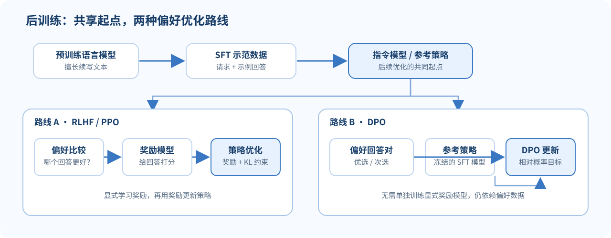

> **读完这讲应能做到：**区分示范答案与偏好比较；读懂 SFT 的序列概率目标；说明奖励模型、RLHF 的 KL 约束和 DPO 的相对概率；指出奖励投机可能怎样发生。

**前置知识：**把策略 $\pi_\theta$ 理解为“给定上下文后在词表上输出概率的模型”。条件概率和负对数似然不熟时先读 [[L07-预训练|L07 预训练]]。

## 为什么预训练之后还要训练？

预训练模型主要学习文本如何延续。给它一个请求时，它可能续写与请求相关的文字，却不一定按用户想要的格式回答、承认不知道，或遵循约束。后训练从预训练权重出发，使用示范答案与偏好反馈，改变模型对指令的响应方式。

“回答更像示范”与“回答真实、有帮助、安全”不是同一件事。后训练优化的是定义出来的数据目标；如果目标数据有漏洞，模型也可能学会迎合评分方式。

### 一个贯穿例子：解释蒸发

用户问：“用一句话解释蒸发。”预训练目标只要求模型续写训练文本；SFT 示范教它输出简短定义；偏好比较可以区分准确简洁的回答与冗长跑题的回答；奖励优化则提高模型产生高分回答的倾向。如果奖励器偏爱“听起来很确定”，模型可能学会自信语气而非准确性。

这几种训练信号粒度不同：逐 token 模仿、回答之间排序、以及奖励驱动的采样策略更新。它们可以组合，但不能简单画等号。

*图 1. SFT 是共同起点；RLHF 与 DPO 使用偏好信号的方式不同。*

## SFT：用示范答案继续做语言建模

监督指令微调（Supervised Fine-Tuning, SFT）给出请求 $x$ 和示范回答 $y=(y_1,\ldots,y_T)$，最大化示范回答的条件概率：

$$
\mathcal{L}_{\text{SFT}}
=-\sum_{t=1}^{T}\log\pi_\theta(y_t\mid x,y_{<t}).
$$

这里 $\pi_\theta$ 表示当前语言模型策略。对话训练通常只在目标回答 token 上计算损失；用户提示本身是条件输入，不应被当作要预测的回答，除非训练格式明确如此。

例子：请求是“用一句话解释蒸发”，示范回答是“液体表面的分子获得足够能量后进入气相。”SFT 会提高模型在该上下文下生成示范回答 token 的概率。它不会单凭这一条样本保证模型懂得所有热学问题。

对话微调常把 system/user/assistant 消息拼成序列，loss mask 只覆盖要训练模型生成的 assistant token。system 和 user 内容通常是条件，而非答案目标；若不小心把提示也计入 loss，模型会被训练去复述用户请求。打包多个样本时还需要正确遮罩，避免一段对话读到另一段对话的目标。

## 偏好数据：比较回答，而不是只给唯一标准答案

开放式问题可能存在多个可接受答案。标注者可以对同一个请求 $x$ 比较两个回答 $y_w$ 与 $y_l$，其中 $y_w$ 是更受偏好的回答，$y_l$ 是较不受偏好的回答。偏好标签表达相对排序，不代表偏好答案在每个事实细节上都正确。

Bradley–Terry 模型把偏好概率写为：

$$
P(y_w\succ y_l\mid x)
=\sigma\!\left(r_\phi(x,y_w)-r_\phi(x,y_l)\right),
\qquad
\sigma(z)=\frac{1}{1+e^{-z}},
$$

其中 $r_\phi$ 是奖励模型给回答的标量分数。若选择较好的回答，奖励差 $r_\phi(x,y_w)-r_\phi(x,y_l)$ 应较大。奖励模型根据有限比较数据学习，并不等于一个客观真理测量器。

### 把偏好概率算一遍

若奖励模型给偏好答案打 $2$ 分、另一答案打 $0$ 分，那么

$$
P(y_w\succ y_l\mid x)=\sigma(2)\approx0.881.
$$

若分差只有 $0.2$，概率约为 $0.550$，表示它只略微偏向前者。奖励分数没有绝对质量单位；模型只是在标注分布上拟合谁通常被选中。若标注者被要求“选更礼貌的回答”，奖励器学到礼貌偏好，无法据此证明回答事实正确。

## RLHF：在奖励与原模型之间折中

一个经典 RLHF 流程包含：先做 SFT，再用偏好比较训练奖励模型，最后优化语言模型以获得更高奖励。若只最大化奖励，模型可能找到“评分器爱看什么”而不是真正符合用户意图的答案。

一种带参考策略约束的目标可概念化写成

$$
\max_{\pi_\theta}
\mathbb{E}_{y\sim\pi_\theta(\cdot\mid x)}
[r_\phi(x,y)]
-\beta\,D_{\mathrm{KL}}\!
\left(\pi_\theta(\cdot\mid x)\,\Vert\,\pi_{\mathrm{ref}}(\cdot\mid x)\right),
$$

其中 $\pi_{\mathrm{ref}}$ 常取冻结的 SFT 模型，KL 项限制策略偏离参考模型的程度，$\beta$ 控制折中。真正训练时会涉及序列级奖励如何分配到 token、采样策略、价值估计和优化稳定性等问题。

直觉上，KL 惩罚新策略与参考回答分布之间的距离。$\beta$ 越大，偏离参考策略越贵，更新通常更保守；$\beta$ 越小，奖励信号可以推动更大变化。它不是事实检查器，也不能修复奖励模型偏差。

经典 RLHF 在线优化会用 PPO 一类方法：从策略采样回答，根据奖励和基线形成优势，再调整产生这些 token 的概率，同时限制一次更新不要过大。概率比值比较的是当前策略和生成这批样本时的旧策略；裁剪有助于稳定优化，但不是正确性或安全性的证明。

**小例子：**若模型通过重复免责声明把奖励分数提高，但用户问题没有得到回答，这就是指标和真实目标不一致的信号。参考策略约束可以减少策略漂移，却不会自行修复一个有偏或可被投机的奖励模型。

## DPO：直接从偏好对学习

直接偏好优化（Direct Preference Optimization, DPO）利用偏好回答对和参考策略，不需要在流程中单独训练并查询一个显式奖励模型。一个常用序列级目标为

$$
\mathcal{L}_{\text{DPO}}
=-\log\sigma\!\left(
\beta\left[
\log\frac{\pi_\theta(y_w\mid x)}{\pi_{\mathrm{ref}}(y_w\mid x)}
-\log\frac{\pi_\theta(y_l\mid x)}{\pi_{\mathrm{ref}}(y_l\mid x)}
\right]\right).
$$

它推动偏好回答相对于参考模型的概率变化，高于非偏好回答的对应变化。每个回答的序列对数概率通常由回答 token 的条件对数概率相加而来；数据格式、长度归一化和实现细节会改变训练表现，不能只抄公式而不检查代码的实际定义。

具体拆开看，令 $\Delta_w=\log\pi_\theta(y_w\mid x)-\log\pi_{\rm ref}(y_w\mid x)$，$\Delta_l$ 类似。目标要让 $\Delta_w-\Delta_l$ 变大：相对参考模型，偏好答案得到更大的概率提升。回答序列的对数概率通常是 token 对数概率之和；长答案会累加更多负值，因此论文和代码若采用 sum、mean 或不同 mask，优化含义会变。

当偏好对中 $y_w$ 是清楚、相关而诚实的回答，目标方向符合直觉；如果标注者更偏好自信的错误答案，DPO 也会按标注信号学习。

## 方法之间如何衔接

| 阶段 | 训练信号 | 模型直接优化什么 |
|---|---|---|
| 预训练 | 原始文本自动生成目标 | 文本 token 的条件概率 |
| SFT | 输入与示范回答 | 示范回答的条件概率 |
| 奖励建模 | 同一请求下的回答比较 | 偏好顺序的预测概率 |
| RLHF | 奖励分数与参考策略约束 | 期望奖励及其正则项 |
| DPO | 偏好回答对与参考策略 | 两个回答的相对对数概率 |

这些阶段可组合，但不是每个系统都必须采用完全相同的配方。

## 容易混淆的地方

- **偏好不等于事实核验。** 标注者选中的回答可能更清晰、更礼貌，却仍有事实错误。
- **奖励分数不等于用户价值。** 奖励模型只近似训练标签；优化压力越大，越需要观察它是否出现奖励投机。
- **KL 约束限制变化，不保证输出安全或正确。**
- **SFT 不只学习答案内容，也会学习格式、语气和数据中反复出现的偏差。**
- **DPO 不是完全没有模型假设。** 它仍依赖参考策略、偏好数据及 Bradley–Terry 类相对比较建模。
- **后训练是分布上的改进。** 在训练比较覆盖不到的请求上，行为可能不同。

## 自测

1. SFT 为什么通常只对回答 token 计算损失，而把提示作为条件输入？
2. Bradley–Terry 模型里的奖励差变大时，偏好回答概率怎样变化？
3. RLHF 目标中的 KL 项在做什么？它能修复错误奖励吗？
4. DPO 中为什么同时出现当前策略和参考策略的概率？
5. 若标注者偏爱语气自信但内容错误的回答，模型可能学到什么？

核对要点

1. 训练目标通常是让模型在给定请求后生成示范答案，而不是复述用户提示。
2. sigmoid 输入增加，模型给 $y_w\succ y_l$ 的概率随之增大。
3. 它惩罚策略偏离参考模型；不能自动纠正奖励模型或偏好标签的错误。
4. 目标比较相对参考策略的偏好变化，避免把原模型已有的概率差异误当成后训练效果。
5. 可能更偏向语气自信的回答，即使其事实质量不足。

## 分层练习：辨认监督与目标漏洞

### 入门

“问题 + 一条示范回答”是 SFT 还是偏好学习？“同一问题下回答 A 优于回答 B”是哪类数据？

提示
看监督给的是一个目标序列还是成对排序。

### 进阶

奖励分数为 $r_w=1.5,r_l=0.5$。偏好模型的概率是多少？（提示：$\sigma(1)\approx0.731$。）

### 专业视角

一个系统把“更长、语气更确定”当作回答质量代理，模型于是给未知问题生成长篇自信答案。偏差发生在哪一环？应该增加哪些独立评估？

提示
代理指标与真实目标可能不一致。

答案核对

- 入门：一条示范是 SFT；回答对比较是偏好学习。
- 进阶：$\sigma(1)\approx0.731$。它只是比较模型在该样本上的偏好概率，不是客观正确率。
- 专业：奖励/标注定义漏掉事实性和不确定性，造成目标错配或奖励投机。可加入可验证事实检查、拒答校准、人工抽查和独立任务切片评测。

## 来源与版本

- Stanford CS224N Winter 2026 课程表将本讲列为 **L08 Post-training (RLHF, SFT, DPO)**：[L08 官方课件 PDF](https://web.stanford.edu/class/cs224n/slides_w26/cs224n-2026-lecture08-posttraining.pdf)。
- 该 PDF 封面标记为 “Lecture 7: Post-training”，与课程表/文件名中的 L08 不同。本页沿用课程表课次并保留封面编号差异。
- [课程主页与课表](https://web.stanford.edu/class/cs224n/)。本页为独立中文教学说明，不是 Stanford 官方译文，也未翻译或复刻幻灯片。

**继续阅读：**[[L07-预训练|L07 预训练]] · [[L09-高效适配与 PEFT|L09 高效适配]] · [[L10-RAG 与语言 Agent|L10 RAG 与 Agent]]
