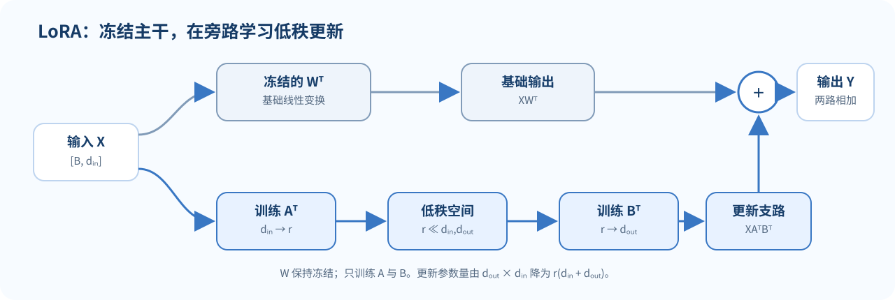

> **读完这讲应能做到：**区分改提示、更新全部权重与 PEFT；用维度检查 LoRA 矩阵；估算可训练参数；解释训练省下什么、推理仍需什么成本。

**前置知识：**矩阵乘法和线性层 $Y=XW^\top$。矩阵形状不熟可先回看 [[L03-神经网络与反向传播|L03]]。

## 适配模型有多种办法

给预训练模型一个新任务时，既可以只改输入，也可以更新模型全部权重，或只训练少量附加参数。它们在训练成本、可训练容量、部署方式与任务表现上各有取舍。

| 方法 | 改动什么 | 训练时更新预训练主干权重吗？ |
|---|---|---|
| Prompting | 人类可读的文本上下文或示例 | 否 |
| 全量微调 | 主干模型的大部分或全部参数 | 是 |
| Soft prompt（软提示） | 输入嵌入序列前的可训练向量，通常为 $[P,D]$ | 否，通常冻结 |
| Prefix tuning（前缀微调） | 各 Transformer 层可访问的可训练 past/key-value 前缀 | 否，通常冻结 |
| LoRA | 低秩权重更新因子 | 通常冻结主干 |
| Adapter | 插入网络层的小型瓶颈模块 | 通常冻结主干 |
| 剪枝 / 子网络 | 删除或冻结部分连接 | 方法不同，可能再训练剩余部分 |

PEFT（Parameter-Efficient Fine-Tuning）是一组降低可训练参数量的思路，不是单一算法。减少更新参数通常也能减少优化器状态和为每个任务保存的差异权重，但激活值、模型前向和推理部署仍有成本。

可以把这些方案看成“在哪儿增加自由度”：Prompting 改输入上下文，soft prompt 改输入端的连续向量，prefix tuning 改各层可读取的前缀状态，LoRA 改线性变换的低秩增量，Adapter 在网络层间插入模块，全量微调则开放主干参数。自由度较少通常更省训练状态，但不一定能表达目标任务需要的变化。

*图 1. LoRA 将权重更新限制在低秩支路中；蓝色支路表示训练的 A、B，灰蓝色主干权重保持冻结。*

## Prompting 与软提示

普通 prompting 通过自然语言描述任务，并可添加少量示例。它不需要更新模型参数，迭代成本低；但效果可能对示例选择、排列和措辞敏感，且提示本身会占用上下文窗口。

Soft prompt（软提示，也常称 prompt tuning）只在输入端起作用：它是在词元嵌入序列前添加 $P$ 个可训练 embedding vectors。若原嵌入为

$$
X\in\mathbb{R}^{B\times T\times d},
$$

增加 $P$ 个虚拟提示后，Transformer 接收到的序列形状变成

$$
\widetilde{X}\in\mathbb{R}^{B\times(P+T)\times d}.
$$

主干参数可冻结，只训练形状约为 $[P,D]$ 的提示表（此处 $D=d$ 是模型隐藏维；批次维通常由同一提示广播，不计入提示表参数）。这些向量不是一个个可读的词，但模型可以通过梯度调整它们。它们进入模型的输入端，随后像普通位置一样经过各层 Transformer；有效输入长度变为 $T+P$，会影响位置、注意力计算以及生成时的 KV cache。

Prefix tuning（前缀微调）通常把可训练前缀加到 Transformer 各层的 attention key/value 状态中，而不是只在输入嵌入前加向量。对第 $\ell$ 层，常见的概念形状可写为

$$
K_{\text{prefix}}^{(\ell)},V_{\text{prefix}}^{(\ell)}\in\mathbb{R}^{B\times H\times P\times d_h},
\qquad D=H d_h,
$$

其中 $B$ 为 batch size，$H$ 为注意力头数，$P$ 为前缀长度，$d_h$ 为每个头的维度。省略 batch 维并合并 head 维时，也常把单层的 K 或 V 写作 $[P,D]$；有些实现直接学习逐层 K/V，有些先学习共享或低维的 $[P,D]$ 表示，再用投影网络生成各层 K/V。因此参数的实际 shape 和数量必须以实现为准，不能只看一个表面张量形状。

经典 prefix tuning（如 Li 与 Liang 提出的做法）冻结语言模型主干，并为多层 Transformer 学习可访问的 K/V 前缀；原论文还用 MLP 重参数化来优化前缀。后续实现会改变参数化方式，例如直接学习逐层 K/V，或从共享、低维的提示表示投影得到 K/V；相关多层提示方法也会把可训练表示注入 Transformer 的中间层。“soft prompt”通常专指输入端的可训练嵌入，“prefix tuning”通常专指逐层的 K/V 前缀，但论文、库和扩展方法的术语边界并非总是完全一致。两者都常冻结预训练主干，只训练轻量适配参数。代价结构不同：soft prompt 让输入有效长度增加 $P$，前缀位置也参与各层计算；prefix tuning 将每层注意力可读的 past 长度增加 $P$，占用逐层 KV cache，直接学习 K/V 的实现还可能省去把前缀作为普通输入完整跑过主干的步骤。两者都要为前缀保留状态，实际显存、预填充和生成延迟取决于实现与缓存策略。

## LoRA：用两个小矩阵表达权重变化

以线性层的权重布局为例，令

$$
W\in\mathbb{R}^{d_{\text{out}}\times d_{\text{in}}},
\qquad X\in\mathbb{R}^{B\times d_{\text{in}}}.
$$

全量微调可训练整个 $W$。LoRA 将权重更新限制成低秩因子的乘积：

$$
\Delta W=BA,
\qquad
A\in\mathbb{R}^{r\times d_{\text{in}}},
\quad
B\in\mathbb{R}^{d_{\text{out}}\times r},
\quad
r\ll\min(d_{\text{in}},d_{\text{out}}).
$$

输出为

$$
Y=X(W+\Delta W)^\top
=XW^\top+XA^\top B^\top.
$$

实现时通常冻结 $W$，只训练 $A,B$。注意不同论文与库对权重存储方向的符号约定可能不同；检查输入、输出形状比机械背诵矩阵次序更可靠。

### 用很小的数检查形状

若 $d_{\text{in}}=3,d_{\text{out}}=4,r=2$，则 $A$ 是 $[2,3]$，$B$ 是 $[4,2]$，所以 $BA$ 是 $[4,3]$，与 $W$ 形状相同。输入 $X$ 是 $[B,3]$，乘 $(W+BA)^\top$ 后输出为 $[B,4]$。若输出形状不匹配，先检查转置约定和 batch 轴。

许多实现使用 $\Delta W=\frac{\alpha}{r}BA$，$\alpha$ 是缩放超参数；库和论文也可能选用不同写法。常见初始化令 $A$ 随机、$B$ 全零，使刚开始时 $\Delta W=0$，模型输出与基座一致。

### 参数量的具体估算

设线性层输入维 $d_{\text{in}}=1024$，输出维 $d_{\text{out}}=4096$，LoRA 秩 $r=8$：

- 全量更新参数：$1024\times4096=4{,}194{,}304$；
- LoRA 参数：$8(1024+4096)=40{,}960$；
- 比例约为 $40{,}960/4{,}194{,}304\approx0.98\%$。

这个估算只针对该矩阵的训练参数，不含模型激活、其他层、优化器精度和部署开销。

再看注意力投影：隐藏维 $d=4096$，对 query 与 value 两个投影分别加秩 $r=8$ 的 LoRA。单个投影有 $8(4096+4096)=65{,}536$ 个训练参数，两处合计 $131{,}072$。对应两张全量矩阵共有 $2\cdot4096^2=33{,}554{,}432$ 参数，因此此例约为 $0.39\%$。实际比例会随目标模块、bias、词嵌入和输出头是否适配而变。

冻结主干并不代表训练无需计算主干：前向仍要通过主干，反向仍需为可训练支路计算梯度。推理时可将 $BA$ 合并到 $W$，避免额外支路；也可保留多个任务适配器按请求切换。需实测量化、权重共享和运行库对合并的兼容性。

## Adapter：在层间加入小型变换

瓶颈 Adapter 把隐藏向量先从 $d$ 维投影到较小的 $r$ 维，再映射回 $d$ 维，并通过残差加回原表示：

$$
\operatorname{Adapter}(h)
=h+W_{\text{up}}\,
\phi(W_{\text{down}}h+b_{\text{down}})
+b_{\text{up}},
$$

其中 $W_{\text{down}}\in\mathbb{R}^{r\times d}$，$W_{\text{up}}\in\mathbb{R}^{d\times r}$，且通常 $r\ll d$。多任务场景下可为不同任务保存不同 Adapter；代价是模块需要参与推理计算。

部署上，软提示增加输入长度；LoRA 可以合并到线性权重，也可以按任务加载；Adapter 会作为额外层参与前向。参数少不保证请求延迟更低，应在真实 batch、序列长度和任务切换路径上测量。

## 怎样选择？

- **任务定义还在变化**：先用 prompting 快速探索，不必立即训练模型。
- **数据量小、希望复用大模型**：可试 PEFT，但要用独立验证集调秩与训练设置。
- **任务对模型行为改变幅度要求很大**：全量微调可能更灵活，但显存、优化状态和存储成本更高。
- **大量任务各自有模型副本**：共享冻结主干并保存轻量差异权重有存储优势；部署系统还要支持加载与切换这些权重。

应当用同一数据划分、同一评测协议比较方法，并计入推理延迟、上下文长度和维护复杂度，而非只比较可训练参数数量。

| 先问什么 | 可作为起点的方法 | 需要验证的代价 |
|---|---|---|
| 任务仍在变化、没有标注集？ | Prompting | 示例敏感性、提示长度与稳定性 |
| 要保存很多小任务能力？ | LoRA / Adapter | 单任务质量、适配器体积与加载延迟 |
| 冻结主干，只需在输入端学习连续条件向量？ | Soft prompt | 输入长度、训练稳定性与部署支持 |
| 冻结主干，需要直接为各层注意力提供任务前缀？ | Prefix tuning | 逐层 KV cache、参数化方式与部署支持 |
| 任务变化需要较大容量且预算充足？ | 全量微调作为对照 | 显存、优化器状态、遗忘和泛化 |

这张表只提供实验起点。比较时应对齐数据划分、训练 token/步数和评估协议，并检查适配后原有能力是否退化。

## 容易混淆的地方

- **参数少不等于总算力按相同比例减少。** 前向仍需经过主干，反向仍需计算可训练支路相关梯度。
- **LoRA 的秩是容量控制。** 秩越低，更新空间越受限；增大秩会增加参数，但不能保证验证表现单调提升。
- **冻结主干不代表模型输出固定。** 附加模块会改变隐藏表示和预测。
- **软提示不是普通字符串提示。** 前者是训练出的连续向量，用户一般无法直接读作自然语言。
- **Soft prompt 与 prefix tuning 的注入位置通常不同。** 前者把可训练 embedding vectors 加在输入端，典型参数形状为 $[P,D]$；后者通常为每层注意力提供 past/key-value 前缀，概念上每个 K/V 可表示为 $[B,H,P,d_h]$，具体参数化与存储形状随实现而变。二者都常冻结主干，但有效序列长度、前向计算和逐层 KV cache 的成本不同。
- **PEFT 也需要谨慎的数据与评估。** 参数效率不能消除训练数据泄漏或标签偏差。

## 自测

1. LoRA 的 $A$ 与 $B$ 相乘后，为什么形状能与原权重 $W$ 相同？
2. 对 $d_{\text{in}}=1024,d_{\text{out}}=4096,r=8$，LoRA 更新参数总数是多少？
3. 普通 Prompting、soft prompt 与 prefix tuning 分别改动什么？写出典型的 soft prompt 和单层 K/V 前缀形状，并说明二者一种推理成本差异。
4. 冻结主干后，LoRA 为什么还能改变模型输出？
5. “只更新 1% 参数”是否说明推理时只需要 1% 的模型计算？

核对要点

1. $[d_{\text{out}},r]\times[r,d_{\text{in}}]=[d_{\text{out}},d_{\text{in}}]$。
2. $8(1024+4096)=40{,}960$ 个参数。
3. 普通 Prompting 使用人类可读的输入文本；soft prompt 在输入端添加可训练 embedding vectors，典型提示表为 $[P,D]$；prefix tuning 通常在各层 attention 的 past/key/value 状态中提供可训练前缀，每层的 K 或 V 概念形状为 $[B,H,P,d_h]$（有的实现从 $[P,D]$ 等潜变量投影得到）。二者都常冻结主干；soft prompt 增加输入有效长度并随前向生成逐层 KV，prefix tuning 直接占用各层前缀 KV cache，直接 K/V 参数化可能免去把前缀作为普通输入完整预填充。
4. 输出包含低秩支路 $XA^\top B^\top$，即使 $W$ 固定，新的因子也会改变结果。
5. 不是。前向仍使用主干的大部分权重，PEFT 主要减少训练更新与任务差异存储。

## 分层练习

### 入门：找到被训练的对象

普通 Prompting、soft prompt 与 prefix tuning 分别改动什么？LoRA 又训练什么？

提示
分别看普通 Prompting 的文本、soft prompt 的输入 embedding vectors、prefix tuning 的层内 K/V 前缀，以及 LoRA 的权重增量。

### 进阶：手算 LoRA

对于 $d_{\text{in}}=1024,d_{\text{out}}=4096,r=8$，写出 $A$、$B$、$BA$ 的形状，并算出两个因子的总参数数。

### 专业视角：审查“省钱”说法

某报告说：“只训练 1% 参数，所以推理成本也只要 1%。”指出错误，并列出至少三项该测的量。

提示
分别想训练参数、前向计算、优化器状态、权重存储和服务延迟。

核对答案

- 入门：普通 Prompting 使用可读提示字符串；soft prompt 训练输入端的 embedding vectors（通常为 $[P,D]$）；prefix tuning 通常训练各层的 past/key-value 前缀（单层每个 K/V 可按实现表示为 $[B,H,P,d_h]$，或由 $[P,D]$ 等潜变量投影生成）；LoRA 训练 $A,B$ 形成的权重增量。二者都常冻结主干，但 soft prompt 延长输入序列，prefix tuning 占用逐层 KV cache，实际计算和缓存取决于实现。
- 进阶：$A:[8,1024]$、$B:[4096,8]$、$BA:[4096,1024]$；参数数 $8(1024+4096)=40{,}960$。
- 专业：冻结主干仍需经过主干前向，不是 1% 计算。实测训练吞吐与显存、推理延迟/吞吐、适配器加载/存储，并和全量微调质量比较。

## 来源与版本

- Stanford CS224N Winter 2026 课程表将本讲列为 **L09 Efficient Adaptation (Prompting + PEFT)**：[L09 官方课件 PDF](https://web.stanford.edu/class/cs224n/slides_w26/cs224n-2026-lecture09-peft.pdf)。
- [课程主页与课表](https://web.stanford.edu/class/cs224n/)。本页独立说明 prompting、LoRA、Adapter 与参数效率，不是 Stanford 官方译文，也未翻译或复刻幻灯片。

**继续阅读：**[[L08-后训练|L08 后训练]] · [[L10-RAG 与语言 Agent|L10 RAG 与 Agent]]
