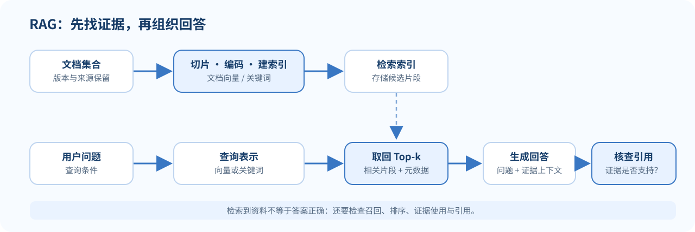

> **读完这讲应能做到：**描述文件到可引用答案的 RAG 数据路径；区分召回、排序和生成；解释 Agent 的状态、动作与观察；知道何时需要拒答、校验或停止。

**前置知识：**知道 embedding 是文本向量（[[L02-词向量与 Word2Vec|L02]]），并能读懂条件概率（[[L07-预训练|L07]]）。

## RAG 想解决什么问题？

语言模型把知识参数化在权重中，但这些知识可能过期、缺失或无法追溯。检索增强生成（Retrieval-Augmented Generation, RAG）先从外部语料找出相关材料，再把材料交给语言模型作为上下文。它让系统能更新知识库，也能把答案指向具体来源。

RAG 不会把模型自动变成数据库。系统还要判断检索到了什么、证据是否足以回答，以及生成文本是否忠实使用证据。

## 从问题到有依据的回答

一个常见 RAG 流程可拆为：

1. **准备语料**：清洗文档、切成片段，并为片段建立向量或关键词索引。
2. **检索**：把问题编码成查询，找到相关片段。
3. **组织上下文**：按来源、相关性和长度预算拼接片段。
4. **生成**：要求模型基于这些材料回答；证据不足时应允许它说明不确定。
5. **核对与引用**：检查回答中的主张是否得到材料支持，并保留文档标识。

注意这里混合了离线和在线工作。索引通常先离线构建：文档读取和版本化 → 切片与元数据 → embedding/关键词索引 → 质量检查。在线阶段才按查询召回、重排、拼接上下文并生成。知识库更新后要更新索引，否则新问句可能仍读到旧政策。

*图 1. RAG 的检索与生成链路；回答质量还取决于证据核验。*

用向量检索时，问题 $q$ 和文档片段 $d$ 分别编码为向量 $e_q,e_d$。若用余弦相似度排序：

$$
s(q,d)=\frac{e_q^\top e_d}{\lVert e_q\rVert_2\lVert e_d\rVert_2}.
$$

系统选取分数较高的 top-$k$ 片段 $z_1,\ldots,z_k$，再生成回答：

$$
P_\theta(y\mid q,z_1,\ldots,z_k).
$$

真实 RAG 可以组合稀疏检索、向量检索、重排器与多轮查询；上式只表示“回答以问题和检索内容为条件”，不规定具体索引实现。

### 两个候选片段的手算排序

假设问题向量归一化为 $e_q=(1,0)$，候选 A 为 $(0.8,0.6)$，候选 B 为 $(0.2,0.98)$，二者也近似单位长度。余弦相似度约是 $0.8$ 和 $0.2$，向量召回会先取 A。但“语义像”不保证片段含有回答问题所需的政策细节，也不说明文档是否最新；后续仍需元数据过滤、重排和证据检查。

词项检索较擅长专名、编号和精确词，向量检索较擅长语义相近表达；混合检索可以同时保留两类候选，再用重排器精排。分块太小容易丢失定义的上下文，太大则噪声多、占满模型窗口。标题、页码、更新时间等元数据可帮助过滤和引用。

### 小例子：找退货政策

用户问：“耳机拆封后还能退吗？”知识库中有「已拆封的个人音频设备不适用无理由退货」和另一页「普通商品支持七天退货」。检索器需要把问题与前一段匹配；生成器还要说明它引用的是哪条规则，并避免把一般规则错误套用到例外商品。

如果检索只返回“普通商品支持七天退货”，生成语言再流畅也不能弥补证据遗漏。因此 RAG 的质量至少包含检索是否找对材料和生成是否用对材料两部分。

## RAG 怎样评估？

对含有标注相关文档的查询，可以定义 Recall@$k$：

$$
\operatorname{Recall@k}
=\frac{\text{前 }k\text{ 个结果中的相关文档数}}
{\text{该查询所有已标注相关文档数}}.
$$

召回高不代表排序最优，也不代表答案忠实。生成侧还应分别评估答案正确性、证据支持度、引用准确性、拒答合理性与用户任务完成度。检索的 chunk 粒度、文档版本、排序器和上下文拼接方式都可能改变结果。

Recall@$k$ 问“相关证据有没有进入前 $k$ 个结果”；Precision@$k$ 问“取回的前 $k$ 项有多少相关”；MRR 看第一个相关结果排得多靠前；nDCG 可按位置折扣并支持分级相关度。它们衡量检索不同侧面，不能替代最终答案正确性。还可抽样核对每条答案主张是否被其引用片段支持。

## Agent：让模型通过动作与环境交互

一次普通问答通常是“输入问题—生成回答”。语言 Agent 则把模型放进循环：根据当前上下文选择回答或工具动作，读取工具结果，再决定下一步。

可以用状态转移描述这个过程：

$$
s_t \xrightarrow[\text{模型选择}]{a_t}
\text{工具或环境}
\xrightarrow{\text{返回结果 }o_{t+1}}
s_{t+1}.
$$

状态 $s_t$ 可以包含用户请求、历史对话、工具说明和此前观察；动作 $a_t$ 可以是搜索、计算、读取文件，或直接结束并回答。循环需要有停止条件与错误处理，否则 Agent 可能反复调用工具。

以搜索为例：**状态 $s_t$** 是目前对话、已查资料和剩余预算；**动作 $a_t$** 是发起某条查询或直接回答；**观察 $o_{t+1}$** 是搜索工具返回的结果列表与状态码。Agent 再根据观察形成新状态。工具接口通常用预定义的函数名和参数 schema 约束动作，而不是执行模型随意写出的文字。

### 一个可检查的工具例子

用户问某个城市今天的气温。Agent 可以调用天气查询工具，读取带有城市、时间戳、温度单位的结果，再用简短语言回答并说明数据时间。若工具返回的是昨天的数据或城市不匹配，就不能将其包装成今天的事实。

这里模型负责决定“要查询什么”，工具负责返回数据；工具结果仍需检查，不是天然可靠的答案。

## Agent 的能力来自哪些部件？

- **规划**：把目标拆成若干可执行步骤。
- **记忆**：在上下文窗口之外保存并重新读取有用状态。
- **工具使用**：根据工具 schema 生成参数，并处理调用结果。
- **反思/校验**：检查步骤是否完成，必要时重试或向用户询问。
- **执行环境**：真正运行 API、代码或其他操作的系统。

如果工具会修改文件、发消息或花费资源，Agent 的动作就有外部影响。设计者需按动作风险限制权限、校验参数，并让重要操作可审计；这属于系统设计的一部分，不只是提示词技巧。

要区分三类系统：固定的“先搜索再总结”可以是普通程序工作流；搜索后把片段交给模型回答是 RAG；若模型根据观察结果自主选择后续动作并循环，才有 Agent 式控制。自由度越大，越应设置调用次数、超时、预算、工具白名单和审批边界。

## 怎样评估语言 Agent？

Agent 成功率不能只看最终文字。评测需要记录任务是否完成、工具选择是否合适、参数是否正确、观察结果是否被正确引用、失败后是否停止，以及完成任务的调用次数和成本。若中间工具结果发生错误，还要区分是计划、调用、执行还是解释环节出了问题。

基准环境应固定工具接口和状态重置方式，否则模型之间的差异可能来自测试环境，而不是推理能力。

错误定位时按链路记录阶段结果：请求解析、召回、排序、上下文组装、生成、引用核验、工具执行。答案错了才知道是没找到材料、版本过期、上下文截断、推理跳步还是工具执行失败。仅有一个端到端分数很难指导修复。

## 容易混淆的地方

- **RAG 不能保证没有幻觉。** 检索可漏召回，来源可过期，模型也可能误用证据。
- **相似度高不等于相关性高。** 向量匹配只是排序信号，要看真实任务中的召回与答案质量。
- **引用存在不等于引用支持结论。** 要核对引用片段是否真的推出回答主张。
- **Agent 调用工具不等于完成任务。** 动作可能报错、返回空结果或操作错对象。
- **更多步骤不自动代表更聪明。** 多轮循环会带来延迟、成本、重复调用和错误传播。
- **记忆是有状态的数据。** 保存内容需要考虑过期、隐私和错误事实被重复使用的问题。

## 自测

1. RAG 中检索与生成分别承担什么功能？
2. Recall@$k$ 高是否能证明最终回答正确？为什么？
3. Agent 的状态、动作和观察分别指什么？
4. 工具返回了带时间戳的旧天气信息，模型应该怎样处理？
5. 为什么评估 Agent 要看工具调用过程和成本，而不只看最终答案？

核对要点

1. 检索选取候选证据；生成依据问题与证据组织答案。
2. 不能。高召回不保证重排、上下文利用、事实推断或引用准确。
3. 状态是当前已知上下文；动作是模型选择的工具/回答行为；观察是环境返回结果。
4. 检查时间是否满足问题条件；若不是，应重新查询或明确说明数据日期。
5. 过程能揭示错误来自选择、参数、工具结果还是解释；成本与调用次数影响可用性。

## 分层练习：定位问题落在哪个阶段

### 入门

RAG 中检索和生成分别负责什么？取回的段落能直接当作事实证明吗？

提示
区分召回候选与核验支持。

### 进阶

某查询有 4 个标注相关片段，top-5 找到其中 3 个。Recall@5 是多少？若答案正确却引用了一份过期政策，端到端是否可靠？

### 专业视角

Agent 接到“查订单并退款”。订单查询成功，但退款 API 超时。下一步应怎样更新状态、选择动作并避免重复退款？

提示
将超时记录为观察；核对操作状态，再用幂等键或人工确认保护重试。

核对答案

- 入门：检索器找候选证据，生成器组织答案；来源可能错或过期，仍要核对版本和支持关系。
- 进阶：$3/4=0.75$。过期引用无法证明答案适用于当前情境。
- 专业：保存超时状态和调用 ID，先查询退款实际状态，再决定是否重试；采用幂等请求、调用上限，必要时人工确认。

## 来源与版本

- Stanford CS224N Winter 2026 课程表列出 L10 RAG and Agents：[L10 官方课件 PDF](https://web.stanford.edu/class/cs224n/slides_w26/cs224n-2026-lecture10-rag-agents.pdf)。
- 课件包括问答与 RAG、语言 Agent、规划、记忆、工具使用以及 Agent 数据和评估。
- [课程主页与课表](https://web.stanford.edu/class/cs224n/)。本页为独立中文教学说明，不是 Stanford 官方译文，也未翻译或复刻课件。

**继续阅读：**[[L09-高效适配与 PEFT|L09 高效适配]] · [[L11-评估与基准|L11 评估]]
