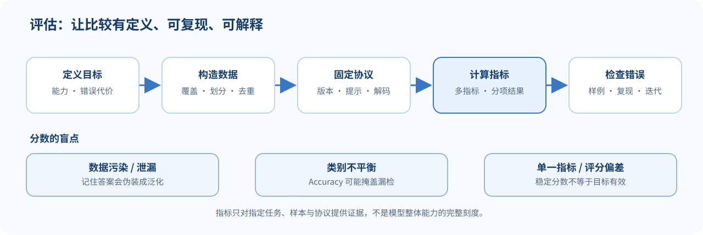

## 先说明“好”指什么

模型分数本身没有脱离任务的含义。一个基准测到的是特定数据、提示格式、答案形式、解码方法与评分规则下的表现。若要说模型“更会推理”或“更安全”，需要说明这些能力是如何操作化的、测试包含什么、哪些失败被计入。

可以把评估拆成两个问题：

1. **测什么？** 任务与样本是否覆盖真正关心的能力？
2. **怎么测？** 指标、参考答案、评判者和执行协议是否可靠？

*图 1. 可复现的评估链路及三类常见分数盲点。*

## 好基准的几项要求

- **效度**：测量结果应对应目标能力，而不是无关捷径。
- **覆盖与多样性**：样本涵盖不同主题、语言、难度和使用场景。
- **可靠性**：评分规则清楚，重复评测结果稳定。
- **难度合适**：不能容易到所有系统满分，也不能难到无法区分系统。
- **抗污染与抗投机**：尽量降低训练数据泄漏、答案模板和标注伪线索。
- **可更新与可审计**：基准过时或被过度优化后，要能补充新样本并留存协议。
- **成本可控**：评测开销应与决策价值相称，但低成本不能成为牺牲覆盖的理由。

多任务基准便于比较广泛能力，却可能把许多不同技能压缩成一个总分。看分项和错误例子，通常比只看排行榜名次更有信息。

## 分类指标：用混淆矩阵看清分母

把系统输出分成真阳性 TP、假阳性 FP、假阴性 FN 和真阴性 TN。常见指标为：

$$
\operatorname{Precision}=\frac{TP}{TP+FP},
\qquad
\operatorname{Recall}=\frac{TP}{TP+FN},
$$

$$
F_1=2\cdot
\frac{\operatorname{Precision}\cdot\operatorname{Recall}}
{\operatorname{Precision}+\operatorname{Recall}},
\qquad
\operatorname{Accuracy}=\frac{TP+TN}{TP+FP+FN+TN}.
$$

### 数值例子

某二分类器有 $TP=8,FP=2,FN=2,TN=8$。它的 Precision 和 Recall 都是 $8/10=0.8$，所以 $F_1=0.8$，Accuracy 也是 $16/20=0.8$。

现在设 100 个样本里只有 1 个正例，模型把所有样本都预测为负例。Accuracy 是 $99\%$，但正类 Recall 是 $0$。如果正类是需要发现的风险事件，99% 的准确率会掩盖系统完全漏掉目标的事实。

因此选指标前先说清楚哪类错误更贵。Precision 回答“报出的正例有多少是真的”，Recall 回答“真实正例有多少被找到”。

## 生成任务：指标会丢掉什么？

精确匹配（Exact Match）适合答案格式固定的任务，但同义表达也可能被判错。BLEU 一类词面指标用 n-gram 重合近似衡量生成文本与参考答案的相似度；它对措辞差异敏感，也无法可靠判断事实是否成立。

嵌入相似度或模型评判可处理部分表述差异，却会引入另一些问题：模型评判可能偏好长答案、某种文风、位置靠前的候选，或者同系列模型的输出。自动分数应和人工抽查、错误分析、任务结果或可执行验证结合。

语言建模常用平均负对数似然与困惑度：

$$
\operatorname{NLL}
=-\frac{1}{N}\sum_{i=1}^{N}
\log P_\theta(x_i\mid x_{<i}),
\qquad
\operatorname{PPL}=e^{\operatorname{NLL}}.
$$

较低 PPL 表示在指定 tokenization 与数据协议下，模型给真实 token 的平均概率更高；它不能单独证明开放式回答更有帮助或事实更准确。

## 评判型评估与校准

使用语言模型作为评判者可以扩展开放式输出的评估，但要检查评判提示、候选顺序、模型版本与评分理由。可将候选答案顺序对调、加入已知质量差异的控制题，观察判分是否稳定。

若模型输出置信度 $c_i$ 与正确标记 $a_i\in\{0,1\}$，校准关心“说有 80% 把握的样本是否大约 80% 正确”。常见的分箱误差形式为

$$
\operatorname{ECE}
=\sum_{m=1}^{M}
\frac{|S_m|}{n}
\left|
\operatorname{acc}(S_m)-\operatorname{conf}(S_m)
\right|,
$$

其中 $S_m$ 是按预测置信度分箱的样本集合，$M$ 是分箱数。ECE 受分箱方式影响，不能当成唯一校准结论；也应查看可靠性图、Brier score 或实际决策成本。

## 数据污染与虚假偏差

若测试问题或答案在训练语料中出现过，模型可能通过记忆而非目标能力得高分。文本轻微改写并不一定能消除污染；公开基准使用时间越久，越需要检查训练数据重叠。

数据还可能存在标签线索。例如正负样本来自不同模板，模型只学模板就能在随机划分上得高分。可以构造反事实或对抗样本：保持真正语义不变，只改无关表面特征，观察模型是否改变判断。

评估报告应记录模型版本、数据版本、提示词、采样温度、随机种子、工具权限和判分代码。没有协议细节的分数很难复现，也难以解释。

## 容易混淆的地方

- **一个指标不是整体能力。** 指标只压缩了预先定义的一类结果。
- **高 Accuracy 可能来自类别不平衡。** 查看每类 Precision、Recall 和混淆矩阵。
- **自动评分可重复，不等于有效。** 稳定地测错目标仍然是错的。
- **基准分数上升不一定代表真实应用改善。** 模型可能针对排行榜优化或利用数据捷径。
- **评估集反复用于调参就不再独立。** 最终仍需留出新样本或外部场景检查泛化。
- **不同 tokenizer 的 PPL 不宜直接横比。** token 单位与预测分母可能不同。

## 自测

1. 上述不平衡数据例子里，为什么 Accuracy 很高而模型仍然无用？
2. Precision 与 Recall 的分母分别是哪类样本？
3. 一个模型评判者对候选顺序敏感，说明什么风险？
4. 测试集被反复用于选择提示词后，它还完全是独立评估吗？
5. PPL 下降能证明模型对用户更有帮助吗？

核对要点

1. 负类占绝大多数；全判负仍有 99% 准确率，但正类完全检测不到。
2. Precision 分母是模型预测为正的样本；Recall 分母是真正的正例。
3. 评估存在位置偏差或提示脆弱性，需要控制候选顺序并做稳定性检查。
4. 不能。评估结果已经影响了提示选择，产生了对评估集的适配。
5. 不能。它衡量指定分布与 tokenizer 下的下一个 token 似然。

## 来源与版本

- Stanford CS224N Winter 2026 课程表列出 L11 Benchmarking and Evaluation：[L11 官方课件 PDF](https://web.stanford.edu/class/cs224n/slides_w26/cs224n-2026-lecture11-evaluation.pdf)。
- 课件涵盖基准设计、虚假偏差、动态/对抗基准以及不同类别的评估指标。
- [课程主页与课表](https://web.stanford.edu/class/cs224n/)。本页是独立中文教学说明，不是 Stanford 官方译文，也未翻译或复刻幻灯片。

**继续阅读：**[[L10-RAG 与语言 Agent|L10 RAG 与 Agent]] · [[L12-推理与解码（一）|L12 推理与解码（一）]]
