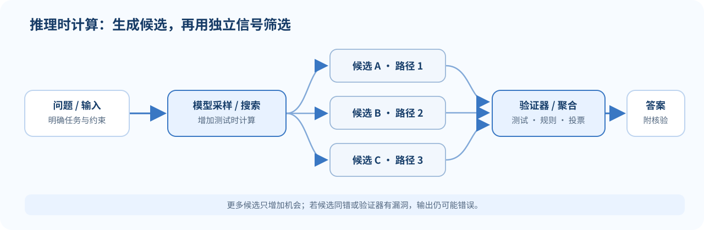

## 生成时，模型还需要一种解码规则

自回归模型在每一步给出下一个 token 的概率分布。解码算法决定怎样从分布中挑选 token。即使模型参数完全不变，换一种解码方法也可能改变回答的多样性、长度、重复程度与正确率。

若当前位置的 logits 为 $z_1,\ldots,z_V$，温度 $\tau>0$ 下的概率为

$$
p_i^{(\tau)}
=\frac{\exp(z_i/\tau)}
{\sum_{j=1}^{V}\exp(z_j/\tau)}.
$$

$\tau$ 较低时分布更尖，较高时更平。温度作用于 logits 的缩放；它不是单独的搜索算法，可以和采样等解码方式一起使用。

### 常见解码方式

- **贪心解码**：每一步都取当前最大概率 token。计算简单，但早期局部选择会限制后续文本，也可能陷入重复。
- **随机采样**：按模型概率抽样。它保留多样性，但低概率噪声也可能进入回答。
- **Top-$k$**：每一步只保留概率最高的 $k$ 个 token，再归一化采样。
- **Top-$p$**：按概率从高到低累加，保留累计概率达到阈值 $p$ 的最小集合，再归一化采样。
- **Beam search**：同时保留若干条部分序列，扩展并按累计得分筛选。它常用于翻译等带参考输出的序列任务；对开放式生成，得分最大序列不一定最自然或最有用。

### 小例子：温度怎样改变选择

假设两个 token 的 logits 是 $[2,1]$。当 $\tau=1$ 时，最大 token 概率约为 $0.731$；当 $\tau=0.5$ 时，概率变成

$$
\frac{e^4}{e^4+e^2}\approx0.881.
$$

低温让高 logit 更占优势，但不意味着模型知识变多，也不保证答案更正确。

## Chain-of-Thought 与多次采样

Chain-of-Thought（CoT）提示要求模型把问题分成中间步骤再回答。它可能让模型利用训练中学到的推导模式，但文字更长并不等于推理忠实或正确。

Self-consistency 的做法是：对同一问题采样多条推理路径，再对最终答案做多数投票或其他聚合。它依赖不同采样能够提供有用差异；若模型以相同方式稳定犯错，投票也会错。

若单条独立采样答对概率为 $p$，采样 $N$ 次至少出现一个正确答案的概率是

$$
P(\text{至少一次正确})=1-(1-p)^N.
$$

这不等于多数投票后的准确率，因为投票质量还取决于错误答案是否一致、采样是否独立、聚合规则是否合适。

*图 1. 推理时计算可以生成更多候选，再借助验证信号筛选；验证器本身也需要评估。*

**具体例子：**模型回答 $12\times15$ 时，可以生成数条推导，再用乘法计算器核对最终结果。计算器能验证答案，却不能证明模型的文本推导忠实反映了它内部的全部计算。

## 把推理结果变成训练信号

有明确答案的数学或程序任务，可以自动检查最终结果。基于可验证奖励的强化学习（RLVR）将正确性或规则检查转换成奖励信号。简化地说，策略希望提高期望奖励，同时受参考策略约束：

$$
J(\theta)=
\mathbb{E}_{y\sim\pi_\theta(\cdot\mid x)}[R(x,y)]
-\beta D_{\mathrm{KL}}
\left(\pi_\theta(\cdot\mid x)\Vert\pi_{\mathrm{ref}}(\cdot\mid x)\right).
$$

这种目标奖励通过检查的结果，而不一定要求训练者逐步标注每一个推理 token。但验证器也可能覆盖不全；模型可能学会满足检查器的表面规则，而不是完成真正任务。

## PPO、GRPO 与优化信号的直觉

PPO 常用新旧策略概率比来限制一次更新幅度。对状态 $s_t$ 和动作 $a_t$，比率为

$$
r_t(\theta)=
\frac{\pi_\theta(a_t\mid s_t)}
{\pi_{\text{old}}(a_t\mid s_t)}.
$$

裁剪式目标使用

$$
L_{\text{clip}}
=\mathbb{E}_t\!
\left[
\min\!\left(
r_t(\theta)A_t,\,
\operatorname{clip}(r_t(\theta),1-\epsilon,1+\epsilon)A_t
\right)
\right],
$$

其中 $A_t$ 是优势估计。裁剪降低新策略远离采样策略过快的风险，但仍需采样、价值估计和多项超参数。

GRPO 的核心想法之一，是针对同一提示采样一组回答，根据组内奖励相对水平构造优势，而不使用传统 PPO 的独立价值模型。一个示意归一化形式是

$$
A_i\approx
\frac{R_i-\operatorname{mean}(R_1,\ldots,R_G)}
{\operatorname{std}(R_1,\ldots,R_G)+\varepsilon}.
$$

完整算法会涉及 token 级目标、KL 项、过滤和稳定化技巧。不同工作对损失细节有不同改动，不能把这个示意式视为某个实现的全部定义。

## “推理能力”应该怎样判断？

观察到 CoT、较长回答或更多采样，不足以说明模型可靠地进行了推理。需要检查任务答案是否正确、推理是否受工具或验证器支持、提示轻微变化后结果是否稳定，以及计算增加带来的收益是否值得其延迟与成本。

还要区分**表现**与**过程忠实度**：一个答案可能正确但解释编造；一个过程看似流畅也可能导向错误答案。评估最好同时使用终局结果与针对过程的独立检查。

## 容易混淆的地方

- **温度不是“创造力旋钮”。** 它改变分布尖锐程度；输出效果要结合模型、任务和采样方法观察。
- **至少一个样本正确，不代表投票会选中它。**
- **CoT 文本不是内部推理的完整记录。** 文字解释要用外部任务结果验证。
- **奖励模型/验证器定义了优化方向。** 检查器遗漏的约束不会凭空进入奖励。
- **PPO 裁剪不是安全证明。** 它约束策略更新尺度，不保证行为符合所有价值标准。
- **GRPO 的组内标准化只是构造相对优势的一种方式。** 具体课程算法还可能在损失、采样和过滤上加入其他处理。

## 自测

1. 温度降低会怎样改变 Softmax 分布？它会改变模型权重吗？
2. Top-$p$ 与 Top-$k$ 分别按什么规则保留候选 token？
3. $p=0.4,N=3$ 时，至少一次采样答对的概率是多少？多数投票准确率能否直接得出？
4. RLVR 为什么需要可执行的验证器？验证器仍可能有什么漏洞？
5. PPO 的概率比值比较哪两个策略？

核对要点

1. 分布变尖；不改变模型参数，只改变解码时 logits 的缩放。
2. Top-$k$ 保留固定数量；Top-$p$ 保留累计概率达到阈值的最小集合。
3. $1-(1-0.4)^3=0.784$。多数投票还需知道错误答案的一致性等信息。
4. 验证器把结果映射为奖励；若规则覆盖不全或可被投机，训练会朝错误目标优化。
5. 当前策略 $\pi_\theta$ 与产生 rollout 的旧策略 $\pi_{\text{old}}$。

## 来源与版本

- Stanford CS224N Winter 2026 课程表列出 L12 Reasoning 1：[L12 官方课件 PDF](https://web.stanford.edu/class/cs224n/slides_w26/cs224n-2026-lecture12-reasoning-part1.pdf)。
- 课件包含解码方法、Reasoning 模型案例、PPO/GRPO/DAPO 与推理的边界讨论。
- [课程主页与课表](https://web.stanford.edu/class/cs224n/)。本页为独立中文教学说明，不是 Stanford 官方译文，也未翻译或复刻课件。

**继续阅读：**[[L11-评估与基准|L11 评估]] · [[L13-推测解码与长上下文|L13 推测解码与长上下文]]
