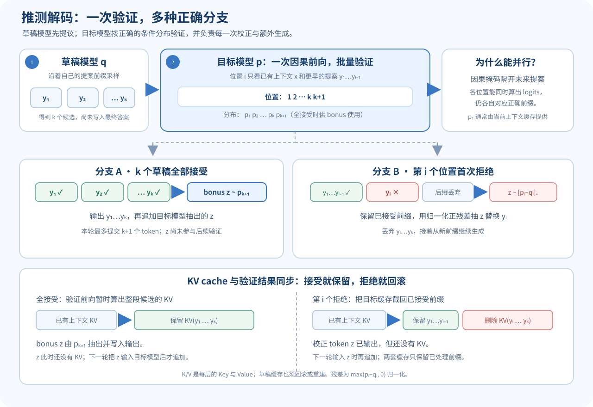

> **读完这讲应能做到：**解释推测解码为何可能加速而不改变目标分布；区分示范式与 on-policy 蒸馏；估计长序列注意力和 KV 缓存的增长；理解 RoPE 如何编码相对位置。

**前置知识：**自回归生成和注意力（[[L04-语言模型与 RNN|L04]]、[[L05-Attention 与 Transformer|L05]]），概率分布与 KL（[[L08-后训练|L08]]）。

## 推测解码：用小模型提议，大模型并行检查

逐 token 自回归生成需要重复调用目标模型。推测解码增加一个更小、更快的草稿模型，让它先提出若干 token；目标模型再利用一次并行前向检查草稿前缀，并在需要时修正。

*图 1. 推测解码减少目标模型的串行调用；目标模型仍负责验证，精确校正规则维持目标分布。*

一轮流程可以概括为：

**草稿模型提议一段 token → 目标模型评估提议 → 接受可接受的前缀 → 遇到不接受处时从目标分布校正 → 继续生成。**

对某一步，令草稿分布为 $q$，目标分布为 $p$，草稿抽到 token $y\sim q$。拒绝采样式校正规则以

$$
\alpha(y)=\min\left(1,\frac{p(y)}{q(y)}\right)
$$

作为接受概率；若拒绝，则从归一化残差分布

$$
r(x)\propto\max(p(x)-q(x),0)
$$

重新采样。多 token 实现会按前缀逐步验证并考虑条件分布变化。若采用正确的精确采样算法，生成结果可保持目标分布；只做“草稿对数概率大于某阈值就接受”等简化启发式时，不能声称严格等价。

### 一个可手算的接受与校正例子

某一步目标分布为 $p=[0.6,0.3,0.1]$，草稿分布为 $q=[0.2,0.5,0.3]$，候选 token 为 A、B、C。草稿提出 A 时接受率 $\min(1,0.6/0.2)=1$；提出 B 时为 $0.3/0.5=0.6$；提出 C 时为 $0.1/0.3\approx0.333$。拒绝后的正残差是 $\max(p-q,0)=[0.4,0,0]$，所以按本例的残差分布会校正为 A。

接受与校正合在一起后，最终采样分布仍是 A/B/C 的 $0.6/0.3/0.1$。真实批量验证会对草稿序列各个位置使用对应前缀条件分布；上面只为说明一个位置的直觉，不应把它当成完整算法伪代码。

### 一轮完整算法：首个拒绝点，或全接受后的 bonus token

设草稿模型连续提出 $k$ 个 token $y_1,\ldots,y_k$。第 $i$ 个草稿分布和目标分布分别是

$$
q_i(\cdot)=q(\cdot\mid x,y_{<i}),\qquad
p_i(\cdot)=p(\cdot\mid x,y_{<i}),
$$

其中 $x$ 是已有上下文，$y_{<i}$ 是本轮草稿中位于 $i$ 之前的 token。对这组候选，目标模型用因果注意力一次计算出各位置对应的 logits：位置 $i$ 只能看到 $x,y_{<i}$，看不到未来草稿。已有上下文的最后一组 logits 可以提供 $p_1$；把 $y_1,\ldots,y_k$ 一起送入目标模型的验证前向，就能同时得到后续位置的分布 $p_2,\ldots,p_{k+1}$。这是并行算多个位置的下一 token 分布，并不表示这些位置彼此独立。

验证按从左到右的顺序进行：

1. 对 $i=1,\ldots,k$，以
   $$
   \alpha_i=\min\left(1,\frac{p_i(y_i)}{q_i(y_i)}\right)
   $$
   的概率接受 $y_i$。
2. 若 $y_i$ 首次被拒绝，保留已接受的 $y_{<i}$，从
   $$
   r_i(z)=\frac{\max(p_i(z)-q_i(z),0)}{\sum_v\max(p_i(v)-q_i(v),0)}
   $$
   抽取校正 token $z$。丢弃 $y_i$ 及后面的草稿，本轮输出变成“已接受前缀 $y_{<i}$ + 校正 token $z$”，再从这个新前缀继续生成。
3. 若 $k$ 个草稿 token 全部接受，就从最后一个位置的目标分布
   $$
   z_{\text{bonus}}\sim p_{k+1}(\cdot\mid x,y_{1:k})
   $$
   再抽一个 **bonus token**，输出 $y_1,\ldots,y_k,z_{\text{bonus}}$。所以一次目标模型验证前向最多能让本轮输出 $k+1$ 个 token；bonus 来自目标模型，不是草稿模型猜测出来的。它若是结束标记，则生成随之结束。

这两个分支都需要正确的接受率与残差校正，才能保持目标分布。接受率不能简单换成“草稿置信度超过阈值就收”。$p_i$ 应是你想保持的目标采样分布，$q_i$ 应是草稿实际使用的归一化提议分布；温度、top-k 或 top-p 等变换会改变这些分布，计算比值时不能把处理前后的 logits 或概率混用。

它的速度优势来自减少昂贵目标模型的串行调用，而不是免掉目标模型计算。草稿越常被接受、批量验证效率越高，越有机会提速；草稿质量差、目标模型内存带宽成为瓶颈或验证开销过高时，收益会减小。

“一次检查多个 token”只减少昂贵目标模型的串行调用。草稿模型自身也花算力，目标模型仍需计算整段验证；若草稿接受率低、显存带宽瓶颈严重或批量验证开销高，速度收益可能很小。比较加速时要报告同一模型、硬件、batch、提示/输出长度下的延迟和吞吐量。

## 训练与生成分布不一致

监督微调常用人工或数据集提供的目标前缀；生成时，模型看到的前缀则是自己采出的 token。若前缀逐渐偏离训练数据，模型可能进入训练期间很少见的状态。这类输入分布差异会让训练中的好表现无法完整转化成推理表现。

策略优化中，rollout 由旧策略 $\pi_{\text{old}}$ 生成，而参数可能已更新成 $\pi_\theta$。一个重要比率是

$$
\rho_t(\theta)=
\frac{\pi_\theta(a_t\mid s_t)}
{\pi_{\text{old}}(a_t\mid s_t)}.
$$

若 rollout 在生成后很久才用于训练，当前策略变化较大，重要性权重可能变得极端，梯度方差增大。限制更新、缩短样本陈旧时间或重新采样可减轻问题，但会带来其他吞吐与算力取舍。

## 蒸馏方式看“学生在哪些上下文里学习”

| 训练信号 | 学生看到的前缀 | 监督目标 |
|---|---|---|
| SFT | 数据集/人工提供的前缀 | 参考答案 token |
| 序列级知识蒸馏 | 教师生成的完整或部分回答前缀 | 教师选出的答案 token |
| On-policy 蒸馏 | 学生自己生成的前缀 | 教师在这些前缀上的分布或标签 |

若在学生生成的前缀 $\hat y_{<t}$ 上匹配教师分布 $p_T$，可用前向 KL 作示意：

$$
\mathcal{L}_{\text{KD}}
=\sum_t
D_{\mathrm{KL}}\!
\left(
p_T(\cdot\mid x,\hat y_{<t})
\Vert
p_S(\cdot\mid x,\hat y_{<t})
\right).
$$

这让学生在自己常进入的状态上获得教师信号。KL 的方向、温度和是否只匹配采样 token 都会改变目标；蒸馏不是单一固定公式。

## 长上下文的计算代价

标准全注意力需要比较序列中大量位置对。若序列长度是 $T$，注意力分数矩阵含 $T^2$ 项，单层主要注意力计算随长度大致呈二次增长。增加上下文窗口会增加计算和显存，不只是调整一个配置数字。

自回归推理常使用 KV cache：已经处理的 token 的 Key/Value 保留下来，生成新 token 时不必重新计算旧 token 的投影。缓存节省重复计算，但缓存大小仍随层数、序列长度、batch 和隐藏维度增长。

标准全注意力的 $T\times T$ 位置分数矩阵有 $T^2$ 项，序列长度翻倍时注意力位置对约变成四倍。优化 kernel 可分块计算而避免显式保留完整矩阵，但注意力运算仍会随长度快速增长。窗口可容纳很长文本，也不代表模型能有效找到中间的关键信息。

KV 缓存近似内存量为

$$
M_{KV}\approx 2 L B T H_{KV} d_h s,
$$

其中 $L$ 为层数、$B$ 为 batch、$T$ 为已缓存 token 数、$H_{KV}$ 为 KV 头数、$d_h$ 是每头维度，$s$ 是每个元素字节数；因子 2 对应 Key 和 Value。例：$L=32,B=1,T=32768,H_{KV}=8,d_h=128$，bf16 每元素 2 字节，KV 缓存约 $4$ GiB，不含临时工作区等额外开销。若 KV 头数加倍，缓存也加倍；分组查询注意力以较少 KV 头降低内存。

推测解码也要让 KV cache 和验证分支保持一致。验证前向会暂时为整段草稿计算 KV：**全接受时**保留所有草稿 token 的缓存；bonus token 只是从 $p_{k+1}$ 抽出并写入输出，尚未经过 Transformer，因此下一轮把它作为输入处理时才会生成自己的 KV。**第 $i$ 个草稿被拒绝时**，把目标模型缓存截回已有上下文加已接受的 $y_{<i}$，丢弃拒绝位置及其后续草稿的 KV；残差校正 token 同样会在下一轮输入时再写入缓存。草稿模型也必须把自己的 cache 截回对应前缀或重建，否则下一轮会按错误的历史生成提案。两套缓存都应与已经处理的前缀对齐。

## RoPE：把相对位置关系写进 Query 与 Key

旋转位置编码（RoPE）把位置相关的旋转作用在 Query 和 Key 上。对一个二维特征对子，位置 $m$ 的旋转矩阵可写为

$$
R(m\theta)=
\begin{bmatrix}
\cos(m\theta)&-\sin(m\theta)\\
\sin(m\theta)&\cos(m\theta)
\end{bmatrix}.
$$

把位置 $m,n$ 的 Query 与 Key 分别旋转后，它们的点积包含相对位置差：

$$
\big(R(m\theta)q\big)^\top
\big(R(n\theta)k\big)
=q^\top R((n-m)\theta)k.
$$

因此注意力分数能依赖位置间隔。实际 RoPE 对多个二维特征对子使用不同频率。扩展训练长度时常调整位置频率或缩放位置，但超出训练范围后的质量取决于数据与模型，不能只靠更大的窗口参数保证。

## 推理时计算：多花计算换更好决策

测试时可以让模型生成多个候选、搜索候选路径、调用验证器，或让模型在最终回答前做额外计算。若有可靠的任务检查器，这些计算可能筛掉错误候选；如果所有候选共享同一种错误模式，增加采样仍未必有帮助。

评测时应同时报告质量和成本：答案准确度、输出 token 数、目标模型前向次数、延迟、显存或 API 费用。某策略在单次质量上略胜，但需要许多倍计算时，适用场景会不同。

## 容易混淆的地方

- **推测解码需要目标模型验证。** 草稿模型不能自行决定目标答案。
- **精确推测采样与简化接受启发式不同。** 只有满足相应校正规则时，才可声称维持目标分布。
- **On-policy 指学生生成的状态/前缀。** 它不表示监督目标也来自学生。
- **长窗口可用，不代表长距离信息被有效利用。**
- **KV cache 省掉重复投影，不是零成本内存。**
- **RoPE 外推不是免费能力。** 改变位置映射可能带来训练与推理分布差异。

## 自测

1. 推测解码中的草稿模型和目标模型分别做什么？
2. 在拒绝采样式推测解码中，拒绝提议后为什么要从残差分布采样？
3. On-policy 蒸馏为什么会把教师信号放在学生生成的前缀上？
4. 序列长度翻倍时，标准全注意力分数矩阵项数大约变成几倍？
5. KV cache 减少了什么计算？它本身带来什么成本？
6. RoPE 点积中的位置变量怎样组合成相对间距？

核对要点

1. 草稿模型提出候选；目标模型检查并在必要时校正，以目标分布为准。
2. 残差 $p-q$ 补足草稿分布未覆盖的目标概率质量，保持目标采样分布。
3. 这样学生在实际生成会访问的状态上学习，缓和示范前缀与学生前缀之间的分布差异。
4. 大约四倍，因为 $T^2$ 中 $T$ 翻倍后变成 $(2T)^2=4T^2$。
5. 它避免重复计算旧 token 的 Key/Value 投影，但缓存会随序列、层数与 batch 增长。
6. 通过旋转矩阵相乘，得到位置差 $n-m$。

## 分层练习：检查加速、缓存与位置

### 入门

推测解码中的草稿模型和目标模型各负责什么？草稿提出的 token 能否未经检查直接写入输出？

### 进阶

全注意力长度从 $8{,}000$ 增为 $16{,}000$，分数矩阵元素数变成几倍？本页 $T=32768$ 的 KV 缓存例子若长度减半，缓存约多少？

提示
分数矩阵与 $T^2$ 成正比，KV 缓存与 $T$ 成正比。

### 专业视角

某实现仅以“草稿概率大于 0.5 就接受”作判断，却声称输出严格服从目标分布。这个说法成立吗？应如何评估速度收益？

提示
核对是否根据 $p/q$ 校正分布；在相同任务和硬件下测端到端延迟。

核对答案

- 入门：草稿模型提出候选，目标模型检查并在需要时校正；不能任意无条件接受。
- 进阶：约 $4$ 倍；长度减半，KV 约 $2$ GiB。
- 专业：不成立，简单阈值一般会改变分布。采用正确采样校正，并在相同提示、目标模型、硬件、batch 下报告质量/分布一致性、端到端延迟和吞吐。

## 来源与版本

- Stanford CS224N Winter 2026 课程表列出 L13 Reasoning 2：[L13 官方课件 PDF](https://web.stanford.edu/class/cs224n/slides_w26/cs224n-2026-lecture13-reasoning-part2.pdf)。
- 课件讨论推测解码、策略漂移与蒸馏、长上下文、RoPE 及推理时计算。
- [课程主页与课表](https://web.stanford.edu/class/cs224n/)。本页是独立中文教学说明，不是 Stanford 官方译文，也未翻译或复刻课件。

**继续阅读：**[[L12-推理与解码（一）|L12 推理与解码（一）]] · [[L14-分词与多语言|L14 分词与多语言]]
