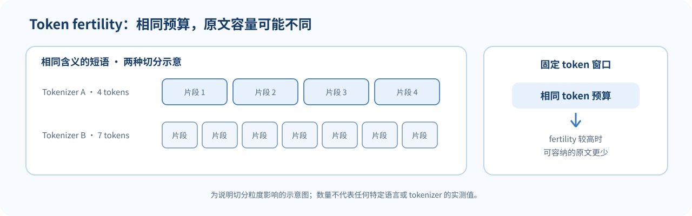

## Token 是模型实际处理的单位

用户输入的是字符串，神经网络接收的是 token ID 序列。Tokenizer 把字符串编码成一串整数，模型再通过嵌入表把 ID 转成向量：

$$
\text{文本}
\xrightarrow{\text{tokenizer}}
[i_1,\ldots,i_T]
\xrightarrow{\text{embedding}}
X\in\mathbb{R}^{T\times d}.
$$

Token 不一定等于单词、汉字或字符。一个英文词可能是一个 token，也可能拆成词根与词缀；一个中文汉字可能独立成 token，也可能和相邻字符、标点组成片段；emoji 在 Unicode 中还可能由多个码点或字节组成。

词表 embedding 通常形如 $E\in\mathbb{R}^{V\times d}$，其中 $V$ 是词表大小。若输出层没有与输入 embedding 共享权重，输出 logits 还需要对 $V$ 个词表项打分。扩大词表会增加相关参数和输出计算，但可能让常见文本用更少 token 表示；这是一种系统级折中。

## 几种切分单位的取舍

### 词级切分

把完整词作为一个单位，常见词含义清楚；但词形变化、拼写变体和新名字会造成庞大词表或未知词。对于形态丰富语言，一个词可能组合出很多表面形式。

### 字符级切分

字符词表较小，几乎不需要把新词映射到未知项；代价是同一文本会变成很长的序列，模型要从很多步中学习词和短语结构。

### 字节级切分

字节覆盖所有 Unicode 文本的编码字节，可以提供可逆表示并处理未见字符组合。但一个人类可见符号可能由多个字节表示，序列可能变长，token 语义也更难解释。

### 子词切分

子词方法在常见片段压缩与开放词表之间折中。BPE 从小单元开始反复合并常见相邻 pair；Unigram 类方法则从候选子词集合及其概率模型中选择切分。具体 tokenizer 还会包含预切分、特殊 token 与规范化规则。

## 手算 BPE 的一次合并

设玩具语料只有两行：abab 和 abac。先按字符切分：

| 词 | 初始 token 序列 |
|---|---|
| abab | a, b, a, b |
| abac | a, b, a, c |

统计相邻 pair：

- a b 出现 3 次；
- b a 出现 2 次；
- a c 出现 1 次。

因此第一步选择合并 a b → ab。两行变成 [ab, ab] 与 [ab, a, c]。若继续训练，会在新序列上重新统计相邻 pair，而不是始终使用最初那份计数。

编码时，tokenizer 按训练出的合并优先级处理新字符串；解码时需把 token 内容还原成原字节/文本。真实 byte-level BPE 要正确处理 UTF-8、多空格、标点、预切分和特殊 token，不能只实现上面这个玩具合并循环。

## Tokenizer 怎样改变语言模型？

相同原文经不同 tokenizer 后 token 数可能不同。更多 token 会拉长序列，影响上下文预算、注意力计算和按 token 收费的服务；更大的词表也会改变 embedding 与输出层参数量。

一个直观统计是 **token fertility**：平均每个词或字符被拆成多少 token。若某种语言写法被切得特别碎，它在同样上下文长度下就能容纳更少原文，训练预算按 token 分配时也可能与其他语言不同。

*图 1. Token fertility 与固定上下文容量的关系。分词数量是虚构的演示值，不代表任何特定语言或 tokenizer。*

比较不同 tokenizer 下的语言模型时，PPL 的 token 分母不同，不宜简单横比。若模型都能精确表示同一 UTF-8 原文，可以考察每字节负对数似然：

$$
\operatorname{BPB}
=-\frac{\log_2 P(\text{文本字节序列})}
{\text{UTF-8 字节数}}.
$$

BPB 仍依赖文本预处理和概率定义，但它以字节而非 tokenizer token 归一化，给跨切分比较提供了另一种视角。

## 多语言 tokenizer 与代表性

一个 tokenizer 往往由有限语料训练。如果训练数据中的某些语言、文字系统或专业领域覆盖不足，其常见字符串也可能被切得更碎。影响包括：

- 同样字符数占用的 token 预算不同；
- 生成罕见文字时需要更多步骤；
- 词表容量向某些高频片段倾斜；
- 某些语言的文本被替换、规范化或切分方式与用户预期不符。

所以多语言评估应同时报告语言质量、token 数或压缩率、样本来源和可逆性，而不是只看一个总体平均分。减少 token 数也不是唯一目标；不能为压缩而破坏语义边界、数字或安全敏感内容。

## 特殊 token 与数据边界

特殊 token 常用于标记消息角色、序列结束、工具调用或被遮蔽位置。它们通常有专门 token ID，不能假定普通文本里同样的可见拼写会始终被编码成相同 ID。

编码前的规范化会影响 tokenization：大小写、Unicode 组合字符、空白和换行处理不同，可能导致编码结果不同。调试时要分别检查原始字符串、预处理字符串、token ID 与解码结果。

## 容易混淆的地方

- **Token 不是天然的语言单位。** 它是 tokenizer 根据规则和词表划出的模型输入单位。
- **字节覆盖不等于一个字节一个可见字符。** UTF-8 中一个字符可能由多个字节组成。
- **BPE 的合并规则有顺序。** 相同 pair 频率、边界符号和预切分策略都可能改变最终词表。
- **更大的词表有系统成本。** embedding/输出层会更大，尽管序列可能更短。
- **Token 数少不自动代表模型更公平或更准确。**
- **跨 tokenizer 的 PPL 不是同一个分母。** 可结合 BPB、任务质量和实际推理成本分析。
- **Tokenizer 训练语料与模型训练语料可以不同。** 词表存在某个片段，不保证模型学过足够上下文来熟练使用它。

## 自测

1. 为什么同一个“词”可能对应多个 token？
2. 在玩具语料 abab、abac 中，第一轮 BPE 会合并哪个 pair？
3. 词表变大可能同时带来哪些好处与成本？
4. 为什么不同 tokenizer 下的 PPL 不适合不加说明地比较？
5. Token fertility 高可能怎样影响有限上下文中的多语言用户？
6. 字节级 tokenization 为什么能处理未见过的字符组合，又可能付出什么代价？

核对要点

1. tokenizer 根据有限词表和合并规则划分字符串，词可能低频或包含不常见片段。
2. a b 出现 3 次，因此合并 a b → ab。
3. 常见文本片段可能更紧凑；embedding 与输出层参数和类别打分成本会增大。
4. 平均损失按各自 token 序列计数，预测单位与分母不同。
5. 相同上下文 token 预算能放入的原文更少，生成序列也更长。
6. UTF-8 字节序列可覆盖所有文本；多字节字符会占多个 token/字节，序列不一定紧凑或有直观语义。

## 来源与版本

- Stanford CS224N Winter 2026 课表将本讲列为 L14 Tokenization and Multilinguality：[L14 官方课件 PDF](https://web.stanford.edu/class/cs224n/slides_w26/cs224n-2026-lecture14-guest-julie-tokenization-multilinguality.pdf)。
- [课程主页与课表](https://web.stanford.edu/class/cs224n/)。本页独立说明 tokenization 与多语言影响，不是 Stanford 官方译文，也未翻译或复刻幻灯片。

**继续阅读：**[[L07-预训练|L07 预训练]] · [[L05-Attention 与 Transformer|L05 Transformer]]
