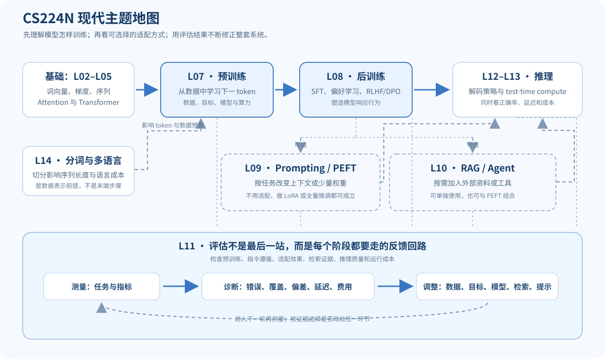

L02–L05 解释了模型如何表示词、计算梯度、处理序列与使用自注意力。现代 LLM 的学习还要回答其他问题：训练文本从哪里来，怎样让模型遵循指令，怎样在算力有限时适配模型，如何检索外部资料，怎样评估输出，以及 tokenizer 是否公平地处理不同语言。

本页是这些主题之间关系的概览，不替代对应官方课件或论文。课程编号和标题按 [Stanford CS224N Winter 2026 课表](https://web.stanford.edu/class/cs224n/)；PDF 文件名跟随该课程页。

## L07：预训练——从大量文本中学习预测

预训练阶段通常在大规模文本上优化下一个 token 的负对数似然。对真实序列 $x_1,\ldots,x_T$，一条序列的损失可写为

$$
\mathcal{L}_{\text{LM}}
=-\sum_{t=1}^{T}\log P_\theta(x_t\mid x_{<t}).
$$

模型参数、训练 token 数量、数据质量和算力都会影响最终结果。讨论 scaling 时要说清测量指标、模型/数据规模和计算预算，不能把一条经验曲线当成对所有模型与任务都成立的定律。

预训练数据不仅是“越多越好”。重复、低质量文本、污染评测集的样本以及不均衡的语言覆盖都会影响训练与评估。课程将训练系统、数据和规模放在同一条链路里讨论，便于理解吞吐量、训练成本和最终能力之间的联系。

[官方 L07 预训练课件 PDF](https://web.stanford.edu/class/cs224n/slides_w26/cs224n-2026-lecture07-pretraining.pdf)

中文逐讲说明：[[L07-预训练|L07 预训练]]。

> **编号提醒：**课程页面及文件名把本讲列为 L07；本地 PDF 封面显示 “Lecture 6: Pretraining”。这是来源材料中的编号差异，本页保留官方课表编号并提示封面标注。

## L08：后训练——从会续写到按要求回答

预训练模型掌握了文本分布中的统计规律，但这不保证它会按用户的指令组织回答。后训练把预训练权重作为起点，再使用指令示例、偏好比较或其他反馈塑造行为。

- **SFT（监督微调）**：给定输入与示范答案，继续训练模型提高示范 token 的条件概率。
- **偏好学习**：给同一问题的两个回答标记更受偏好的那个，学习回答之间的相对优劣。
- **RLHF**：通常包含偏好数据、奖励模型及基于奖励的策略优化。奖励只是训练信号；被优化的目标与真正想要的行为可能有差距。
- **DPO**：直接利用成对偏好与参考策略构造优化目标，不必单独训练一个显式奖励模型。它仍依赖偏好数据质量和参考策略定义。

DPO 的一类常用形式如下。$y_w$ 是偏好回答，$y_l$ 是较不偏好的回答，$\pi_{\text{ref}}$ 是参考策略：

$$
\mathcal{L}_{\text{DPO}}
=-\log \sigma\!\left(
\beta\left[
\log\frac{\pi_\theta(y_w\mid x)}{\pi_{\text{ref}}(y_w\mid x)}
-\log\frac{\pi_\theta(y_l\mid x)}{\pi_{\text{ref}}(y_l\mid x)}
\right]\right).
$$

这里省略了对回答 token 的逐 token 展开。公式表达的方向是：相对参考模型，提高偏好回答的相对概率。不同实现会对序列对数概率的归一化方式作不同选择，阅读具体方法时要查看其定义。

[官方 L08 后训练课件 PDF](https://web.stanford.edu/class/cs224n/slides_w26/cs224n-2026-lecture08-posttraining.pdf)

中文逐讲说明：[[L08-后训练|L08 后训练]]。

> **编号提醒：**课程页面及文件名把本讲列为 L08；本地 PDF 封面显示 “Lecture 7: Post-training”。引用时以课程页 L08 和文件名为准，并保留封面编号差异说明。

## L09：Prompting 与 PEFT——适配模型的不同成本

Prompting 改变模型看到的上下文，不更新权重；全量微调更新大量预训练参数；参数高效微调（PEFT）只训练一小部分参数或附加模块。

LoRA 的直觉是把原权重更新 $\Delta W$ 限制为低秩矩阵的乘积：

$$
\Delta W=BA,\qquad
A\in\mathbb{R}^{r\times d_{\text{in}}},
\quad
B\in\mathbb{R}^{d_{\text{out}}\times r},
\quad
r\ll\min(d_{\text{in}},d_{\text{out}}).
$$

原线性层使用 $W+\Delta W$，而训练时可以冻结 $W$，只更新 $A,B$。参数数目从 $d_{\text{in}}d_{\text{out}}$ 变成 $r(d_{\text{in}}+d_{\text{out}})$。这通常能节省可训练参数和优化器状态，但是否达到全量微调质量取决于任务、数据、秩和实现。

[官方 L09 高效适配课件 PDF](https://web.stanford.edu/class/cs224n/slides_w26/cs224n-2026-lecture09-peft.pdf)

中文逐讲说明：[[L09-高效适配与 PEFT|L09 高效适配]]。

## L10：RAG 与 Agent——让模型使用外部信息和工具

检索增强生成（RAG）把检索结果作为模型生成时可见的上下文。一个基础流程是：

1. 把文档切成片段并建立检索索引。
2. 根据用户问题检索候选片段。
3. 将问题与片段交给模型生成答案。
4. 检查答案是否受来源支持，并保留来源标记。

RAG 的成败不只看生成模型。分块方式、召回率、排序、上下文长度和模型是否忠实使用证据都可能成为瓶颈。检索到文本并不自动证明答案正确。

Agent 可把模型放进“观察—决定—调用工具—读取结果—继续或结束”的控制循环。工具返回值也是外部输入，可能缺失、过期或错误；系统应验证参数、权限与结果，并对高影响操作保留人的确认。

[官方 L10 RAG 与 Agent 课件 PDF](https://web.stanford.edu/class/cs224n/slides_w26/cs224n-2026-lecture10-rag-agents.pdf)

中文逐讲说明：[[L10-RAG 与语言 Agent|L10 RAG 与 Agent]]。

## L11：评估——把“表现更好”变成可检验的问题

评估开始于任务定义，而不是挑一个方便的分数。分类任务可以看准确率或 F1；精确答案任务可以看 Exact Match；语言建模可以看负对数似然或困惑度；开放式生成还可能需要人工判断、成对偏好或基于标准的打分。

评测报告至少应能回答：

- 用了什么模型版本、提示词、解码设置和数据集划分？
- 指标如何计算，是否有公开判分规则？
- 训练数据或提示是否可能泄漏了评测答案？
- 分数是否覆盖真实使用场景中的错误、偏见和安全问题？
- 对比模型是否在同一设置下测试？

自动指标容易规模化，但指标不能覆盖整个目标。LLM-as-a-judge 也有评判偏差、提示敏感性和模型偏好，需要验证其稳定性。

[官方 L11 评估课件 PDF](https://web.stanford.edu/class/cs224n/slides_w26/cs224n-2026-lecture11-evaluation.pdf)

中文逐讲说明：[[L11-评估与基准|L11 评估与基准]]。

## L12–L13：推理与 test-time compute

链式思考（CoT）提示让模型输出中间步骤；self-consistency 采样多个解答并汇总；验证器可以检查最终答案或部分推导。增加推理时计算有时会提升某些任务的正确率，同时也会增加 token 数、延迟和成本。

要把“答案对不对”与“解释是否忠实描述内部计算”分开。长篇推理文本本身不是正确性的证据；需要答案校验、工具执行、形式验证或独立评测。强化学习方法还需要关注奖励是否可以被投机，以及模型是否只学会迎合测量方式。

- [官方 L12 推理（一）课件 PDF](https://web.stanford.edu/class/cs224n/slides_w26/cs224n-2026-lecture12-reasoning-part1.pdf)
- [官方 L13 推理（二）课件 PDF](https://web.stanford.edu/class/cs224n/slides_w26/cs224n-2026-lecture13-reasoning-part2.pdf)

中文逐讲说明：[[L12-推理与解码（一）|L12 推理与解码（一）]] · [[L13-推测解码与长上下文|L13 推测解码与长上下文]]。

## L14：Tokenization 与多语言

Tokenization 把文本转成模型词表里的 token ID。字符、字节和子词切分在词表规模、序列长度、未知内容处理与语言公平性上各有取舍。BPE 一类方法会从较小单元开始，根据语料中的统计频率逐步合并常见片段。

不同语言经过同一 tokenizer 后，平均每个词或字符对应的 token 数可能不同。切得更碎会拉长序列、占用上下文预算，也可能改变固定 token 训练预算中各语言获得的有效文本量。跨语言比较模型时，质量、token 数与上下文成本都值得一起看。

[官方 L14 分词与多语言课件 PDF](https://web.stanford.edu/class/cs224n/slides_w26/cs224n-2026-lecture14-guest-julie-tokenization-multilinguality.pdf)

中文逐讲说明：[[L14-分词与多语言|L14 分词与多语言]]。

## 现代主题之间的依赖：主干、可选支路、评估回路

**图 1.** L02–L05 提供模型基础，L07 和 L08 介绍预训练与后训练；L14 分词会影响训练数据进入模型时的表示。之后不必走一条固定流水线：可以直接推理，也可以按任务选择 PEFT、RAG/Agent，或把它们组合起来。

- **PEFT 是适配选项。**若任务表现可接受，可以不训练适配器；若要适配，可比较提示词、LoRA 或全量微调的质量和成本。
- **RAG/Agent 是系统能力选项。**只有在需要外部证据或工具时才接入。它们不是 PEFT 的后续必修步骤，也不保证答案自动正确。
- **评估是贯穿回路。**分别检查训练数据与目标、指令遵循、适配质量、检索证据、推理正确率和运行成本。评估结果可以促使我们调整数据、训练目标、模型、检索或提示词，然后重新测量；它不是推理之后才做一次的终点。

## 自测

1. SFT 和偏好优化的监督信号有什么不同？
2. LoRA 降低的是哪些参数成本？为什么它不保证质量一定与全量微调相同？
3. RAG 的答案为什么仍然需要核对检索证据？
4. “模型的 CoT 很长”为什么不足以证明模型推理可靠？
5. tokenization 可能怎样影响跨语言质量比较？

核对要点

1. SFT 使用示范目标文本；偏好优化使用回答之间的相对偏好信号。
2. 它减少可训练参数和相关优化状态；低秩约束与有限数据可能无法表达全量更新能表达的调整。
3. 检索可能漏召回、排序错误或包含错误内容，生成模型也可能曲解证据。
4. 长度只是输出形式，不能独立验证结论；需要独立答案或过程检查。
5. 不同语言的 token 切分粒度会影响序列长度、预算和按 token 计算的指标。

## 第三方中文补充入口

以下链接指向第三方 CS224N 学习笔记的原始网页，不是 Stanford 官方译本。其公开再分发许可未确认；本站只链接网页，不复制或托管其中内容。网页和本站说明有差异时，以 Stanford 官方课件为准。

- L07 [预训练](https://www.dihengye.cn/cs224n/lectures/l07-pretraining/)
- L08 [后训练](https://www.dihengye.cn/cs224n/lectures/l08-post-training/)
- L09 [参数高效微调](https://www.dihengye.cn/cs224n/lectures/l09-peft/)
- L10 [RAG 与 Agent](https://www.dihengye.cn/cs224n/lectures/l10-rag-and-agents/)
- L11 [评估](https://www.dihengye.cn/cs224n/lectures/l11-evaluation/)
- L12 [推理一](https://www.dihengye.cn/cs224n/lectures/l12-reasoning-part-1/)
- L13 [推理二](https://www.dihengye.cn/cs224n/lectures/l13-reasoning-part-2/)
- L14 [分词与多语言](https://www.dihengye.cn/cs224n/lectures/l14-tokenization-and-multilinguality/)

## 来源与版本

- 课程范围与官方课件链接：Stanford CS224N Winter 2026 [课程主页](https://web.stanford.edu/class/cs224n/)。
- 本页对 L07–L14 的中文概述为独立编写，不翻译或复刻 Stanford 幻灯片，不复制第三方中文快照。
- 课件封面与课表的 L07/L08 编号不一致时，以上述官方课程页的课次和文件名作为索引，同时保留封面差异说明。
