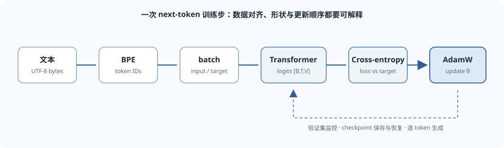
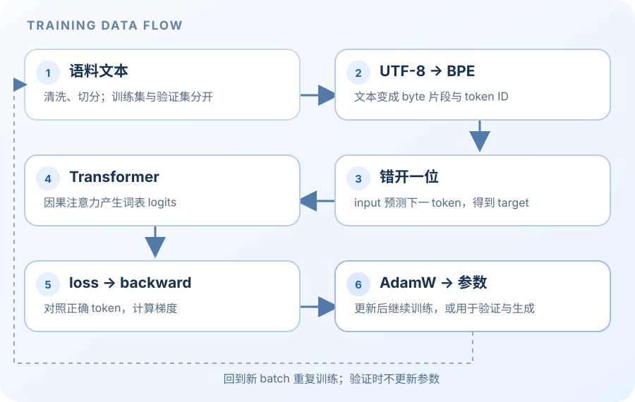
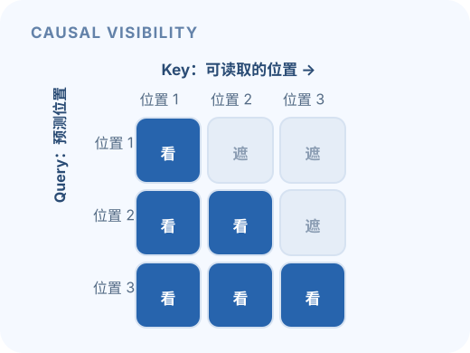

这页帮助读懂 CS336 Spring 2026 的 Assignment 1（Basics）。它解释组件之间如何连接，不给出作业实现、测试答案或可直接提交的代码。具体接口、限制和实验要求以[官方 A1 handout](https://github.com/stanford-cs336/assignment1-basics/blob/main/cs336_assignment1_basics.pdf)及[官方仓库](https://github.com/stanford-cs336/assignment1-basics)为准。

> [!warning] 作业与 AI 工具
> 官方 A1 handout 允许 AI 协助理解概念、查 API 文档，但禁止 AI 工具实现作业任何部分，包括代码代理和 AI 自动补全。请在正式做题前查看 handout 中当期有效的政策。下面是学习导读，不是作业解答。

## 先看整体：模型在做什么

自回归语言模型接收一段 token ID 序列，在每个位置预测下一个 token。若输入批次有 $B$ 条序列、每条长度 $T$，词表大小为 $V$，模型最后会为每个位置给出 $V$ 个分数（logits）。训练时把 logits 与“下一个真实 token”比较；生成时把最后一个位置的分数转为概率，选出一个新 token，再把它接回上下文重复预测。

*图 1. 分词与 input/target 对齐产生训练批次；模型前向产生 logits，交叉熵提供梯度，优化器更新参数。*

### 本页使用的形状记号

| 记号 | 含义 |
|---|---|
| $B$ | batch 中的序列数 |
| $T$ | 每条序列的 token 数 |
| $V$ | tokenizer 词表大小 |
| $d$ | 模型隐藏维度（`d_model`） |
| $H$ | 注意力头数 |
| $d_h=d/H$ | 每个注意力头的维度，通常要求 $d$ 能被 $H$ 整除 |

张量 shape 是调试 Transformer 的“接口说明”。看到矩阵乘法时，先把每个维度写出来，再判断它沿哪一维相乘、哪一维保留。

## 1. UTF-8 与 byte-level BPE：文字如何变成 token

计算机中的 Python `str` 是 Unicode 字符序列。CS336 A1 使用 byte-level BPE：先将文本编码为 UTF-8 字节，再通过子词合并规则把字节序列压缩成 token ID。

### 为什么从字节开始

- Unicode 字符可能由不同数量的 UTF-8 字节表示。一个“字符”不等于一个字节，也不等于一个 token。
- 任意 UTF-8 文本都能表示为取值在 $0$ 到 $255$ 之间的字节序列，因此初始字节词表固定且完整，不会因罕见字符而出现未知字符问题。
- 字节序列很长。BPE 通过反复合并常见的相邻符号，让常见的字节片段获得自己的 token，从而缩短模型要处理的序列。

### BPE 训练的概念流程

1. 对语料做预切分（pre-tokenization），确定 BPE 统计与合并的局部边界。
2. 把各片段转成字节序列，初始化为单字节符号。
3. 统计相邻符号对的出现次数，按算法规则选择要合并的 pair。
4. 把每次合并记录为一个新 token 和一条 merge 规则，重复到目标词表大小。

**训练阶段的产物有两部分：** token 字节内容到整数 ID 的词表，以及有顺序的 merge 列表。编码时应用学到的规则；解码时将 token 对应的字节拼接回去，再整体解码为文本。独立的 byte token 可能暂时不是有效 UTF-8 字符，因此不要把每个 token 分别当作字符解码。

特殊 token（例如文档边界标记）承担结构意义，不是普通文本片段。需按 handout 规定处理它们，避免被普通的预切分或 BPE 合并吞并。

**建议自行验证的性质：** 对一般文本做 `decode(encode(text))` 应还原输入；测试内容应包括 ASCII、中文、多字节字符、空文本以及特殊 token 边界。这里列的是性质，不提供作业测试答案。

## 2. Transformer 的张量路线

### Token ID 与 embedding

tokenizer 输出整数序列，组 batch 后 token ID 张量形状是 $(B,T)$。Embedding 表可看成 $V\times d$ 的可训练矩阵，从表中按 ID 取行后得到隐藏表示：

$$
X\in\mathbb{R}^{B\times T\times d}.
$$

模型的线性层通常作用在最后一维：$B$ 和 $T$ 作为批次及位置维保留，$d$ 变成该层的输出维度。先确认这一点，许多 shape 错误就会显现。

### RMSNorm 与逐位置前馈网络

RMSNorm 对每个位置的隐藏向量按均方根做缩放，并使用可学习的逐维权重。对 $x\in\mathbb{R}^{d}$，概念形式为

$$
\operatorname{RMSNorm}(x)=\frac{x}{\sqrt{\frac{1}{d}\sum_{j=1}^{d}x_j^2+\epsilon}}\odot g,
$$

其中 $g\in\mathbb{R}^{d}$，$\epsilon$ 用于数值稳定，输出 shape 仍是 $(B,T,d)$。注意 RMSNorm 不减均值；不要把它和 LayerNorm 的公式混为一谈。

SwiGLU 前馈网络在每个 token 位置独立处理最后一维。一种常见写法是

$$
\operatorname{FFN}(x)=W_2\big(\operatorname{SiLU}(W_1x)\odot W_3x\big).
$$

$W_1,W_3$ 把 $d$ 映射到中间维度 $d_{ff}$；逐元素门控后，$W_2$ 再投影回 $d$。因此输入和输出 shape 都是 $(B,T,d)$，中间分支 shape 是 $(B,T,d_{ff})$。A1 的具体激活、维度和参数化以当前 handout 为准。

### RoPE：把位置信息加到注意力的 Q/K 上

注意力需要知道 token 的顺序。旋转位置编码（RoPE）按位置 $p$ 对 query 和 key 的每一对通道做二维旋转。对一对分量，可写作

$$
\begin{bmatrix}x'_{2i}\\x'_{2i+1}\end{bmatrix}
=
\begin{bmatrix}\cos\theta_{p,i}&-\sin\theta_{p,i}\\
\sin\theta_{p,i}&\cos\theta_{p,i}\end{bmatrix}
\begin{bmatrix}x_{2i}\\x_{2i+1}\end{bmatrix}.
$$

它不改变 Q/K 的 shape；位置信息通过旋转进入注意力分数。实现时要确认位置索引、head 维度和偶/奇通道配对使用同一约定。

### 缩放点积注意力与因果 mask

对隐藏状态投影得到 $Q,K,V$，并拆成 $H$ 个 head。采用常见的 batch-first 记法：

$$
Q,K,V\in\mathbb{R}^{B\times H\times T\times d_h}.
$$

注意力分数为

$$
S=\frac{QK^\top}{\sqrt{d_h}}+M,
\qquad A=\operatorname{softmax}(S),
\qquad O=AV.
$$

$QK^\top$ 在 key 的特征维度上相乘，得到

$$
S,A\in\mathbb{R}^{B\times H\times T\times T},
\qquad O\in\mathbb{R}^{B\times H\times T\times d_h}.
$$

因果语言模型不能偷看未来 token。对位置 $i$ 的 query，只允许读取位置 $j\le i$ 的 key；$j>i$ 的分数在 softmax 前被 mask 为负无穷。softmax 沿最后的 key 位置维度计算。合并所有 head 后，输出回到 $(B,T,d)$。

> [!tip] causal mask 的检查思路
> 对角线及对角线以下可见，对角线以上不可见。检查 mask 时写出一个很短序列的可见性矩阵，比只凭广播维度猜测可靠。

### Transformer block 与 LM 输出

A1 的 decoder-only block 是带残差的 pre-norm 结构：先归一化输入，再计算因果多头自注意力并加回残差；之后对残差结果归一化、过 SwiGLU FFN，再加第二条残差。这样每层输入输出 shape 保持 $(B,T,d)$。

经过若干 block 后，LM head 把每个位置的 $d$ 维表示映射到词表维度：

$$
\operatorname{logits}\in\mathbb{R}^{B\times T\times V}.
$$

logits 是未归一化分数，不是概率。需要概率时才对词表维度做 softmax。

## 3. Next-token 目标、交叉熵与 AdamW

假设一段 token 序列含 $T+1$ 个 ID：$[x_0,x_1,\ldots,x_T]$。训练时把前面的 token 作为上下文，把后一个 token 作为标签：

$$
\text{input}=[x_0,\ldots,x_{T-1}],\qquad
\text{target}=[x_1,\ldots,x_T].
$$

因此 batch input/target 均是 $(B,T)$；模型 logits 是 $(B,T,V)$。每个位置都在 $V$ 个候选 token 中做分类。

对位置 $t$ 的真实标签 $y_t$，交叉熵是该标签的负对数概率。批次和位置上取平均可写为

$$
\mathcal{L}=-\frac{1}{BT}\sum_{b=1}^{B}\sum_{t=1}^{T}
\log p_{b,t,y_{b,t}}.
$$

数值稳定的实现直接从 logits 使用 log-sum-exp 形式，而不是先显式算很小的概率再取对数。A1 的目标是自己理解并实现所需 loss；不要把 PyTorch 内置交叉熵调用当作实现本身。

AdamW 为每个参数维护梯度的一阶与二阶移动平均，并对权重衰减做解耦处理。忽略下标时，核心关系可概括为

$$
m_t=\beta_1m_{t-1}+(1-\beta_1)g_t,\qquad
v_t=\beta_2v_{t-1}+(1-\beta_2)g_t^2,
$$

对 $m_t,v_t$ 做偏差修正后，使用它们的比值缩放更新步长；权重衰减单独作用于参数，而不混入梯度平方平均。具体 epsilon 放置、偏差修正规则和初始化按 handout 定义核对。

学习率 warmup 先逐步增大学习率，cosine schedule 随后平滑降至目标下限。梯度裁剪通常按所有参数梯度的整体范数缩放：若总范数超过阈值，就把梯度向量统一乘以不大于 $1$ 的比例因子；这改变梯度大小，不改变各参数间的相对方向。

## 4. 数据、训练循环、检查点与生成

### 数据批次

文本经 tokenizer 变成一维 token ID 流。Data loader 从流中组织长度为 $T+1$ 的训练片段，再按上面的错位方式构造 input 和 target。要确认切片边界和 batch 维度一致，也要区分训练数据与验证数据。

### 一次参数更新的顺序

1. 取一批 input/target。
2. 前向计算 logits 和 loss。
3. 清理上一轮梯度，反向传播当前 loss。
4. 按要求裁剪梯度，更新学习率和参数。
5. 定期在验证集上评估，并记录训练状态。

评估时关闭梯度计算并使用评估模式；报告的验证 loss 是每个目标 token 的平均负对数似然。困惑度（perplexity）定义为 $\exp(\text{平均交叉熵})$，两者都越低通常表示模型对验证序列预测得更好，但跨 tokenizer 或数据集直接比较要谨慎。

### 检查点与恢复

只保存模型参数可以用于推理；要尽可能原样继续训练，还需要保存优化器状态、训练步数以及学习率计划所需状态。随机数状态也会影响后续 batch 和采样。恢复后检查计数、参数和下一步学习率是否符合预期。

### 自回归生成

从 prompt 的 token IDs 开始，运行模型并读取最后一个位置的 logits；按设定的解码规则选出下一个 token，把它追加到上下文，再重复前向过程，直到达到停止条件。若上下文超过模型支持的长度，要按课程规范处理。最终把生成的 token 序列交给 tokenizer 解码；字节片段应在拼接后再解释为 UTF-8 文本。

## 5. 阅读 handout 时的概念检查表

- tokenizer：字节、预切分、pair merge、special token、encode/decode 是否各自清楚？
- 线性层与 embedding：输入/输出最后一维分别是什么？
- attention：Q/K/V、分数矩阵、softmax 轴、mask 后的 shape 是否写对？
- LM 目标：input 与 target 为什么错开一个 token？
- 优化：梯度、裁剪、AdamW 状态、学习率计划的先后关系是否能解释？
- 工程：能否区分训练 loss、验证 loss 和 perplexity？检查点是否支持恢复训练？

这是理解时的自查清单，不是官方测试答案。完成 A1 还包括 handout 中规定的数据运行、实验、报告和提交内容；本页不替代这些要求。

## 官方资料

- [CS336 官方课程主页与 Schedule](https://cs336.stanford.edu/)
- [A1 Basics 官方仓库](https://github.com/stanford-cs336/assignment1-basics)
- [A1 官方讲义 PDF](https://github.com/stanford-cs336/assignment1-basics/blob/main/cs336_assignment1_basics.pdf)
- [Attention Is All You Need（原始 Transformer 论文）](https://arxiv.org/abs/1706.03762)

## 从直觉到手算：把 A1 的组件连起来

初学时不要把 tokenizer、注意力和优化器当作三段互不相干的代码。它们共同回答一件事：**给定前面的 token，模型怎样给下一个 token 打分，并从错误中调整参数？** 先看下面的路径图，再逐步检查每一段的输入和输出。

*图 2. 训练时的数据从文字逐步变成梯度；验证与生成是同一模型的两种使用方式。*

### 先区分几个容易混淆的词

| 名词 | 可以先这样理解 | 它不等于什么 |
|---|---|---|
| 字符 | Unicode 文本中的字符单位 | 一个 UTF-8 byte 或一个 token |
| byte | UTF-8 编码后的 0–255 数值 | 一个完整汉字 |
| token | tokenizer 词表里的一个符号 | 必然对应一个词或一个字 |
| token ID | token 在当前词表中的整数编号 | token 本身的文字含义 |
| logit | 对词表候选项的未归一化分数 | 概率 |
| loss | 对正确答案给低概率时受到的惩罚 | 一条样本的“正确率” |

#### 小例子：BPE 合并到底做了什么？

为了手算，暂时把字母当作初始 byte 符号，并假设预切分后语料里有两段 `a b a b`。初始符号序列是 `[a, b, a, b]`；相邻 pair 有 `ab` 两次和 `ba` 一次。若当前规则选择合并 `ab`，就得到 `[ab, ab]`。下一轮可把相邻的两个 `ab` 合成 `[abab]`。真实 tokenizer 会在大量预切分片段上统计，并按规则和频数迭代；这个微型例子只说明**词表增加的是可复用的 byte 片段**。训练结束后，编码器必须用记录下来的合并顺序处理文本，不能在推理时重新统计。

检查这个例子时，问自己三件事：原始 UTF-8 byte 是否仍可恢复？合并规则是否按已学顺序应用？跨预切分边界的 pair 是否被错误合并？中英文、emoji 和空格都应放进往返检查里。

### 手算一轮 Transformer：shape 是接口说明

设一小批输入有 $B=1$ 条序列，长度 $T=3$，隐藏维度 $d=4$，注意力头数 $H=2$。每头宽度 $d_h=d/H=2$。输入 ID 的 shape 是 $(1,3)$，查 embedding 后的隐藏状态为 $(1,3,4)$；投影并拆头后，$Q,K,V$ 都是 $(1,2,3,2)$。计算 $QK^\top$ 时，最后的 head 特征维 $2$ 被消去，于是每头每个 query 对三个 key 得一个分数，分数矩阵 shape 是 $(1,2,3,3)$。

因果可见性矩阵可手写为：

$$
\begin{bmatrix}
1&0&0\\
1&1&0\\
1&1&1
\end{bmatrix}.
$$

这里行是 query 位置，列是 key 位置；0 对应的 logit 在 softmax 前屏蔽。softmax 沿 key 这一轴做，每一行得到“当前 token 读每个过去位置多少”的权重。乘上 $V$ 后，每头输出 $(1,2,3,2)$，合并 head 并投影回去，block 的输入和输出仍为 $(1,3,4)$。经过词表投影后 logits 的 shape 是 $(1,3,V)$。这个尺寸账本能快速暴露转置、广播、softmax 轴和 mask 方向错误。

*图 3. 对角线以下（含对角线）可见；上三角必须在 softmax 前屏蔽，避免模型偷看未来。*

### 手算交叉熵：正确 token 的概率决定惩罚

先只看一个位置。词表里有五个 token，模型对正确 token 的概率是 $0.5$，那么这一个 token 的负对数似然为 $-\ln(0.5)=\ln 2\approx0.693$ nats。若第二个位置正确 token 概率为 $0.25$，两个位置的平均 loss 是 $(\ln2+\ln4)/2\approx1.040$ nats/token。把正确答案概率从 $0.5$ 降到 $0.25$，损失会变大；如果模型有把握且答对，损失才小。

实践中从 logits 直接用稳定的 log-sum-exp 算交叉熵，不必先建立完整概率再取对数。批次平均究竟是按有效 token 还是按序列归约、padding 是否参与 loss，都必须和训练约定相同。困惑度定义为 $\exp(\text{平均 token loss})$，因此它依赖 tokenizer 和评测文本，跨不同分词器直接比较会误导。

### 手算 AdamW 的第一步：方向与衰减分开

考虑某个参数 $\theta=2$，当前梯度 $g=0.2$，学习率 $\eta=0.1$，权重衰减系数 $\lambda=0.01$。假设 Adam 的一阶、二阶矩都从零开始，使用标准偏差修正且 $\epsilon=10^{-8}$；第一步的修正矩约为 $\hat m=0.2,\hat v=0.04$，因此归一化梯度项 $\hat m/(\sqrt{\hat v}+\epsilon)\approx1$。先做梯度更新，参数约为 $2-0.1\times1=1.9$；再按解耦权重衰减扣掉 $0.1\times0.01\times2=0.002$，结果约为 $1.898$。实际实现的 epsilon 放置和更新约定要按 handout 核对；重点是衰减按更新前的参数本身计算，不并入 $g$ 后再送进 Adam 的二阶矩。

真实 AdamW 还维护一阶矩 $m_t$ 和二阶矩 $v_t$，按步数做偏差修正，并受 $\epsilon$、参数分组、学习率计划、梯度裁剪和权重衰减筛选规则影响。阅读实现时，逐项对照更新顺序和状态 shape；不要仅凭优化器名字假设这些选项一致。

梯度可以先理解为“把某个参数稍微改动时，loss 会朝哪个方向、以多快速度变化”。反向传播按链式法则把最终 loss 对中间激活、再对各层参数的敏感度逐层算回来。若参数矩阵 $W$ 的 shape 是 $(d_1,d_2)$，它的梯度 $\partial\mathcal{L}/\partial W$ 也必须是 $(d_1,d_2)$；梯度与参数一一对应，才能更新。梯度不是模型的下一 token，也不是 loss 本身。前向时保存的激活（或 checkpoint）会被反向使用，这也解释了训练通常比只做前向生成占用更多显存。

### 一次训练 step 的系统流程

1. 文本清洗与切分后，用固定 tokenizer 编成 ID 流；训练、验证数据来源分开，并记录 tokenizer 版本。
2. Data loader 取 $T+1$ 个连续 ID，错开一位形成长度 $T$ 的 input 与 target，构成 shape 为 $(B,T)$ 的批次。
3. 前向计算 logits $(B,T,V)$，按正确的 target 位置计算交叉熵；causal mask 确保未来位置不可见。
4. 清空旧梯度，反向传播得到参数梯度；若配置了全局范数裁剪，就在 optimizer step 前统一缩放。
5. 按学习率计划更新参数和 AdamW 状态；按固定间隔做验证、保存检查点并记录数据与训练状态。
6. 生成时不再计算 target loss：把 prompt 编码后反复读取最后位置 logits、选下一个 ID、追加到上下文，直到停止条件满足。

### 常见坑与递进练习

- **入门：** 给序列 `[4, 7, 9, 2]` 手写 next-token 的 input 和 target，并标出 logits 哪一行负责预测每个 target。核对提示：两边长度相同，target 每个位置对应 input 的下一个 ID。
- **进阶：** 用 $B=2,T=4,d=8,H=2$ 写出 embedding、$Q/K/V$、注意力分数、合并 heads、logits 的 shape。核对提示：$d_h=4$，分数最后两维是 $(4,4)$，词表投影把最后一维改成 $V$。
- **进阶：** 在没有代码的情况下，给定正确 token 概率 $0.8$ 与 $0.2$，比较两者交叉熵，并解释为何平均 loss 不是平均准确率。核对提示：负对数是单调递减函数，低概率的惩罚更大。
- **综合：** 画出数据 loader 到 checkpoint 的一轮流程，标注哪些对象必须在恢复训练时一并保存。核对提示：除了模型参数，至少检查优化器状态、step/学习率进度、随机数状态和数据采样位置是否需要恢复。

完成这些练习后，再回到上文的每个组件，逐条核对其接口、shape 与失败模式。这里的数字例子用于理解概念，不是 CS336 作业题的答案或替代实现。
