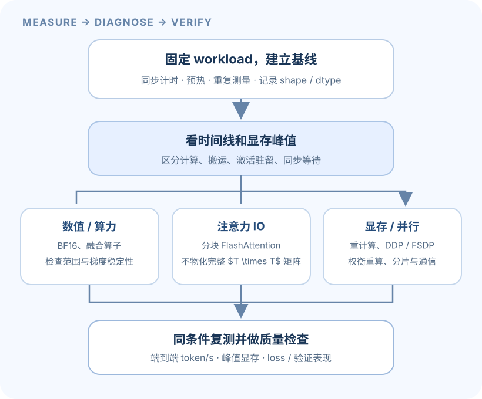

A1 关注“语言模型由什么组成”；A2 关注“这些组件怎样高效地跑在 GPU 和多 GPU 系统上”。本页讲概念和分析方法，不提供官方作业实现或数值答案。组件接口、实验设置以 [Stanford A2 handout](https://github.com/stanford-cs336/assignment2-systems/blob/main/cs336_assignment2_systems.pdf) 和[官方仓库](https://github.com/stanford-cs336/assignment2-systems)为准。

> [!warning] 作业与 AI 工具
> Spring 2026 handout 限制 AI 工具实现作业代码。本页是原创概念导读，不含解题代码或测试答案。做作业前请核对 handout 的当前政策。

## 1. 先测量，再优化

优化前要先回答三个不同问题：训练 step 总共用了多久？时间花在哪些 CPU/GPU 操作上？显存峰值出现在何时、由哪些张量造成？一个 end-to-end timer 只能回答第一个问题；Nsight Systems 一类系统 profiler 有助于定位主机、CUDA 调用和 kernel 时间线；PyTorch memory profiler 则用于检查分配和峰值显存。

GPU 调用通常是异步提交的。若只用 CPU 时钟量一次函数调用，测到的可能只是“提交任务的时间”，不是 GPU 完成任务的时间。可靠测量应使用与目标设备同步的计时方法，并进行预热和重复测量。记录均值或中位数、波动、batch/序列长度、精度、模型配置、GPU 型号和软件环境；profiling 本身也会带来开销。

Roofline 思路用算术强度判断瓶颈方向：

$$
I=\frac{F}{M},\qquad
t\gtrsim \max\left(\frac{F}{P_{\mathrm{compute}}},\frac{M}{B_{\mathrm{memory}}}\right),
$$

其中 $F$ 是浮点运算量，$M$ 是读写的字节量，$P_{\mathrm{compute}}$ 是有效计算吞吐，$B_{\mathrm{memory}}$ 是有效带宽。若运算相对数据搬运多，可能受计算吞吐限制；若反复读写大量中间结果，可能受内存带宽限制。融合算子、降低精度或改用分块算法，解决的是不同瓶颈，必须通过目标 workload 的测量来判断。

**比较之前先固定条件：**相同模型、输入 shape、dtype、warmup 和测量区间；区分纯前向、前向加反向、完整 optimizer step 和端到端吞吐。只比较一个 kernel 的最快时间，不能代表训练整体更快。

## 2. 单 GPU：精度、激活与重计算

### 混合精度

低精度数据格式可以提升矩阵乘吞吐并减少激活/参数占用，但有限的指数范围和尾数精度会改变数值误差。累加精度、梯度表示和 optimizer state 的 dtype 可能不同。要同时观察速度、峰值显存、loss/梯度是否稳定；不能假设所有张量都应使用同一种 dtype。

### Activation checkpointing

反向传播需要前向时产生的一些中间激活。保存所有激活可减少反向重算，但会占用大量显存。Activation checkpointing 只保存选定边界的激活，在反向时重新计算中间部分：显存下降，计算量与 step 时间通常上升。边界选得不同，内存峰值和额外计算也不同。

可用一个粗略账本思考：若某层保存激活约占 $A$ 字节，保存 $L$ 层约为 $LA$；改为每 $k$ 层留一个边界，峰值项会下降，但每次反向要重算若干层。实际峰值还受临时张量、allocator、kernel 工作区和并行流水影响，估算要用 profiler 校验。

## 3. FlashAttention：减少注意力的中间数据搬运

给定因果多头注意力的输入

$$
Q,K,V\in\mathbb{R}^{B\times H\times T\times d_h},
$$

常规写法形成分数矩阵 $S=QK^\top/\sqrt{d_h}$ 和概率矩阵 $P=\operatorname{softmax}(S+M)$，二者 shape 都是 $(B,H,T,T)$。因此 attention 中间矩阵的空间随序列长度按 $T^2$ 增长；因果 mask 虽然禁止访问未来位置，朴素实现仍可能物化大块矩阵。

FlashAttention 的核心是按 query/key tile 分块计算，并以在线 softmax 累积每一行的归一化分母和加权 value；避免把完整 $T\times T$ 注意力矩阵写入高带宽显存（HBM），反向时按需重算部分中间值。它主要减少内存流量和中间存储；注意力的主要点积工作量仍随 $T^2$ 增长，所以它不会让长序列注意力变成线性计算。

输出 shape 仍为 $(B,H,T,d_h)$，只是中间数据的存储和搬运策略改变。比较优化实现时要检验前向输出及梯度与参考实现的数值误差，再在多个 $B,H,T,d_h$ 和 dtype 上测吞吐/峰值显存。tile 太小会增加调度和重复加载，tile 太大可能超出片上资源；寄存器占用、共享内存和 occupancy 都会影响实际速度。

## 4. 多 GPU：数据并行与状态分片

### DDP 的同步逻辑

数据并行把 batch 分给 $N$ 个 rank，每个 rank 保存一份模型副本并计算自己的梯度。令 $B_i$ 表示 rank $i$ 的样本数，$g_i$ 表示它对本地**样本平均 loss** 算出的梯度；希望得到的全局样本平均梯度是

$$
g_{\mathrm{global}}=\frac{1}{\sum_i B_i}\sum_i B_i g_i.
$$

梯度同步完成后，各 rank 使用相同的更新保持模型副本一致。

实际工作负载 batch 相同的时候才简化为各 rank 梯度的普通平均。梯度同步需要通信；把多个小张量合并为 bucket 可减少通信调用开销，反向时逐 bucket 通信则有机会与尚未完成的计算重叠。小模型或少量 GPU 上，通信开销可能超过增加的计算吞吐。

这里的加权平均是目标值，不是默认 DDP 会自动按 $B_i$ 加权：标准 DDP 通常对各 rank 的梯度做等权平均。若本地 batch 大小不等且每个 $g_i$ 是本地样本平均梯度，就要在反向前按 $N B_i/\sum_j B_j$ 缩放各 rank 的本地 loss（以 DDP 再除以 $N$ 为前提），才能得到上式。若 loss 是按有效 token 平均而每个样本长度不同，应把权重换成各 rank 的有效目标 token 数 $C_i$，并按 $N C_i/\sum_j C_j$ 缩放；padding 或被 mask 的 token 不应计入 $C_i$。如果使用本地 loss 的求和而非平均，缩放方式也相应不同。

一个环形 all-reduce 的粗略通信模型为

$$
t_{\mathrm{comm}}\approx 2(N-1)\alpha+
2\frac{N-1}{N}\frac{S}{\beta},
$$

其中 $N$ 是 rank 数，$S$ 是待同步字节数，$\alpha$ 是每阶段延迟，$\beta$ 是链路有效带宽。它只用于理解“消息延迟 + 数据量/带宽”的构成；拓扑、collective 算法和框架实现会改变实际时间。

### Optimizer state sharding 与 FSDP

DDP 通常在每张卡上复制模型参数、梯度和优化器状态。AdamW 为参数维护额外动量等状态，模型较大时这些副本会成为显存瓶颈。

- **Optimizer state sharding：**将优化器状态分散到各 rank，减少重复状态占用；参数仍需在更新及前向/反向中保持可用，实施时需要相应的同步和参数更新处理。
- **Fully Sharded Data Parallel（FSDP）：**进一步切分参数、梯度和优化器状态。计算某个模块时，需要临时 all-gather 对应权重；梯度可 reduce-scatter 回各 rank 的分片。这样降低常驻显存，但增加通信，并需要选择模块粒度和通信/计算重叠策略。

因此，“每卡显存变少”不自动等于“训练更快”。模块切得过细会带来频繁 collective 和延迟；切得过粗又可能在 all-gather 时造成显存峰值。数据并行、FSDP、tensor parallel 的适用性取决于模型大小、batch、序列长度、GPU 互连和目标吞吐。

## 5. 自己读 profile 时要问的问题

- 测量的是哪个边界：只含前向，还是包含 backward、optimizer、数据等待和通信？
- GPU 是否因 Python、数据加载或同步等待而空转？哪个 profile 时间线能支持这个判断？
- 峰值显存对应参数、梯度、优化器状态、保存的激活还是临时 attention tensor？
- 激活重计算节省多少显存，代价是多少额外 FLOPs/时间？
- attention 优化是否在目标 $T$ 上显著减少内存流量？准确度误差和速度变化分别是多少？
- 增加 GPU 后，总吞吐如何变化？每步通信占比、扩展效率和每样本时间如何变化？
- 混合精度或 kernel 修改后，loss、梯度和最终验证行为是否仍与基线相容？

这些是分析问题，不是 handout 中具体实验的解答。A2 还涉及 Triton kernel、并行实现、书面分析与性能比较，需按官方仓库自行完成。

## 从单步训练到系统瓶颈：用一组小实验学 A2

A2 的核心问题是：模型在数学上能训练，并不代表它能在目标 GPU 上高效地训练。**测得慢，要先判断是在算、在搬数据、在等同步，还是显存根本装不下。** 下面的图把常见诊断路线放在一起；优化手段各自改变不同资源的使用方式。

*图 1. 每次只动一类因素并回到端到端基线；内核变快不一定让完整训练 step 同比例变快。*

### 先定义“快”：一个 step 里到底计了什么？

- **latency（延迟）**：完成一个指定单位工作的时间，例如一次 optimizer step。
- **throughput（吞吐）**：单位时间处理的 token 或样本数。要明确是否把 padding、数据读取、前向、反向、梯度同步和 optimizer step 都计入。
- **显存峰值**：最繁忙时实际需要同时驻留的内存，不是 checkpoint 文件大小。
- **利用率**：GPU 的计算或内存资源忙碌比例。利用率低可能是 CPU 数据准备、kernel 启动、同步或小批次造成；单独看一个利用率数字无法定位原因。

本章常见 shape 与单位：token 输入 $(B,T)$；隐藏激活 $(B,T,d)$；多头注意力分数 $(B,H,T,T)$；单个可训练参数组的梯度与该参数组同 shape。吞吐量用 token/s 或 sample/s，显存用 bytes（报告时可换算 MiB/GiB）；时间应明确是单步、固定多步区间，还是端到端训练总时长。

一个容易核对的小例子：每个 step 处理 $B=8$ 条、每条 $T=512$ 个有效 token，共 $4096$ token；跑完 20 个 step 的同步耗时是 2 秒，则吞吐为 $4096\times20/2=40{,}960$ token/s。若样本中 padding 很多，应另报有效 token 吞吐。若分母只计 GPU kernel 而不计数据等待，它就不是端到端吞吐。

GPU 工作经常异步提交。CPU 计时器记录完函数调用时，设备可能还没做完。因此，测量应使用能和设备完成点同步的方法；先预热，再做多次重复，报告中位数或分位数并留下离散程度。记录 batch/sequence shape、dtype、模型、GPU、软件版本和计时范围；profile 本身也会改变运行速度。系统 profiler 看 CPU/GPU 时间线，算子 profiler 用于定位单个 kernel，显存快照则用来追峰值分配。

### Roofline 直觉：瓶颈是算力还是搬运？

算术强度 $I=F/M$ 表示做 $F$ 次浮点运算时读写了多少字节 $M$。如果数据搬运很少、同一块数据能用于很多计算，算子可能受计算吞吐限制；如果读写量大或访存零散，可能受带宽限制。粗略下界为

$$
t\gtrsim\max\left(\frac{F}{P_{\mathrm{compute}}},\frac{M}{B_{\mathrm{memory}}}\right).
$$

这里的峰值算力和理论带宽只是上界；真实效率还会受访存合并、kernel launch、占用率、通信和同步影响。比如，一个很小的逐元素算子可能算得少，却被 kernel 启动耗时主导；把算子融合起来能减少启动和中间读写，但融合后也要检查寄存器压力与数值误差。

### 混合精度：省字节也省算力，但不能盲目转换

FP32 每个值通常占 4 bytes；BF16、FP16 通常占 2 bytes。低精度让矩阵乘法更省带宽、更快，也可能减小激活的驻留空间，但累加、归一化、softmax 和优化器状态可以保留较高精度。不要把“模型使用 BF16”误解为“所有状态都自动变成 BF16”。

BF16 指数位宽与 FP32 相同，因此可表达较大的数值范围，但尾数更短；FP16 尾数相对更长，指数范围更小，训练中小梯度可能下溢。loss scaling 会放大梯度以让其更容易表示，反向后再缩回；溢出时通常需要跳过该步并调整 scale。实验至少同时观察 step 时间、显存峰值、loss/梯度是否有限、验证指标与重复运行差异。

**手边练习：** 一个纯激活张量含 $2^{28}$ 个元素，FP32 约占 $2^{30}$ bytes（约 1 GiB），BF16 约占一半。真实模型还会同时保留参数、梯度、优化器状态、临时 buffer 和多个激活张量，因此一次减半并不等于总峰值减半。

### 激活重计算与 FlashAttention：用计算换内存流量

反向传播要用到前向中的中间激活。activation checkpointing 只保存选定边界，反向时重新执行部分前向来换取较低的显存峰值。它增加计算量，因此在显存受限且 GPU 还有可用算力时可能值得；若计算本来就是瓶颈，可能变慢。选择 checkpoint 粒度时要核对哪些张量仍然驻留，以及 RNG、dropout 等随机算子能否按需要重现。

标准注意力会形成 $T\times T$ 的 score/weight 矩阵。序列长 $T=4096$ 时，单个 head 有 $16{,}777{,}216$ 个分数；若以 BF16 存储，一个矩阵约 32 MiB，还未计入 batch、heads、反向所需中间值与其他激活。FlashAttention 采用分块计算，利用在线 softmax 汇总块结果，不把完整的 $T\times T$ 矩阵写入显存；它仍计算精确的注意力，只改变计算组织和 IO 行为。代价与限制包括 kernel 对 shape/dtype 的支持、硬件适配与可能的数值舍入差异。不要把它误认为低秩近似或稀疏注意力。

### 多 GPU 的账本：数据并行同步什么、分片放在哪里

DDP 将模型复制到每张 GPU，每张卡处理不同 mini-batch；反向后 all-reduce 汇总梯度，让副本保持一致。它通常易理解、计算与通信能并行一部分，但每张卡都要容纳整套模型、梯度和优化器状态。

FSDP 把参数、梯度和/或优化器状态切分到多卡上，需要时 all-gather 参数进行计算，再 reduce-scatter 梯度。这样可降低每卡常驻状态，但增加通信和调度成本。小模型或小 batch 上，通信占比可能盖过计算收益。实际显存取决于分片策略、reshard 时机、参数精度和通信 buffer，不能仅凭“用 FSDP”断定一个固定倍数。

比较分布式设置时要区分 **strong scaling**（总工作固定、增加设备）与 **weak scaling**（每台设备工作量固定、总工作随设备增加）。报告跨卡吞吐还要明确 global batch、每卡 batch、梯度累积和同步边界；只报单卡 microbatch 不足以说明训练结果可比。

### 诊断步骤、常见坑与递进练习

1. **固定工作负载并做基线。** 保存可复现的 shape、dtype、随机种子、计时脚本与端到端 step 定义。
2. **定位瓶颈。** 对照 CPU/GPU 时间线、算子耗时、显存分配和数据输入等待；确认设备确实执行了预期 kernel。
3. **提出单一假设。** 例如“attention score 的显存峰值限制 batch”，对应测试 FlashAttention 或 checkpointing，而不是同时改 batch、精度和并行策略。
4. **改变并复测。** 保持数据、总 token、训练步数与评估方式尽量相同；同时看速度、内存、数值稳定性和验证效果。

- **入门：** $B=4,T=1024$ 与 $B=8,T=512$ 都有相同的 token 数吗？核对提示：两者都是每 step 4096 token，但 attention 的 $BT^2$ 分别为 $4\times1024^2$ 与 $8\times512^2$，不可把 token 数相同当作计算量完全相同。
- **进阶：** 如果 FP32 改 BF16 后显存降、吞吐不变，你会查什么？核对提示：当前算子是否走低精度 kernel、瓶颈是否是内存/通信/输入、计时有没有同步与包含数据读取。
- **进阶：** 解释为何 checkpointing 能缓解 OOM，却可能让 step 变慢。核对提示：被丢弃的激活要重算；峰值内存下降，执行的 FLOPs 增加。
- **综合：** 为 DDP 与 FSDP 各画出“参数、梯度、优化器状态、通信”的驻留和传输账本。核对提示：沿 rank 逐项写出哪些完整复制、哪些分片、何时 all-reduce/all-gather/reduce-scatter。

这些问题检验的是系统推理，不是 A2 某个 benchmark 的答案。具体支持范围、计时约定和作业接口仍以当前 handout 与 starter 为准。

## 课程与笔记入口

- 官方相关讲次：L02（PyTorch 与资源核算）、L05（GPU/TPU）、L06（kernels/Triton）、L07–L08（parallelism）。课次主题见 [[course-map|官方课程地图]]。
- [A2 官方 handout 与仓库](https://github.com/stanford-cs336/assignment2-systems)
- 第三方、MIT 许可的 Hands-on-LLM 笔记中可按文件名寻找 `02_L4-L8_注意力替代_MoE_GPU系统_Triton.md`；这是把数讲内容并为一个阅读单元的**笔记文件标签**，不是 Stanford 官方课号。见[笔记目录](https://github.com/FRS2003/hands-on-llm/tree/main/01-foundations/notes)。
