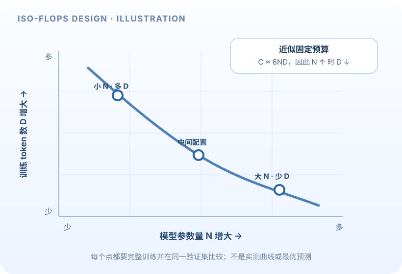

Scaling law 是用一组不同规模的训练实验，归纳模型规模、训练 token 数、计算量与 loss 之间的经验关系。A3 关注的问题是：计算预算固定时，模型应该多大、训练数据应该用多少，才能得到较低的损失？这是一种资源分配问题，不是“模型越大总会越好”的定律。

本页是概念导读，不包含 handout 中的拟合结果、超参数答案或提交代码。具体实验范围以 [Stanford A3 handout](https://github.com/stanford-cs336/assignment3-scaling/blob/main/cs336_assignment3_scaling.pdf)和[官方仓库](https://github.com/stanford-cs336/assignment3-scaling)为准。

> [!warning] 作业与 AI 工具
> Spring 2026 A3 handout 允许 AI 帮助理解概念或查询 API，但禁止 AI 工具代做作业实现。本页只解释方法和检查思路。

## 1. 变量与粗略计算量

记 $N$ 为可训练参数数量，$D$ 为训练 token 数，$C$ 为训练 FLOPs 预算。对标准 dense Transformer，一个常用的训练计算量粗略估算是

$$
C\approx 6ND.
$$

它把每个参数每个 token 的前向与反向计算近似折算为常数因子。attention、词表投影、序列长度、激活重计算、padding 和实现效率会影响实际用量，因此该式适合理解基本权衡，不能替代目标模型的测量。

当 $C$ 固定时，增大模型 $N$ 会减少能处理的 token 数：

$$
D\approx\frac{C}{6N}.
$$

小模型可能受模型容量限制，无法充分拟合数据；过大的模型则可能在给定预算下只能看到较少训练 token 或完成较少更新。因此需要从实验中找一个折中点。

## 2. IsoFLOPs：在同一预算下比较不同模型

IsoFLOPs 的意思是固定一条曲线上的总计算量 $C_i$，改变模型规模 $N_{ij}$，并按预算调整 token 数 $D_{ij}$，观察最终训练 loss $L_{ij}$。对每个预算得到一组 $(N,D,L)$ 后：

1. 在同一 $C_i$ 的实验中找出 loss 较低的模型与数据配置，得到该预算下的 $N_{\mathrm{opt}}(C_i)$ 和 $D_{\mathrm{opt}}(C_i)$。
2. 收集多个不同预算的最优点，拟合预算到最优模型大小、最优数据量的经验曲线。
3. 将拟合曲线外推到目标预算，作为新预算下的配置估计，再用独立验证实验检查预测。

若采用幂律表示，可写成

$$
N_{\mathrm{opt}}(C)=aC^{\alpha},\qquad
D_{\mathrm{opt}}(C)=bC^{\delta},
$$

其中 $a,b,\alpha,\delta$ 由特定数据、模型族和训练流程的观测拟合得出。它们不是普适常数。

也可以用更一般的损失模型来表达直觉：

$$
L(N,D)\approx L_{\infty}+A N^{-\alpha}+B D^{-\beta},
$$

该式说明模型容量和数据覆盖都可能限制 loss；它只是常见经验建模形式之一，不等于对所有训练设置都成立，也不是 A3 的唯一拟合方法。

## 3. 测量与拟合中的关键判断

### 训练 loss 与验证 loss

A3 的不同部分可能使用合成训练结果或训练 API 返回的验证曲线。两种 loss 不能不加区分地混在一条拟合数据中。训练 loss 更直接反映拟合目标；验证 loss 同时受到泛化、数据分布、评估 token 数和污染等影响。要在图表与报告中明确使用的 loss 类型和评估点。

### 拟合范围与残差

幂律通常在 log-log 坐标中拟合为近似直线，例如

$$
\log N_{\mathrm{opt}}=\log a+\alpha\log C.
$$

看起来直线并不意味着外推可靠。拟合点过少、计算预算跨度过窄、某一个点异常、低预算区域有不同训练瓶颈、或高预算超出数据分布，都可能改变斜率。检查散点、拟合残差、误差范围及去掉单点后的敏感度，有助于判断曲线是否被少数观测支配。

### 实验预算是稀缺资源

每个训练点都消耗预算；还要选择模型层数、隐藏维度、头数、batch size、上下文长度、学习率与训练 token 数。先设计能区分假设的少量点，避免无目的扫参。对相近候选配置，固定变量并只改变需要研究的因素；否则观察到的 loss 差异无法归因。

### 从预算到真实训练配置

参数数 $N$ 不是完整模型描述。不同 $d_{\mathrm{model}}$、层数 $L$、头数 $H$ 和词表会给出不同的参数与激活结构；相同 FLOPs 下，batch、序列长度和学习率计划也会改变优化轨迹。token 数换算成 step 数时，要明确全局 batch 的 token 数：

$$
\text{optimizer steps}\approx
\frac{D}{B_{\mathrm{global}}\,T_{\mathrm{sequence}}},
$$

前提是每步恰好消费这样的全局 token 数，且没有额外的丢弃、累积或数据重复。这里的式子用于核对数量级，不替代 API 对训练步骤和 token 计数的定义。

## 4. 外推不能脱离它的适用条件

- **规律是经验性的。** 参数化方式、数据质量、tokenizer、训练 recipe 和评估设置变了，最优曲线也可能变。
- **数据上限会影响曲线。** 数据有限、重复采样或混入低质量样本时，继续扩大模型可能更快进入收益递减区。
- **预算估算会有误差。** $6ND$ 忽略一些架构和实现细节；硬件利用率不同，同样理论 FLOPs 对应的 wall-clock 可能差很多。
- **目标 metric 要对齐。** 若目标是验证交叉熵，应直接拟合与预测验证交叉熵，并确认验证集足够且分布匹配。
- **最优点是候选范围内的最优。** 如果 sweep 没覆盖更小或更大的模型，观测最优不代表全局最优。

## 5. 读 scaling 实验图时的检查问题

- 一条 IsoFLOPs 曲线是否真的把总预算控制为近似常数？$N$ 变大后，$D$ 是否按预算约束相应调整？
- 每个配置的优化是否足够完成？学习率或训练步数问题会不会被误判为模型容量效应？
- 图上用的是训练 loss 还是验证 loss？评估 token 数是否一致？
- 幂律拟合用了哪些点？斜率、残差和外推跨度对单个点有多敏感？
- 给定目标预算，模型参数规模、数据 token 数和序列长度组合是否符合计算量与可训练步数的约束？
- 预测需要哪些确认实验，才能判断结果落在合理误差范围？

## 用有限预算做 scaling 实验：一份从定义到解释的路线

Scaling 实验研究：增加模型容量和训练数据后，预先选定的指标如何变化？这不是单纯地“训练几个不同大小模型”。若训练 token、架构、数据质量或优化充分程度同时变化，就很难判断曲线来自哪个因素。下面的图是概念示例，不代表课程实验数据或任何模型的实测结果。

*图 1. 横轴模型参数量增大时，同一近似预算可用于的 token 数会减少；曲线只提示应比较预算相同的配置。*

### 先把变量和“预算”说清楚

- $N$：模型的可训练参数量；必须说明是否计入 embedding、输出层等。
- $D$：训练中处理的 token 数；应说明重复采样 token 是否重新计数、序列 padding 是否计入。
- $C$：估算训练计算量；常见粗略关系是稠密 Transformer 训练的 $C\approx6ND$ FLOPs，来自每个 token 约 $2N$ 前向 FLOPs、反向再约为前向两倍的简化估算。
- $L$：预先选定的质量指标，例如固定独立验证集上的平均 next-token loss。

这些 $N,D,C,L$ 都是标量预算或统计量，不是 activation tensor 的 shape。模型一次前向仍处理形如 $(B,T,d)$ 的隐藏激活；若 batch、序列长度、padding 策略或数据分布不同，同一个 $N,D$ 也未必对应相同 wall-clock 和评测含义。

$6ND$ 适合做量级判断，不是精确计时器：attention 对序列长度的额外计算、embedding 与词表投影、padding、稀疏/专家结构、重计算、非理想 kernel 利用率和通信都会影响实际成本。实验里要同时保留估算 FLOPs 与实际 GPU-hours；二者回答的问题不同。

### IsoFLOPs 为什么能帮我们公平比较？

在粗略关系 $C\approx6ND$ 下固定 $C$，增大 $N$ 就意味着减少 $D$。例如用归一化单位令 $ND=100$：候选甲 $N=10,D=10$，候选乙 $N=25,D=4$。它们在这个简化预算下相同，但一个模型小、数据多，另一个模型大、数据少。若其余条件、训练完成度和验证评估都一致，loss 较低的候选可提示该预算附近更合适的参数/数据分配。

这只是**实验安排的手算例子**，不能据此推出哪一组真实训练一定更好。扫一条 IsoFLOPs 曲线时，应在每个预算下安排多组 $N,D$ 配置，覆盖观测到最优值的两侧。若最好的候选总在扫区间的最左或最右，通常要扩大范围，而不是宣布已找到全局最优。

### Scaling law 是观测范围内的模型，不是定律外推许可证

训练规模增大时，损失常可由幂律形式近似描述，例如

$$
L(N,D)=L_\infty + \frac{a}{N^{\alpha}}+\frac{b}{D^{\beta}},
$$

其中 $L_\infty$ 是此类拟合中的损失下限项，$a,b,\alpha,\beta$ 由数据与实验估计。此式说明：参数量不足和训练数据不足可能分别形成误差来源；每个项的影响会随规模按幂次减弱。真实数据可能还包含转折、噪声、训练未收敛或领域偏移，因此要报告拟合区间、残差和不确定性。

估计参数时使用 log-log 图有助观察幂律区间，但图看起来接近直线并不足以证明幂律适用于更大规模。若用预测预算决策，先预留不同种子的重复点，做范围内验证，再用更大规模的点检验外推。训练 loss 与验证 loss 要分开；若验证集在预训练数据中泄漏，曲线再平滑也不能代表泛化。

### 从小规模试跑到可靠结论

1. **确定测量对象。** 明确模型参数计数、数据版本/tokenizer、$D$ 的定义、计算预算估算方式和主要 validation metric。
2. **先验证训练配方。** 确认每种模型在相同规则下充分优化；不要让某个候选仅仅因为学习率、batch size 或训练步数没调好而输掉。
3. **扫描参数/数据组合。** 在每个预算层安排多个 $N,D$ 点，覆盖过小模型与过大模型两侧，并记录实际耗时和峰值内存。
4. **估计曲线与不确定性。** 用训练、验证曲线查是否已稳定；多 seed、小规模重复和残差检查用于估计噪声。
5. **留出验证点。** 不用所有点拟合后再只在相同点上宣称预测成功；将一部分配置留作曲线外或较大规模的检验。
6. **报告约束和失败。** 描述硬件、数值格式、数据质量、训练完成度和无法探索的规模范围。

### 读图常见误区与递进练习

- **入门：** 若 $C$ 固定且粗略按 $ND$ 估算，$N$ 增为 2 倍，$D$ 大约如何变化？核对提示：$D$ 约减半；这是同一乘积预算的代数关系，不是最优性结论。
- **进阶：** 为什么比较同一个 $N$ 在不同 $D$ 上的 loss，仍不能直接推导最优 $N$？核对提示：参数量与数据量存在联合取舍；需要在相同预算下同时改变二者并控制训练过程。
- **进阶：** 拟合曲线的最好候选处于扫描区间端点，应当怎样处理？核对提示：扩大搜索范围并确认预算计算与训练完成度；端点最优说明当前数据没包住最优点。
- **综合：** 设计一个能检验外推的报告：哪些图、表、重复实验和配置要公开？核对提示：至少包括 $N,D,C$ 与实测 GPU-hours、训练/验证 loss、残差、重复种子、数据/tokenizer、硬件和保留的验证规模点。

这些练习帮助你辨认实验逻辑，不提供 CS336 A3 handout 的数值结果、拟合参数或提交答案。具体模型配置和评估协议应以当期官方说明为准。

## 课程与笔记入口

- 官方相关讲次：L09 和 L11 均为 scaling laws；资源与推理主题分别见 L02、L10。编号和讲题见 [[course-map|官方课程地图]]。
- [A3 官方 handout 与仓库](https://github.com/stanford-cs336/assignment3-scaling)
- 第三方、MIT 许可的 Hands-on-LLM 笔记文件 `03_L9-L11_缩放定律_推理优化.md` 将 scaling 与 inference 内容编为一个阅读单元。这里的 `L9-L11` 是笔记分组标签，并不等同于一讲或课程作业编号。见[笔记目录](https://github.com/FRS2003/hands-on-llm/tree/main/01-foundations/notes)。
