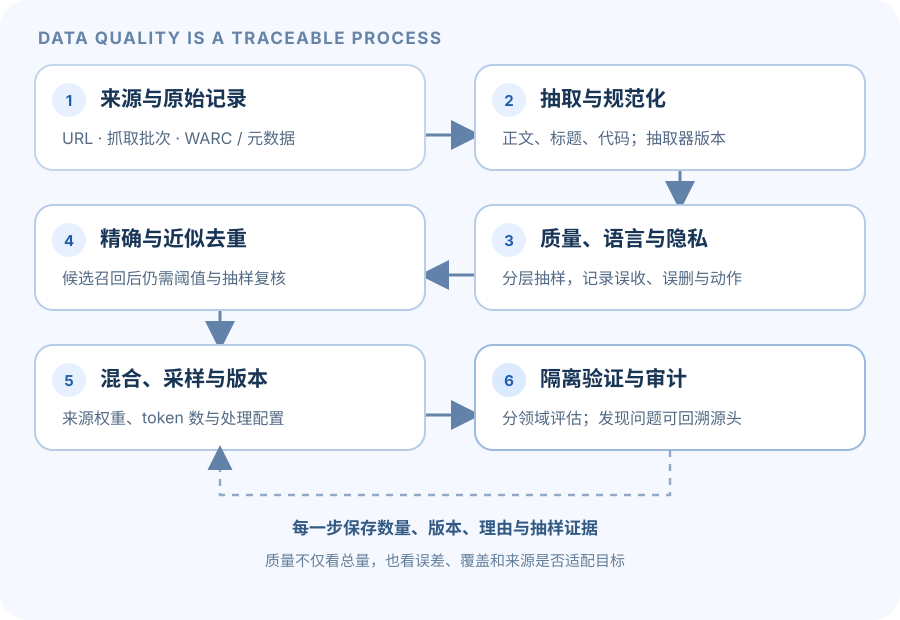

大规模网页抓取并不是现成的高质量语言模型数据集。页面里有 HTML 标记、导航和广告；抓取中包含多种语言、重复文本、个人信息和有害内容；什么算“高质量”也取决于目标模型。A4 的核心是理解一条数据处理 pipeline 如何改变语料，以及如何用可追踪的证据判断改变是否有帮助。

本页是概念导读，不提供官方过滤器实现、阈值答案或实验结果。数据格式、允许资源与实验定义以 [Stanford A4 handout](https://github.com/stanford-cs336/assignment4-data/blob/main/cs336_assignment4_data.pdf)和[官方仓库](https://github.com/stanford-cs336/assignment4-data)为准。

> [!warning] 原始网页内容
> 未过滤的网页抓取可能包含令人不适、有害或敏感的内容。阅读和处理样例时遵循课程 handout 的提示；无需为了完成数据处理目标而深入查看不必要的内容。

## 1. 从抓取记录到纯文本

Common Crawl 的几类文件承载不同信息：

- **WARC** 保存网页抓取记录、请求信息和原始响应内容（例如 HTML）。
- **WAT** 保存从抓取记录提取出的结构化元信息，例如页面标题或链接。
- **WET** 保存已提取的文本，但仍可能带有导航、页脚、模板文字或解析噪声。

HTML 到纯文本不是删除尖括号那么简单：需要处理字符编码、脚本与样式、正文结构，以及导航和模板内容。文本抽取器的目标也需明确：对一个对话模型可能不希望把 cookie banner 当语言知识；对搜索模型，页面标题或链接文字也可能有价值。

建议记录每阶段的输入输出和失败原因，让任意样本能回溯到原始来源。只保留最终文本而丢弃来源元数据，会让质量排查、重复溯源和风险处置变困难。

## 2. 过滤是质量、覆盖和风险的权衡

### 语言识别

语言识别器通常给出候选语言 $\hat{\ell}$ 和置信度 $s\in[0,1]$。阈值 $\tau$ 用来决定是否接受：

$$
\text{keep}(x)=\mathbf{1}[s(x)\ge\tau\ \land\ \hat{\ell}(x)\in\mathcal{L}],
$$

其中 $\mathcal{L}$ 是目标语言集合。提高阈值通常会减少误收，但可能误删短文本、代码混合文本、方言或低资源语言。应抽样人工核对混淆情况，并按语言、来源域名、页面长度等切片评估，而不是只看一个总体准确率。

### PII 与有害内容

个人可识别信息可被删除或替换成明确占位标记；每种选择都会影响上下文。正则表达式便于发现常见邮箱、电话号码和 IP 格式，但难以覆盖所有格式，也可能误伤正常文本。分类器和规则同样有漏检与误检：阈值越严格，潜在风险下降的同时，有用内容也可能被移除。

过滤策略应写清检测对象、动作（删除/遮盖/隔离）、置信度规则和审计字段。若目标人群、产品安全要求或适用语言变化，阈值与抽样方案需要重新评估。

### 质量规则与分类器

规则过滤（例如文档长度、重复字符、词语分布或标点结构）成本低、容易解释，但容易被网页模板、专业文本、代码或非目标语言误导。学习型质量分类器能组合多个信号，但它会继承标注来源和训练样本中的偏差。分类器“判为高质量”只是代理指标，不等于对所有训练目标都适合。

保留高分网页可能提高某个验证集上的效果，却降低领域覆盖、长尾事实和语言多样性。数据选择应由目标模型和目标任务决定，并报告舍弃了什么类型的数据。

## 3. 去重：避免重复样本支配 token 预算

精确去重直接识别完全相同的文本或行；近似去重则尝试找出轻微编辑、模板差异或格式变换后的重复文档。一种常见概念是把文档切成 shingles（例如连续 token 片段）形成集合 $A,B$，用 Jaccard 相似度衡量重叠：

$$
J(A,B)=\frac{|A\cap B|}{|A\cup B|}.
$$

MinHash 对集合做压缩签名，其关键性质是：对一个随机置换，两个集合的最小哈希相同的概率等于它们的 Jaccard 相似度。Locality-Sensitive Hashing（LSH）将签名切成多个 band，从而以更低成本生成相似文档的候选对；它是候选检索机制，最终是否去重仍取决于相似度检查与阈值。

若一个签名有 $b$ 个 band、每个 band 有 $r$ 行，相似度为 $s$ 的两份文档至少有一个 band 全匹配的概率近似为

$$
P(\text{candidate}\mid s)=1-(1-s^r)^b.
$$

这个曲线由 $b,r$ 决定：候选召回更积极时，比较成本和误报通常也会上升。token shingle 长度、文本规范化、候选阈值和数据域都会影响重复识别效果。

去重不只是节省空间。重复网页可能让某些事实或模板在训练中被过度加权，降低有效多样性；但过强的近似去重也可能把同一主题的不同页面或合理复述一并删除。要用抽样的候选对检查漏检与误删。

## 4. 评估整条 pipeline，而不只看“留下多少”

一个可审查的数据 pipeline 至少要看这些量：

- 各阶段输入文档数、保留比例、丢弃原因和异常失败数量。
- 语言、域名、文档长度、主题或时间分布在处理前后的变化。
- PII/有害内容检测的抽样误报、漏报与最终残留检查。
- 去重前后的重复率、候选对质量和数据量变化。
- 经过 tokenizer 后的 token 数、序列长度分布及截断比例。
- 用固定模型和固定训练预算，在独立验证集上比较 loss/perplexity，并检查具体生成样本。

若多个过滤器同时变化，很难知道验证指标为何改变。实验时保持其他因素不变，或采用清楚记录的消融对照；同时保留数据版本和配置，使评估可复现。

验证集也有边界：如果训练语料包含其近重复文本，较低的验证 loss 可能部分来自数据污染；如果验证域与目标使用场景不匹配，loss 下降也未必意味着实际质量提升。应使用隔离的数据来源，并按领域与语言报告结果。

## 5. 阅读 A4 结果时可以问

- 抽取后的文本真的以页面正文为主吗？WARC/WET 和自己的解析结果差在哪里？
- 语言分类器的错误集中在哪些内容？阈值改变后，各语言保留率怎么变化？
- PII 替换统计只反映规则命中，还是有独立抽样检查漏检？
- 质量过滤偏好哪些域名、语言和文档类型？数据覆盖因此怎样改变？
- 去重的 shingle 和 LSH 参数对候选量、漏检、误删分别造成什么影响？
- 训练/验证数据是否来源隔离？模型规模、tokenizer、训练 token 预算是否固定？

这些问题用于审视数据质量证据，不是 A4 的特定过滤器答案。作业还要求依官方说明完成数据处理、统计和训练评估。

## 从抓取页面到训练 token：A4 的数据工作台

网页语料并不是拿到文件后直接 tokenize 就结束了。训练数据要经历提取、规范化、语言与质量判断、去重、隐私处理、采样混合和独立验证；每一步都能改变内容分布。数据处理的目标不是让“留下来的比例最大”，而是得到**来源可追踪、质量可度量、与训练目标相符**的语料。

*图 1. 保留每阶段计数、版本与丢弃原因，才能从训练结果追溯回原始数据处理决定。*

### 从一条记录看清“原始页面”与“训练文本”

假设一条抓取记录包含 URL、抓取时间、HTTP 响应和 HTML。WARC 通常保存抓取请求与原始响应，WAT 保存结构化元数据，WET 是抽取后的文本；三者的信息粒度不同。WET 不一定已经移除了导航、cookie 提示和页脚，HTML 去标签也不等于提取正文。正文抽取器应按明确目标保留标题、段落、列表、代码或表格，同时丢掉与目标任务无关的模板噪声。

为每份派生文本保留 source ID、URL/域名、抓取批次、抽取器版本、语言判定、过滤器版本、去重簇 ID、保留/拒绝理由和最终 token 数。这样如果发现某类文档消失，就能查明它是源站缺失、正文提取失败，还是过滤器误删，而不是只看到最终语料中的比例变小。

这里的计量单位也要分开：抓取/抽取阶段按文档或记录计数，去重阶段可按文档簇与 token shingle 比较，模型训练预算最终常按 tokenizer 产出的 token 数统计。文档条数相同不等于 token 数相同；字符数也不等于 token 数。

### 过滤不是“好/坏”二分类：阈值会换来不同错误

语言分类器给出候选语言 $\hat{\ell}$ 和分数 $s$ 后，可以采用类似 $s\ge\tau$ 且 $\hat{\ell}$ 属于目标语言集的规则。阈值调高通常少收错语言，却可能误删短文本、术语密集的技术文档、代码与中英混写；阈值调低则保留更多边界文本，也引入更多噪声。总体准确率会掩盖长尾语言上的漏检和误收，应按语言、来源域名、长度、文档类型分组审查抽样结果。

质量分类器、启发式规则和人工复核相互补足，但分类器分数不是“真实质量”。如果过滤器在标题完整、网页格式整齐的资料上表现好，可能间接偏向少数出版格式或网站。应检查留下与丢弃的样本分别是什么，记录阈值、召回/误报估计和领域覆盖变化。对 PII（个人可识别信息）与有害内容，正则匹配成本低、便于说明，但不能覆盖所有写法；策略需定义检测对象、动作、抽样复核和审计字段。

### 手算相似文本去重：候选发现不等于判决

取两个 token 序列：A=`red blue green black`，B=`red blue green white`。用长度为 2 的 shingle（相邻二元片段）建立集合：

$$
A=\{\text{red-blue},\text{blue-green},\text{green-black}\},\quad
B=\{\text{red-blue},\text{blue-green},\text{green-white}\}.
$$

交集大小为 2，合并集大小为 4，因此 Jaccard 相似度 $J(A,B)=2/4=0.5$。不同 shingle 长度、文本规范化与分词方式会改变相似度，短文中一个 token 也能造成很大的比例变化。

精确哈希适合查完全重复；MinHash 用短签名近似集合相似度；LSH 用多个 band 快速找出可能相似的候选。若签名有 $b$ 个 band、每 band $r$ 行，理想独立假设下，相似度 $s$ 的一对文档成为候选的概率约为 $1-(1-s^r)^b$。候选只是“值得进一步比较”，阈值和最终合并规则仍决定误报与漏报。过强去重能消除重复网页对训练 token 的过度加权，也可能删掉合法复述、常见模板或相似但互补的内容。

### 为什么要记录语料混合，而不只报总 token 数

设想最终训练集由网页、书籍和代码三个来源混成，每类都可能具有不同文档长度、噪声水平、领域和语言覆盖。报告每个来源的样本数、token 数、采样权重、去重前后比例、抽样审计结果和训练中的采样策略，才知道总量相同的两个数据集为何行为不同。若按来源设定目标权重，应在 token 层面还是文档层面抽样、短长文档是否等概率、训练期间是否动态改变，都要明说。

验证集应与训练源隔离，并与评测目标匹配。对网页数据，按来源/时间或文档簇隔离有助降低近重复泄漏；只随机拆分段落可能把同一原文分到训练和验证两侧。除了平均 loss，还应看不同领域、语言和长度分桶，并人工检查代表样本。较低验证 loss 可能只是数据重叠或域匹配，并不能单独证明整体数据更有益。

### 常见坑与递进练习

1. **建立来源账本：** 原始对象数、成功抽取数、各过滤器丢弃数和理由、去重前后数、最终有效 token 都按版本保存。
2. **分层抽样复核：** 在不同语言、长度、域名和规则分数区间抽样，检查误收与误删，而非只审查“最高质量”文本。
3. **单因素对照：** 每次改变一个规则/阈值/去重策略，固定模型、tokenizer、预算和评测集；明确数据变化的代价。
4. **训练并评估：** 保存语料清单与处理配置，报告总体与分桶指标，以及可复查的生成样本。

- **入门：** 上面的 A/B 文档为什么 Jaccard 是 0.5？核对提示：两个共有 shingle，三个来自 A、三个来自 B，联合集合去掉重复后共有四个。
- **进阶：** 提高语言阈值后，为什么整体准确率提高仍可能使目标语料变差？核对提示：整体准确率会让数量少的语言或文档类权重很低；逐组看误删率和覆盖。
- **进阶：** LSH 报告了很多相似候选，是否等于应该全部合并？核对提示：候选检索追求发现潜在重复，最终决定还要看实际相似度、长度、来源关系与内容差异。
- **综合：** 为一种数据过滤改动设计可审计的消融实验。核对提示：留存/丢弃统计、分组抽样、误报漏报、去重簇、token 预算、训练对照和独立验证应连成一条记录链。

这些练习讨论的是方法和取舍，不包含 A4 作业所要求的数据结果或应达到的具体过滤比例。数据授权、合规要求与课程当期政策需依据官方材料和数据来源另行核实。

## 课程与笔记入口

- 官方相关讲次：L13（data sources/datasets）和 L14（filtering、deduplication、mixing、synthetic data），另参考 L12 的 evaluation。编号见 [[course-map|官方课程地图]]。
- [A4 官方 handout 与仓库](https://github.com/stanford-cs336/assignment4-data)
- 第三方、MIT 许可的 Hands-on-LLM 笔记 `04_L12-L14_模型评估_训练数据.md` 合并了几个课程主题；`L12-L14` 在这里是笔记分组标签，不是单独课程名称或 A4 的编号。见[笔记目录](https://github.com/FRS2003/hands-on-llm/tree/main/01-foundations/notes)。
