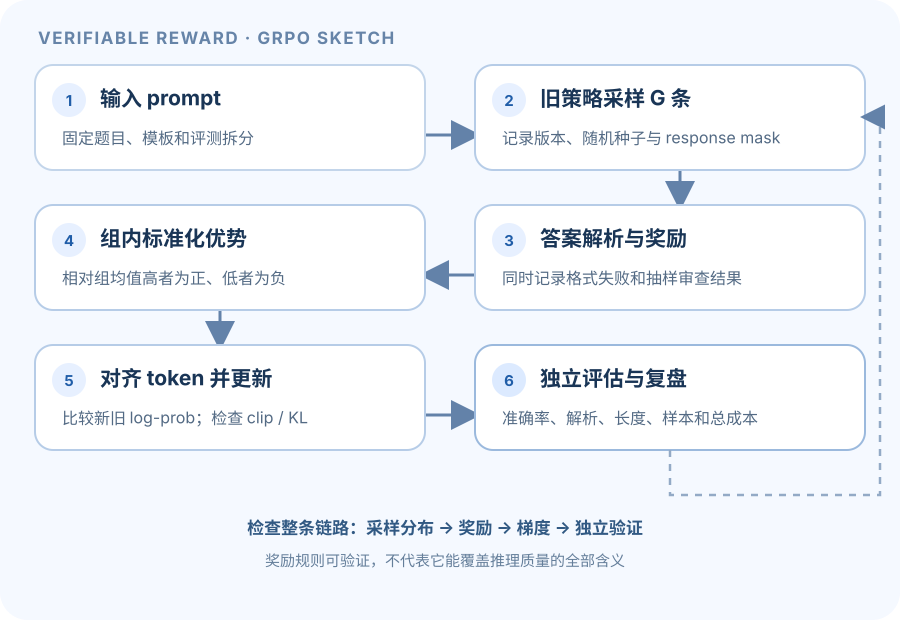

预训练语言模型可以根据上下文继续生成 token。Reasoning RL 的目标是用可验证任务上的奖励，让模型更常生成能得到高分的回答。A5 从 zero-shot/few-shot/chain-of-thought prompting 的基线开始，再讲策略梯度和 GRPO，最后讨论若干估计器变体与 off-policy 数据复用。

本页给出概念框架和符号，不包含作业推导结果、实现代码或实验答案。请以 [Stanford A5 handout](https://github.com/stanford-cs336/assignment5-alignment/blob/main/cs336_spring2026_assignment5_alignment.pdf)、[官方作业仓库](https://github.com/stanford-cs336/assignment5-alignment)和当前课程说明为准。

> [!warning] 作业与 AI 工具
> Spring 2026 A5 handout 允许 AI 解释概念或查询 API 文档，但禁止 AI 工具实现作业任一部分。此页是原创的概念讲解，不提供作业代码或解答。

## 1. 提示基线：先分清“改变上下文”和“更新参数”

Zero-shot 直接给任务说明；few-shot 在上下文中添加示例；chain-of-thought prompting 要求模型给出推理过程。它们改变输入上下文或生成格式，不一定改变模型参数。比较不同提示时，需要固定模型、解码配置和评估集，并明确评分器怎样从输出中提取答案。

在 A5 的 GSM8K 设置中，自动评估需要解析模型最终答案。一个回答可能推理过程正确但格式解析失败，也可能被格式解析器判为正确而推理文本有问题。把准确率、答案格式、解析失败、输出长度和代表性样例一起看，避免将 parser 的行为误认为模型能力本身。

## 2. 语言模型作为策略

把 prompt $x$ 看作初始状态。模型按自回归方式生成 token $y_1,\ldots,y_T$，每一步根据已有上下文给出下一个 token 分布：

$$
\pi_\theta(y\mid x)=\prod_{t=1}^{T}
\pi_\theta(y_t\mid x,y_{<t}).
$$

其中 $\theta$ 是模型参数。对完成序列 $y$ 的奖励记为 $R(x,y)$；在可验证任务里，奖励可以来自答案是否通过规则或测试。目标是提高 prompt 分布下的期望奖励：

$$
J(\theta)=\mathbb{E}_{x\sim\rho,\ y\sim\pi_\theta(\cdot\mid x)}[R(x,y)].
$$

REINFORCE 的基本梯度形式为

$$
\nabla_\theta J(\theta)=
\mathbb{E}\left[
R(x,y)\sum_{t=1}^{T}\nabla_\theta\log\pi_\theta(y_t\mid x,y_{<t})
\right].
$$

要区分原始奖励和相对基线后的优势：若奖励非负，未减基线的公式会用正奖励强化采样到的轨迹，零奖励在该项中不给梯度；一个仍为正的低奖励并不会自动变成负反馈。若原始奖励本身为负，它也会抑制对应轨迹。减去基线后，则根据优势 $R-b(x)$ 的符号判断方向：正优势强化轨迹，负优势抑制轨迹。这种采样目标的方差可能很大，特别是模型回答长度不同、奖励稀疏或同一 prompt 下结果随机性强时。

## 3. 基线与组相对优势

可以从奖励中减去一个不依赖当前动作的基线 $b(x)$，帮助降低估计方差而不改变期望梯度：

$$
\nabla_\theta J(\theta)=
\mathbb{E}\left[
(R(x,y)-b(x))\sum_t\nabla_\theta\log\pi_\theta(y_t\mid x,y_{<t})
\right].
$$

GRPO 对同一 prompt 采样一组回答 $y_1,\ldots,y_G$，并在组内比较奖励。例如组相对优势可写为

$$
A_i=\frac{R_i-\operatorname{mean}(R_1,\ldots,R_G)}
{\operatorname{std}(R_1,\ldots,R_G)+\epsilon}.
$$

减去组均值让“高于同组平均”的回答为正、“低于平均”的为负；除以标准差又改变了不同 prompt 组之间的权重尺度。实现和变体会对标准差归一化、序列长度归一化与 token 聚合采取不同做法；这些选择改变优化目标或样本权重，不能只当成无影响的代码细节。

若一组样本得到相同奖励，组内标准差接近零，优势的数值处理就很重要。此时该组能提供的相对排序信号也很少。分析日志时应同时记录奖励分布、每 prompt 的成功比例和优势分布。

## 4. On-policy 与 off-policy：生成成本和分布偏差

On-policy 更新使用当前策略 $\pi_\theta$ 生成的响应。生成昂贵，但梯度所依据的样本分布与当前策略一致。Off-policy 方法会在一批响应上进行多次更新，生成成本更易摊薄；但响应来自较旧策略 $\pi_{\mathrm{old}}$，与当前策略的分布逐步拉开。

常用重要性比率为

$$
r_t(\theta)=
\frac{\pi_\theta(y_t\mid x,y_{<t})}
{\pi_{\mathrm{old}}(y_t\mid x,y_{<t})}.
$$

比率用于校正采样策略和当前策略之间的差异，但对极端比率进行重加权会增加梯度估计方差。PPO/GRPO 类方法常采用 clipping 限制比率对目标的影响，以换取更稳的更新；这同时带来偏差，且裁剪过紧可能压低有效学习信号。

因此 off-policy 的权衡不只是“更快或更慢”：要比较 rollout 生成用时、训练用时、总壁钟时间、响应复用次数、验证奖励、更新稳定性和不同随机种子的波动。若只看训练 step 数或训练 reward，可能错过生成成本和分布漂移。

## 5. 训练与评估中的实用问题

- **答案奖励是什么？** 解析器、测试或规则是否正确区分格式问题与内容错误？奖励来源是否可验证？
- **采样单位是什么？** 一批里有多少 prompts、每个 prompt 几条响应？batch 维度是回答数还是问题数？
- **mask 对齐正确吗？** prompt token 与 response token 哪些参与语言模型 loss？response mask、padding 和终止 token 是否一一对应？
- **归一化改变了什么？** 组内标准化、序列长度归一化、token/sequence loss aggregation 各自如何影响不同长度的回答？
- **更新有多陈旧？** off-policy 时当前策略与 rollout policy 的 log-prob 比率分布如何变化？clip 前后有多少 token 被裁剪？
- **结果是否稳健？** 多次运行的验证奖励方差多大？是否出现 reward hacking、输出变长但准确率不变、格式退化或灾难性遗忘？
- **效率是否按端到端计算？** 计入模型生成、同步权重、训练、验证和数据解析后，总时间与显存是什么？

A5 的推理链样例有助于分析行为，但并不构成对内部推理真实性的保证。奖励指标和自动评分器都可能被利用；报告任务分数时应同时抽查输出并说明评估器局限。

## 6. A5 与课程后训练主题的边界

官方课程 L15 介绍 SFT/RLHF，L16 聚焦 RLVR，L17 涉及 alignment 与 multimodality；A5 必做 handout 当前主要研究 prompting、GSM8K 上的 reasoning RL/GRPO 与估计器变体。课程主题更宽，作业不是这些主题的完整覆盖。handout 还链接了可选补充材料；不要把可选内容误写成必做 A5 范围。

Spring 2026 handout 的实验对象是 OLMo-2-0425-1B 与 GSM8K。作业从 zero-shot/few-shot/CoT 提示基线开始，然后研究 on-policy GRPO；之后比较 RFT、Dr. GRPO、MaxRL 等估计器选择，并考察 off-policy 更新和重要性比率处理。此处只概括作业主题，不预设哪种方法会获得更好的结果。

## 一步步看懂 reasoning RL：从 prompt 到 GRPO 更新

监督微调教模型复现示范答案；RL（强化学习）则让模型采样回答，再根据奖励信号调整生成策略。对有明确答案的数学题，程序可以检查最终答案是否正确，因此不一定要先让人给每条推理打分。不过，“最终答案通过规则检查”只说明某个可观察标准通过了，不能保证推理过程可靠。

*图 1. rollout 回答先成为带来源策略的训练样本；奖励和策略更新都要遵循同一套 token mask 与版本记录。*

### 先把模型看成一个会抽样的策略

给定 prompt $x$，自回归模型按步采样回复 $y=(y_1,\dots,y_T)$。每一步概率依赖此前上下文：

$$
\pi_\theta(y\mid x)=\prod_{t=1}^T\pi_\theta(y_t\mid x,y_{<t}).
$$

$\theta$ 是策略模型参数；$R(x,y)$ 是整条回复的奖励。目标是让回答的期望奖励增大。对未减基线的 REINFORCE，正的 $R$ 会提高该采样轨迹的 log-prob，$R=0$ 则不提供这项梯度；只有负奖励或负优势才会把相应轨迹往下压。使用基线后，较低奖励是否变成负优势，取决于它相对基线的位置。它不是逐 token 判断文字是否优美，除非奖励本身确实在测那个性质。

以一道只检查最终数值的题为例，回答可能带有解释、公式、最后答案标记。奖励程序必须从回复中提取最终答案，规范化格式，再和标准答案比对。少了终止符、答案解析不支持格式或多写了另一个数字，都可能让 parser 的评分与真实能力脱节。因此要分别跟踪解析失败、格式失败、答案正确率和人工样本审阅。

批次张量可这样记账：$P$ 个 prompt，每个 prompt 采样 $G$ 条回复，每条最多保留 $L$ 个 response token。对齐后的旧/新 token log-prob 与 response mask 形如 $(P,G,L)$；整条回复的 reward 和组相对 advantage 形如 $(P,G)$。若算法把序列级 advantage 广播到每个有效回复 token，计算时会扩展到 $(P,G,L)$ 并乘 mask；不能把 prompt token、padding token 与 response token 混在同一个 loss 里。工程实现也可能把前两维展平成 $P\cdot G$，但概念上的分组关系仍要保留。

### 为什么需要 baseline：同一答案的奖励要有比较背景

策略梯度中，从奖励减去一个不依赖本次动作的 baseline，理论上可以降低梯度估计方差而不改变期望方向。它回答的问题从“奖励绝对有多大”转成了“比参照更好还是更差”。若不同 prompt 难度不一样，组内比较可以减少题目本身难易带来的尺度差异。

GRPO 对同一个 prompt 采样 $G$ 条回复，计算各自奖励 $R_i$，然后用组内中心化、标准化后的 advantage 作为学习信号。示意写法是

$$
A_i=\frac{R_i-\operatorname{mean}(R_1,\ldots,R_G)}
{\operatorname{std}(R_1,\ldots,R_G)+\epsilon}.
$$

手算一组 $G=3$ 的奖励 $(0,1,3)$：均值为 $4/3$；使用总体标准差时，方差是 $14/9$，标准差为 $\sqrt{14}/3\approx1.247$。相应标准化优势约为 $(-1.069,-0.267,1.336)$，平均值为 0。于是组内最佳回答给正信号，最低回答给负信号。样本标准差会使用不同分母，因此这些数字用于说明总体标准差定义；实现必须核对 handout 对标准差与 $\epsilon$ 的定义。

若同一组所有回复都得相同奖励，中心化后优势全为零，组内比较没有辨别信号。$\epsilon$ 让除法数值稳定，却不能制造奖励差异。这时需要从奖励定义、采样多样性、温度、prompt 难度、生成截断或格式解析日志查原因，而不是只调大优化器步长。

### 看懂概率比和裁剪：新策略不能一下子跑太远

rollout 通常由旧策略 $\pi_{\mathrm{old}}$ 生成。训练时再用当前策略计算相同上下文下的 token log-prob，得到重要性比率

$$
r_{i,t}(\theta)=\exp\!\left(\log\pi_\theta(y_{i,t}\mid x_i,y_{i,<t})
-\log\pi_{\mathrm{old}}(y_{i,t}\mid x_i,y_{i,<t})\right).
$$

如果这个 ratio 很大，当前策略已经大幅提高某个采样 token 的概率；很小则表示大幅降低。PPO 风格裁剪的示意目标取 $\min(rA,\operatorname{clip}(r,1-\epsilon_c,1+\epsilon_c)A)$，限制单次更新从旧策略样本得到的极端增益。它会引入偏差，也可能使超出裁剪区间的 token 梯度变小。

GRPO 变体常会另加入与参考策略的 KL 惩罚，或在 token/sequence 维度以不同方式聚合 loss。常见的示意性最大化目标是“裁剪后的策略项减去 $\beta$ 乘 KL”，但具体是按 token、回复还是批次归约，是否长度归一化，以及 KL 如何估计，都应以当期 handout 为准。本页不把这个示意式当作所有实现的精确答案。

实现概率 ratio 时，保存旧策略的 token log-prob 并确保 token 对齐；数值上通常在 log 空间做差再指数化。prompt token 通常是 conditioning 上下文而非动作，回复部分才由 response mask 参与策略 loss。padding、EOS、truncated response 和解析后的答案位置都要保持同一套对齐约定。

### On-policy、off-policy 和几种估计器在权衡什么

**On-policy** 更新使用当前/近似当前策略生成的 rollout，生成成本较高，但采样分布与优化对象接近。**Off-policy** 复用旧策略样本可节省昂贵生成，却让训练策略和样本来源的分布逐渐分离；importance ratio 尝试校正差异，ratio 过极端又会增大方差，因此会考虑裁剪、截断或其他稳健方法。

A5 中会比较不同 prompting，以及 RFT、Dr. GRPO、MaxRL 等方法/估计器变体。阅读这些缩写时先按当期 handout 核对精确定义，再比较它们改变了哪一步。实验比较时要问清是否使用同一模型、训练 token 预算和 rollout 数；是否有参考策略或不同的 KL 约束；每批旧回答复用了几轮；总成本是否包含生成、解析、同步更新和评估。仅按 optimizer step 个数比较会忽略回答生成成本与数据新鲜度。

### 从评估到训练的工作流与常见失败模式

1. **建立 prompting 基线。** 固定模型版本、prompt 模板、解码参数、数据拆分和 parser；同时保留最终答案与原始回答。
2. **生成 rollout。** 每个 prompt 抽样多条回复，记录策略版本、随机种子、终止原因和 response token mask。
3. **执行奖励与审计。** 保存解析结果、奖励、失败原因，并抽样检查 reward hacking、格式投机和标注偏差。
4. **形成优势并更新。** 核对组内统计方式、log-prob 来源、clip、KL、loss reduction 与 optimizer 状态。
5. **独立评估。** 用未参加训练的题目/来源检查答案正确率、解析失败、回答长度、格式、跨种子波动和代表性原文。

常见失败包括：奖励只看答案而模型学会猜测；组内几乎没有奖励差异；不同生成长度导致长序列获得不成比例的权重；解析器把错误答案判对；重复使用旧回答太多导致 ratio 极端；模型为了奖励改变格式或输出冗长但不增进正确率。每种现象都应在分组指标与样本审查中可见。

### 递进练习与核对提示

- **入门：** 一条回复有 12 个 prompt token、20 个生成 token 和 3 个 padding token。哪些位置是策略生成的动作？核对提示：padding 不是真实动作，prompt 作为条件上下文，通常只对 20 个 response token 的对应部分计算策略项；特殊终止 token 是否计入按具体实现确认。
- **进阶：** 奖励组为 $(0,1,3)$ 时，哪个回答得到正优势？若全为 1 呢？核对提示：组均值为 $4/3$，第三个为正；全相同则中心化后全零。
- **进阶：** 为什么裁剪 ratio 不能修复错误的奖励函数？核对提示：clip 限制策略更新幅度，奖励仍决定哪类行为被鼓励。
- **综合：** 比较 on-policy 与复用旧回答的系统成本和统计风险。核对提示：把生成 GPU-hours、训练时长、数据新鲜度、ratio 分布、裁剪比例和独立验证表现同时列出。
- **综合：** 设计一次人工审计以找 reward hacking。核对提示：按高奖励/低奖励、正确/解析失败、回答长度和题目类别分层抽样，比较模型原文、parser 输出与判定理由。

这些例子帮助理解策略梯度机制，不给出 A5 评测数值、超参数或作业实现答案。reward hacking 也提醒我们：形式化评分器测到的只是它定义的目标，不能自动代表正确推理。

## 课程与笔记入口

- 官方相关讲次：L12 Evaluation、L15 Mid/post-training、L16 RLVR、L17 Alignment and multimodality。讲次与作业是两套编号，见 [[course-map|官方课程地图]]。
- [A5 官方 handout 与仓库](https://github.com/stanford-cs336/assignment5-alignment)
- 第三方、MIT 许可的 Hands-on-LLM 笔记文件 `05_L15-L17_对齐_GRPO_多模态.md` 把多讲主题放入一个阅读单元；这里的范围号是笔记文件分组，不是 A5 小节或官方课号。见[笔记目录](https://github.com/FRS2003/hands-on-llm/tree/main/01-foundations/notes)。
