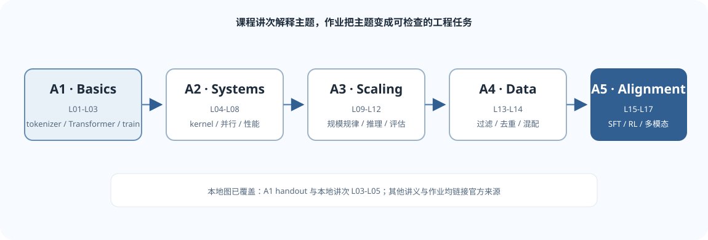

本页按 [Stanford CS336 官方 Spring 2026 课程主页](https://cs336.stanford.edu/)的 Schedule 和作业仓库整理。不同学期可能调整主题、顺序或作业内容；开始学习前请以课程主页当前版本为准。

## 官方讲次 L01–L17

| 官方编号 | 官方主题 | 学习重点 | 官方材料 |
|---|---|---|---|
| L01 | Overview, tokenization | 语言模型课程全景与 tokenization 问题 | [讲义/可执行材料](https://cs336.stanford.edu/lectures/?trace=lecture_01) |
| L02 | PyTorch（einops）、资源核算 | 张量重排、FLOPs、显存和算术强度 | [讲义/可执行材料](https://cs336.stanford.edu/lectures/?trace=lecture_02) |
| L03 | Architectures, hyperparameters | Transformer 架构组件、模型超参数及其影响 | [官方讲义 PDF](https://github.com/stanford-cs336/lectures/blob/main/lecture_03.pdf) |
| L04 | Attention alternatives and mixture of experts | 注意力替代结构与 MoE | [官方讲义 PDF](https://github.com/stanford-cs336/lectures/blob/main/lecture_04.pdf) |
| L05 | GPUs, TPUs | 加速器、计算与存储层次 | [官方讲义 PDF](https://github.com/stanford-cs336/lectures/blob/main/lecture_05.pdf) |
| L06 | Kernels, Triton | GPU kernel、Triton 编程与性能优化 | [讲义/可执行材料](https://cs336.stanford.edu/lectures/?trace=lecture_06) |
| L07 | Parallelism | 大模型训练中的并行化基础 | [讲义/可执行材料](https://cs336.stanford.edu/lectures/?trace=lecture_07) |
| L08 | Parallelism | 并行策略及其计算/通信权衡 | [官方讲义 PDF](https://github.com/stanford-cs336/lectures/blob/main/lecture_08.pdf) |
| L09 | Scaling laws | 规模、数据、计算量与训练表现之间的经验规律 | [官方讲义 PDF](https://github.com/stanford-cs336/lectures/blob/main/lecture_09.pdf) |
| L10 | Inference | 自回归推理、推理开销与优化 | [讲义/可执行材料](https://cs336.stanford.edu/lectures/?trace=lecture_10) |
| L11 | Scaling laws | 缩放规律的进一步分析与应用 | [官方讲义 PDF](https://github.com/stanford-cs336/lectures/blob/main/lecture_11.pdf) |
| L12 | Evaluation | 语言模型评估及评估方法的局限 | [讲义/可执行材料](https://cs336.stanford.edu/lectures/?trace=lecture_12) |
| L13 | Data: sources, datasets | 预训练数据来源与数据集构建 | [讲义/可执行材料](https://cs336.stanford.edu/lectures/?trace=lecture_13) |
| L14 | Data: filtering, deduplication, mixing, synthetic data | 数据过滤、去重、混合与合成数据 | [讲义/可执行材料](https://cs336.stanford.edu/lectures/?trace=lecture_14) |
| L15 | Mid/post-training: SFT/RLHF | 中期训练、监督微调和人类反馈强化学习 | [官方讲义 PDF](https://github.com/stanford-cs336/lectures/blob/main/lecture_15.pdf) |
| L16 | Post-training: RLVR | 可验证奖励强化学习与推理任务训练 | [官方讲义 PDF](https://github.com/stanford-cs336/lectures/blob/main/lecture_16.pdf) |
| L17 | Alignment, multimodality | 对齐主题与多模态模型 | [讲义/可执行材料](https://cs336.stanford.edu/lectures/?trace=lecture_17) |

官方主页还列出 L17 之后的客座讲座。上表按本目录目标列出课程主页中 L01–L17 的核心讲次，不代表一门课只有 17 次活动。

## 官方作业 A1–A5

| 作业 | 官方名称 | 核心工作 | 官方仓库与讲义 |
|---|---|---|---|
| A1 | Basics | 从零实现 byte-level BPE tokenizer、Transformer LM、交叉熵、AdamW、训练循环和检查点；运行小型模型训练、生成与评估实验 | [仓库](https://github.com/stanford-cs336/assignment1-basics) · [讲义 PDF](https://github.com/stanford-cs336/assignment1-basics/blob/main/cs336_assignment1_basics.pdf) |
| A2 | Systems and Parallelism | profiling/benchmarking、activation checkpointing、Triton FlashAttention 2、多 GPU 数据并行、optimizer state sharding 与 FSDP | [仓库](https://github.com/stanford-cs336/assignment2-systems) · [讲义 PDF](https://github.com/stanford-cs336/assignment2-systems/blob/main/cs336_assignment2_systems.pdf) |
| A3 | Scaling Laws | 在受限计算预算下设计实验、拟合 scaling laws，并预测计算最优模型和超参数 | [仓库](https://github.com/stanford-cs336/assignment3-scaling) · [讲义 PDF](https://github.com/stanford-cs336/assignment3-scaling/blob/main/cs336_assignment3_scaling.pdf) |
| A4 | Filtering Language Modeling Data | 从 Common Crawl 转换文本、过滤和去重，再分析数据处理对语言模型训练效果的影响 | [仓库](https://github.com/stanford-cs336/assignment4-data) · [讲义 PDF](https://github.com/stanford-cs336/assignment4-data/blob/main/cs336_assignment4_data.pdf) |
| A5 | Alignment and Reasoning RL | prompting 基线、GRPO 与策略梯度变体；在可验证任务上研究强化学习如何改变模型表现 | [仓库](https://github.com/stanford-cs336/assignment5-alignment) · [讲义 PDF](https://github.com/stanford-cs336/assignment5-alignment/blob/main/cs336_spring2026_assignment5_alignment.pdf) |

A5 的当前必做主题聚焦 reasoning RL；课程主页另列有可选补充材料。阅读前请核对仓库当期说明，不要把补充材料和 A5 必做范围混作一项。

## 课程讲次与第三方笔记编号不是一回事

Stanford 官方的 **L01–L17** 是课程 Schedule 上逐次讲课的编号。第三方 [FRS2003/Hands-on-LLM](https://github.com/FRS2003/hands-on-llm) 则把课程内容合并成 5 份笔记文件，并在文件名中用范围概括来源讲次：

| Hands-on-LLM 文件标签 | 它归并的课程讲次范围 | 主题概括 |
|---|---|---|
| `L1–L3` | 官方 L01–L03 | 分词、资源核算、Transformer 基础 |
| `L4–L8` | 官方 L04–L08 | 注意力替代、MoE、GPU/Triton、并行 |
| `L9–L11` | 官方 L09–L11 | Scaling laws、推理优化 |
| `L12–L14` | 官方 L12–L14 | 评估和训练数据 |
| `L15–L17` | 官方 L15–L17 | 对齐、强化学习、多模态 |

上表中的 `L1–L3` 等是第三方笔记的**分组标题**，不是 Stanford 额外定义的课号，也不表示每个范围都只有一讲。课程主题和讲次以 [Stanford 官方 Schedule](https://cs336.stanford.edu/#schedule)为准；第三方笔记只作辅助阅读。

## 建议的依赖关系

*图 1. 课次按主题聚类以显示作业依赖；正式编号和题目范围仍以 Stanford 课程主页为准。*

这是帮助定位材料的关系图，不是官方规定的作业先修表。
